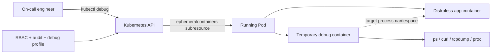
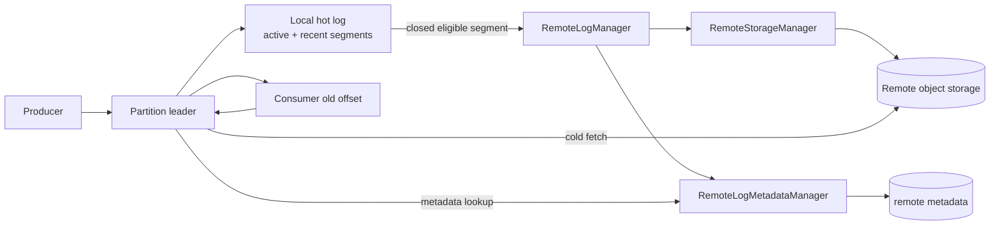

# 2026-09-23 07:00 — Interview Study Packages

README ve yakın `daily/2026-09-23/06-00.md` kontrol edildi. Android Baseline Profiles ve Wardley Mapping tekrar edilmedi. Repo-wide aramada Kubernetes Ephemeral Containers ve Kafka Tiered Storage için doğrudan önceki paket/canonical chapter bulunmadı. Bu tur Cloud/SRE/Security ile Data Engineering/Distributed Systems eksenlerine dönüyor.

## Paket 1 — Junior → Staff Cloud/DevOps/SRE + Cybersecurity: Kubernetes Ephemeral Containers, Distroless Debugging & Privilege Boundaries
**Süre:** 20–30 dk

### Konu anlatımı
Production container image'ını küçük tutmak attack surface, image pull süresi ve dependency riskini azaltır; fakat distroless/minimal image içinde shell, `ps`, `curl`, `tcpdump` gibi araçlar olmayabilir. Kubernetes **ephemeral container**, çalışan Pod'u yeniden build/restart etmeden geçici bir debug container ekleyerek bu gözlemlenebilirlik boşluğunu kapatır. Feature Kubernetes v1.25'ten beri stable'dır.

Ephemeral container normal sidecar değildir: uygulama yaşam döngüsünün parçası olmak için tasarlanmamıştır, otomatik restart garantisi yoktur; port, readiness/liveness probe ve `resources` gibi alanları kullanamaz. API'de Pod spec'e sıradan container eklemek yerine özel `ephemeralcontainers` subresource'u üzerinden eklenir. `kubectl debug` bunun kullanıcı dostu yoludur.

Asıl production sorusu “debug shell nasıl açarım?” değil, **debug yetkisini nasıl sınırlarım?** sorusudur. `--target` ile hedef container'ın process namespace'ine erişim runtime desteğine bağlıdır. `--profile=sysadmin` gibi güçlü profiller geniş Linux capabilities verebilir; bu nedenle RBAC, audit log, image allowlist/signing, kısa süreli erişim ve incident prosedürü birlikte düşünülmelidir.

### Mental model

**Invariant:** Debug tooling'i production image'a kalıcı gömmek zorunda değilsin; fakat debug container'a verilen privilege production trust boundary'sinin parçasıdır.

### İçeride ne oluyor?
1. `kubectl debug` API üzerinden mevcut Pod'a ephemeral container tanımı ekler.
2. Ephemeral container Pod'un network/storage bağlamının bir kısmını paylaşabilir; process görünürlüğü namespace paylaşımı ve runtime'ın `--target` desteğine bağlıdır.
3. Eklenen ephemeral container sonradan normal container gibi silinip değiştirilemez; Pod yaşam döngüsüyle birlikte gider.
4. Port/probe/resource tanımları desteklenmediğinden workload/sidecar yerine kullanılması yanlıştır.
5. Distroless image uygulama attack surface'ini küçültür; debug araçları ayrı ve kontrollü image'da tutulabilir.
6. `general`, `baseline`, `restricted`, `netadmin`, `sysadmin` gibi debug profilleri farklı securityContext ihtiyaçlarını ifade eder; custom profile desteği de vardır.
7. Node debugging daha güçlü bir sınırdır: host namespace/filesystem görünürlüğü incident müdahalesinde faydalı, güvenlik açısından daha risklidir.

### Yüksek getirili mülakat soruları
1. Distroless image neden faydalıdır ve debugging'i neden zorlaştırır?
2. Ephemeral container ile sidecar arasındaki yaşam döngüsü farkı nedir?
3. `kubectl exec` çalışmıyorsa `kubectl debug` ne kazandırır?
4. `--target` neyi amaçlar; neden her runtime'da aynı sonucu vermeyebilir?
5. Senior: Production'da `sysadmin` debug profile erişimini nasıl sınırlandırırsın?
6. Staff: Debug image supply-chain güvenliği, RBAC ve audit politikasını nasıl tasarlarsın?
7. Staff: Pod debug ile node debug arasında hangi blast-radius kriterleriyle seçim yaparsın?

### Beklenen cevap derinliği
- **Junior:** minimal/distroless image, exec ve ephemeral debug container farkını açıklar.
- **Mid:** namespace görünürlüğü, lifecycle kısıtları ve `kubectl debug` akışını bilir.
- **Senior:** Linux capabilities, RBAC, audit ve least-privilege debug profile tasarımını tartışır.
- **Staff:** incident access'i JIT authorization, signed debug images, policy enforcement ve forensic evidence ile sistemleştirir.

### Kısa alıştırma
Shell içermeyen bir API Pod'unda DNS timeout var. Önce `logs`, sonra ephemeral container ile `nslookup/curl`, gerekirse network capability gerektiren packet capture sırasını tasarla. Her adımda gereken minimum privilege'ı yaz.

### Proje fikri
`k8s-debug-lab`: distroless HTTP app deploy et; `kubectl exec` başarısızlığını gözle. Ephemeral debug container ile process/network teşhisi yap. `restricted`, `netadmin` ve `sysadmin` profillerinin erişebildiği kaynakları karşılaştırıp bir incident runbook üret.

### Failure modes / trade-off / production
Aşırı yetkili debug container container isolation'ı anlamsızlaştırabilir. Rastgele registry'den debug image çekmek supply-chain riskidir. Packet capture müşteri verisi/secret taşıyabilir. Ephemeral container resource reservation alamadığı için zaten baskı altındaki Pod/node'u daha da zorlayabilir. Production'da debug subresource audit event'leri, privileged profile kullanımı, image digest, session süresi, node pressure ve incident ticket korelasyonu izlenmelidir.

### Kaynaklar
- Kubernetes — Ephemeral Containers: https://kubernetes.io/docs/concepts/workloads/pods/ephemeral-containers/
- Kubernetes — Debug Running Pods: https://kubernetes.io/docs/tasks/debug/debug-application/debug-running-pod/
- Kubernetes — kubectl debug reference: https://kubernetes.io/docs/reference/kubectl/generated/kubectl_debug/

---

## Paket 2 — Mid → Principal Data Engineering/Distributed Systems: Kafka Tiered Storage, Remote Log Metadata & Cold-Read Economics
**Süre:** 20–30 dk

### Konu anlatımı
Klasik Kafka'da retention büyüdükçe broker-local disk ihtiyacı da büyür; compute ve storage kapasitesi birbirine bağlanır. Tiered Storage (KIP-405) log'u iki katmana ayırır: yakın zamanda aktif kullanılan **local/hot tier** broker diskinde, daha eski kapalı segmentler ise **remote tier**'da tutulur. Böylece uzun retention için her broker'a dev disk koymak yerine pahalı yerel depolama ile ucuz remote storage arasında ayrım yapılabilir.

Client protokolü açısından amaç transparanlıktır: consumer eski bir offset istediğinde broker bunun local log start offset'in altında olduğunu anlayıp remote segment metadata'sını bulur ve veriyi remote storage'dan getirir. Bunun bedeli cold-read latency, remote request/egress maliyeti ve yeni failure domain'leridir. Bu nedenle tiered storage “ucuz sonsuz disk” değil, **retention economics + replay SLO** tasarımıdır.

Kafka güncel dokümantasyonunda cluster seviyesinde `remote.log.storage.system.enable`, topic seviyesinde `remote.storage.enable` ile özellik açılır. `local.retention.ms/bytes` hot tier penceresini, genel `retention.ms/bytes` toplam retention'ı belirler. `RemoteStorageManager` segment byte'larının yaşam döngüsünü, `RemoteLogMetadataManager` ise remote segment metadata'sını yönetir; varsayılan metadata implementation internal topic kullanır ve strong-consistency semantics hedefler.

### Mental model

**Invariant:** Data byte'larının remote store'da bulunması tek başına yeterli değildir; doğru offset/leader-epoch aralığını güvenilir biçimde bulacak metadata control plane gerekir.

### İçeride ne oluyor?
1. Active segment local'da yazılır; kapatılmış/eligible segment remote storage'a kopyalanır.
2. Segment ve index lifecycle'ı pluggable `RemoteStorageManager` tarafından yönetilir.
3. Remote segment'in offset/timestamp/leader-epoch bilgisi `RemoteLogMetadataManager` üzerinden takip edilir.
4. Local retention, toplam retention'dan bağımsızlaştırılarak broker disk footprint'i küçültülebilir.
5. Hot-tail consumer local/page-cache yolundan ilerler; backfill/replay remote fetch latency ve object-store maliyetine maruz kalabilir.
6. Leader change sırasında metadata/data lifecycle correctness'i korunmalıdır; “upload oldu mu?” ile “metadata görünür mü?” ayrımı önemlidir.
7. Güncel Kafka dokümantasyonu compacted topic'ler için tiered storage kısıtlarına dikkat çeker; workload compatibility doğrulanmalıdır.

### Yüksek getirili mülakat soruları
1. Tiered storage Kafka'da hangi compute-storage coupling problemini azaltır?
2. `local.retention` ile total `retention` neden ayrı knob'lardır?
3. RemoteStorageManager ile RemoteLogMetadataManager sorumlulukları nasıl ayrılır?
4. Consumer neden client değişikliği olmadan eski offset'i okuyabilir?
5. Senior: 90 günlük retention, fakat replay SLO p95 < 2 s ise local window'u nasıl seçersin?
6. Staff: Remote store outage sırasında hot-tail ve cold-read davranışını nasıl izole edersin?
7. Principal: Broker SSD maliyeti, object-store request/egress maliyeti ve disaster-recovery süresini tek capacity modelinde nasıl birleştirirsin?

### Beklenen cevap derinliği
- **Mid:** segment, retention ve hot/cold tier ayrımını açıklar.
- **Senior:** remote metadata, cold-fetch latency, backfill ve retention knobs'larını bağlar.
- **Staff:** leader changes, quotas, remote-store outage, replay storms ve observability tasarımını tartışır.
- **Principal:** storage economics, DR/RTO, workload classes ve platform defaults'u birlikte optimize eder.

### Kısa alıştırma
Bir topic günde 4 TB üretiyor, toplam retention 30 gün, broker'da 2 günlük hot window tutulacak. Replication factor 3 varsayımıyla tiering öncesi ve sonrası yaklaşık local logical retention footprint'ini karşılaştır; sonra 30 günlük replay'in remote read path'e etkisini listele.

### Proje fikri
`kafka-tiered-storage-lab`: test cluster'da tiered storage aç, küçük `segment.bytes` ve kısa `local.retention.ms` ile segment offload'u hızlandır. Offset 0'dan consume ederek cold fetch'i doğrula. Hot-tail ve cold-read p50/p95 latency, broker disk kullanımı ve remote request sayısını raporla.

### Failure modes / trade-off / production
Remote storage ucuz kapasite sağlayabilir fakat backfill storm object-store throughput/request maliyetini patlatabilir. Remote metadata lag/corruption eski offset lookup'unu bozabilir. Yanlış local-retention değeri normal consumer lag'ini gereksiz yere cold path'e iter. Remote dependency outage hot-tail'i etkilememeli diye failure isolation düşünülmelidir. Production'da local-vs-remote fetch rate, remote fetch latency/error, offload backlog, remote metadata lag, broker disk headroom, consumer lag ve cost/TB-month birlikte izlenmelidir.

### Kaynaklar
- Apache Kafka — Tiered Storage: https://kafka.apache.org/43/operations/tiered-storage/
- Apache Kafka — Tiered Storage GA Release Notes: https://cwiki.apache.org/confluence/spaces/KAFKA/pages/315494647/Kafka+Tiered+Storage+GA+Release+Notes
