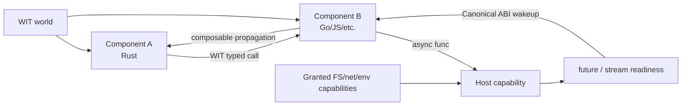
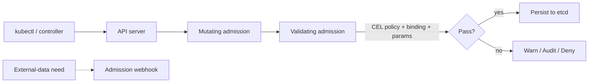

# 2026-09-23 08:00 — Interview Study Packages

README ve yakın `daily/2026-09-23/07-00.md` kontrol edildi. Kubernetes ephemeral-container debugging ile Linux capacity/uclamp/EAS tekrar edilmedi. Repo-wide aramada QUIC migration, OpenTelemetry sampling, LSM compaction, point-in-time feature joins ve benzeri adayların daha önce işlendiği görüldü. Bu tur iki doğrulanmış boşluğa dönüyor: **WASI 0.3 native async + WebAssembly Component Model** ve **Kubernetes CEL admission policies**.

## Paket 1 — Mid → Principal Backend/Distributed Systems/Platform: WASI 0.3 Native Async, Component Model & Capability Boundaries
**Süre:** 20–30 dk

### Konu anlatımı
WebAssembly core module düşük seviyeli import/export'larla taşınabilir compute sağlar; fakat farklı dillerde yazılmış modülleri güçlü tipli, versionlanabilir ve composable servis parçaları olarak bağlamak için daha üst seviye bir contract gerekir. **WebAssembly Component Model** bu sınırı WIT (WebAssembly Interface Types), resources, worlds ve Canonical ABI ile kurar.

WASI 0.2 Component Model tabanını yaygınlaştırdı; async I/O ise `wasi:io` içindeki `pollable` resource'larıyla modelleniyordu. Bu model doğrudan host I/O'sunda çalışsa da `A → B → Host` gibi component zincirinde readiness/wakeup'ı ara component'in relay etmesini gerektirebiliyordu.

**WASI 0.3.0 11 Haziran 2026'da yayımlandı; 0.3.1 11 Ağustos 2026'da geldi.** 0.3, async'i Canonical ABI'ye taşıyarak WIT seviyesinde `async func`, `stream<T>` ve `future<T>` ekler; eski `wasi:io` paketi kaldırılır. Böylece suspension/resumption ve wakeup propagation component'in kendi polling glue code'u yerine runtime/ABI'nin sorumluluğuna yaklaşır.

Bu yalnız performans özelliği değildir. Component host varsayılan olarak filesystem/network/environment gibi capability'leri vermek zorunda değildir; interface contract ve granted capabilities plugin/edge-function/platform isolation tasarımının parçasıdır. Ancak Wasm sandbox'ını otomatik multi-tenant security boundary saymak yanlıştır: runtime configuration, host imports, resource limits ve supply-chain doğrulaması hâlâ kritiktir.

### Mental model

**Invariant:** Component boundary'si dil ABI'si değildir; WIT + Canonical ABI contract'ıdır. WASI 0.3'te async readiness bu contract boyunca compose edilebilir.

### İçeride ne oluyor?
1. WIT `interface` fonksiyon/type contract'ını, `world` ise bir component'in import/export yüzeyini tanımlar.
2. Language binding generator WIT tiplerini Rust/Go/JS gibi dil tiplerine map eder; Canonical ABI component ile host arasındaki representation/lift-lower mekaniklerini standartlaştırır.
3. `async func` çağrının suspend olup sonra devam edebileceğini contract'a taşır.
4. `future<T>` daha sonra üretilecek tek bir typed değeri, `stream<T>` ise typed async değer akışını component sınırından geçirebilir.
5. WASI 0.3, 0.2'nin `pollable` relay problemine native async primitives ile yaklaşır; ara component'in busy/active polling glue code'u azalır.
6. Runtime hem 0.2 hem 0.3 component'leri destekleyebilir; 0.2 interface'leri 0.3 üzerinde virtualize/polyfill edilebilir. Migration bu nedenle big-bang olmak zorunda değildir.
7. Capability exposure host policy'sidir: component'in bir WIT interface'i istemesi, host'un filesystem/network/env erişimini otomatik vermesi anlamına gelmez.
8. Toolchain/WIT version mismatch instantiation/type hataları yaratabilir; runtime, bindgen ve interface version pinning production artifact contract'ının parçasıdır.

### Yüksek getirili mülakat soruları
1. Core Wasm module ile Component Model component arasındaki fark nedir?
2. WIT `interface` ve `world` neyi çözer?
3. WASI 0.2 async modelinde `pollable` neden component zincirlerinde zorlaşır?
4. `async func`, `future<T>` ve `stream<T>` birbirinden nasıl ayrılır?
5. Senior: Plugin platformunda filesystem/network capability'lerini nasıl least-privilege verirsin?
6. Staff: 0.2 component fleet'ini 0.3'e nasıl kademeli geçirir, compatibility'yi nasıl test edersin?
7. Principal: Wasm component platformunu container/microservice boundary'sine alternatif veya tamamlayıcı olarak hangi latency, isolation, portability ve operability kriterleriyle değerlendirirsin?

### Beklenen cevap derinliği
- **Mid:** module/component, WIT/world ve host capability ayrımını açıklar.
- **Senior:** Canonical ABI, binding generation, async composition ve resource/capability lifecycle'ını bağlar.
- **Staff:** mixed 0.2/0.3 fleet, version pinning, runtime rollout, observability ve resource limits tasarlar.
- **Principal:** component platformunu org-level portability, multi-language SDK, security boundary ve platform economics kararlarına bağlar.

### Kısa alıştırma
`A → B → object-store host` zinciri çiz. B yalnız request'i forward ediyor. 0.2 pollable modelinde readiness relay'in nerede gerektiğini; 0.3 `async func + stream` modelinde sorumluluğun nereye taşındığını yaz. Sonra A ve B için minimum filesystem/network capability setini belirt.

### Proje fikri
`wasi-component-gateway`: iki farklı dilde iki küçük component üret; WIT ile typed interface tanımla. Bir component HTTP/transform işi, diğeri storage adapter olsun. Wasmtime üzerinde capability'leri minimum ver; 0.2 ve 0.3 varyantlarında request latency, memory, cold-start ve failure telemetry'sini karşılaştır.

### Failure modes / trade-off / production
WIT/runtime/bindgen sürümlerinin uyuşmaması instantiation failure yaratabilir. Host'a fazla geniş filesystem/network erişimi vermek sandbox değerini düşürür. Async sınırsız concurrency demek değildir; stream consumer yavaşsa backpressure ve memory budget gerekir. CPU/memory/time limit olmadan untrusted component noisy-neighbor olabilir. Production'da component load/instantiate failure, WIT/version distribution, cold-start, async in-flight count, stream backlog, host-call latency/error, memory/fuel/epoch limit termination ve denied-capability denemeleri izlenmelidir.

### Kaynaklar
- WASI — Releases: https://wasi.dev/releases
- WASI 0.3 — Native async overview: https://wasi.dev/releases/wasi-p3
- Bytecode Alliance — Component Model async/streams/futures: https://component-model.bytecodealliance.org/design/async.html
- Bytecode Alliance — Wasmtime component runtime: https://component-model.bytecodealliance.org/running-components/wasmtime.html

---

## Paket 2 — Junior → Staff Cloud/DevOps/SRE + Cybersecurity: Kubernetes CEL Admission Policies, Failure Semantics & Policy Rollout
**Süre:** 20–30 dk

### Konu anlatımı
Kubernetes admission, authenticated/authorized bir API request'in etcd'ye yazılmadan önce policy kontrolünden geçtiği kritik control-plane sınırıdır. Klasik validating/mutating admission webhook'ları cluster dışı/in-cluster HTTP servislerine çağrı yapar; güçlüdür ama network dependency, certificate lifecycle, timeout ve availability failure mode'ları ekler.

**ValidatingAdmissionPolicy**, CEL (Common Expression Language) kurallarını API server içinde değerlendirerek declarative, in-process validation sağlar ve Kubernetes v1.30'dan beri stable'dır. Policy soyut kuralı; `ValidatingAdmissionPolicyBinding` scope ve enforcement action'ını; isteğe bağlı parameter resource ise environment/namespace bazlı değerleri taşır.

Kubernetes v1.36 ile **MutatingAdmissionPolicy** stable hale geldi ve CEL ile mutation için in-process alternatif sundu. Validation ile mutation'ı ayırmak önemlidir: mümkünse invariant'ı reject etmek validation; kontrollü default/patch uygulamak mutation işidir. External registry/signature lookup gibi dış veriye ihtiyaç varsa webhook hâlâ doğru araç olabilir.

Admission policy'nin en kritik production konusu kural yazmak değil, **yanlış kuralın control plane'i kilitlemesini engelleyen rollout/failure semantics** tasarlamaktır. `failurePolicy: Fail` evaluation error'da request'i reddeder; `Ignore` availability lehine policy bypass riski taşır. Binding'deki `Warn`, `Audit`, `Deny` aksiyonları staged rollout için kullanılabilir.

### Mental model

**Invariant:** Admission policy runtime request path'indadır. Policy availability ve latency'si control-plane availability/latency'sidir.

### İçeride ne oluyor?
1. `ValidatingAdmissionPolicy` hangi resource/operation'ların eşleşeceğini ve CEL validation expression'larını tanımlar.
2. Binding policy'yi namespace/resource scope'una bağlar; binding olmadan policy etkili değildir.
3. `object`, `oldObject`, `request`, `params`, `namespaceObject` ve authorization helper'ları CEL expression'larında kullanılabilir.
4. Parameter resource aynı soyut policy'nin dev/test/prod için farklı limitlerle kullanılmasını sağlar.
5. Birden çok matching binding varsa ilgili evaluation'ların tamamı geçmelidir.
6. `failurePolicy` expression/misconfiguration error'ında fail-open/fail-closed kararını taşır; bu karar security ile availability arasında gerçek trade-off'tur.
7. CEL evaluation cost budget vardır; policy language'ın bounded olması API server'ı pahalı/unbounded evaluation'dan korumaya yardım eder.
8. MutatingAdmissionPolicy CEL ile apply-configuration veya JSON patch tarzı mutation sağlar; external lookup gerektiren karmaşık policy'lerde webhook gerekebilir.
9. Staged rollout'ta önce `Audit`/`Warn`, telemetry ile false-positive kontrolü, sonra `Deny` tipik güvenli yoldur.

### Yüksek getirili mülakat soruları
1. Admission control authentication/authorization'dan sonra neden ayrıca gerekir?
2. CEL policy ile admission webhook arasındaki temel trade-off nedir?
3. Policy ile Binding neden ayrı resource'lardır?
4. `failurePolicy: Fail` ve `Ignore` hangi riskleri taşır?
5. Senior: Yeni image-tag policy'sini prod'u kırmadan nasıl rollout edersin?
6. Senior: Hangi policy external webhook gerektirir, hangisi CEL'e taşınmalıdır?
7. Staff: 100 cluster'lık fleet'te policy versioning, exceptions, audit ve break-glass mekanizmasını nasıl tasarlarsın?
8. Staff: Admission policy'nin kendi değişikliklerinin korunması ve bootstrap gap'i neden ayrı bir platform problemi olabilir?

### Beklenen cevap derinliği
- **Junior:** admission'ın request lifecycle'daki yerini ve validation/mutation farkını bilir.
- **Mid:** CEL, policy/binding/params, match scope ve failurePolicy semantics'ini açıklar.
- **Senior:** webhook-vs-in-process seçimi, staged rollout, false positive ve break-glass tasarlar.
- **Staff:** fleet policy governance, policy-as-code testing, audit evidence, blast radius ve control-plane SLO'larını birlikte yönetir.

### Kısa alıştırma
Bir Deployment için `latest` image tag'ini yasaklamak ve prod'da replica sayısını namespace-parametresine göre sınırlamak istiyorsun. Policy/binding/param ayrımını çiz. Önce `Warn+Audit`, sonra `Deny` rollout planı yaz; CEL evaluation error'ında Fail/Ignore seçimini gerekçelendir.

### Proje fikri
`k8s-cel-policy-lab`: kind cluster'da üç policy yaz: required owner label, replica limit ve forbidden `latest` tag. Namespace bazlı parameter kullan. Warn/Audit/Deny davranışlarını ve invalid CEL/failurePolicy senaryolarını test et; aynı kontrolün webhook varyantını kurup latency ve failure surface'ini karşılaştır.

### Failure modes / trade-off / production
Yanlış broad match tüm deploy'ları engelleyebilir. `Fail` güvenliği korurken policy bug'ını outage'a çevirebilir; `Ignore` availability sağlar ama guardrail'i sessizce atlayabilir. Webhook external dependency ekler; timeout/cert/DNS problemi admission'ı etkileyebilir. Mutation'ın beklenmedik default'ları ownership/debugging karmaşası yaratabilir. Production'da admission latency p95/p99, deny/warn/audit count, policy/binding version, evaluation error, webhook timeout, exception usage ve break-glass event'leri izlenmelidir.

### Kaynaklar
- Kubernetes — Validating Admission Policy: https://kubernetes.io/docs/reference/access-authn-authz/validating-admission-policy/
- Kubernetes — Policies overview: https://kubernetes.io/docs/concepts/policy/
- Kubernetes — Mutating Admission Policy: https://kubernetes.io/docs/reference/access-authn-authz/mutating-admission-policy/
- Kubernetes — Admission Controllers: https://kubernetes.io/docs/reference/access-authn-authz/admission-controllers/
