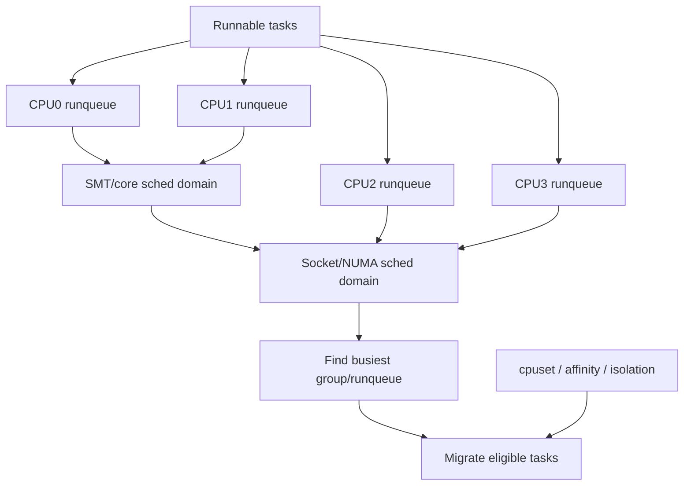
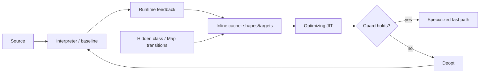

# 2026-09-23 08:00 — Interview Study Packages

README ve yakın `daily/2026-09-23/07-00.md` kontrol edildi. Ephemeral containers/distroless debugging ile uclamp/EAS tekrar edilmedi. Ek repo-wide dedup kontrolde ilk 08:00 taslağındaki WASI 0.3/native async'in daha önce birden çok kez işlendiği görüldüğü için çıkarıldı. Allocator internals ve compiler register allocation da zaten mevcut. Bu tur iki doğrulanmış boşluğa dönüyor: Linux scheduler'ın **topology-aware load balancing** katmanı ve compiler/runtime zincirinin **speculative JIT + deoptimization** katmanı.

## Paket 1 — Mid → Principal Foundations/Linux: Scheduler Domains, Load Balancing & CPU Isolation
**Süre:** 20–30 dk

### Konu anlatımı
Linux'ta her CPU'nun runqueue'su vardır; fakat çok çekirdekli sistemde yalnız lokal olarak “en iyi runnable task”ı seçmek yetmez. İş yükü CPU'lar arasında dengesiz kalabilir. **Scheduler domains**, donanım topolojisini katmanlı balancing scope'larına dönüştürür: SMT sibling'ları, core/socket ve NUMA seviyeleri gibi. Her domain CPU gruplarından oluşur; load balancing önce busiest group'u, sonra busiest runqueue'yu bulup uygun task'ları taşımaya çalışır.

Bu mekanizma ücretsiz değildir. Migration cache locality'yi bozabilir, NUMA memory'den uzaklaştırabilir ve büyük makinelerde balancing search maliyeti büyür. Bu yüzden “tüm CPU'lar tek havuz” her workload için doğru değildir. CPU isolation/cpuset partitioning latency-sensitive veya specialized workload'larda balancing scope'unu bilinçli biçimde daraltabilir.

### Mental model

**Invariant:** Load balancing throughput/fairness için task taşır; fakat migration'ın cache/NUMA maliyeti ve placement constraints her zaman denklemin parçasıdır.

### İçeride ne oluyor?
1. Her CPU için `sched_domain` hiyerarşisi vardır; parent domain daha geniş CPU span'ı kapsar.
2. Domain içindeki `sched_group` kümeleri balancing'in karşılaştırdığı birimlerdir.
3. Periodic balancing scheduler tick tarafından tetiklenebilir; asıl çalışma scheduler softirq bağlamında domain hiyerarşisini dolaşır.
4. Balancer busiest group → busiest runqueue bulur ve hesaplanan imbalance kadar uygun task taşımaya çalışır.
5. Wakeup placement ve idle balancing, periodic balancing dışında daha hızlı reaksiyon yollarıdır.
6. CPU affinity/cpuset izin verilen destination CPU setini sınırlar; isolation domain'den CPU çıkartarak otomatik migration'ı azaltabilir.
7. NUMA/SMT/topology sınırları migration cost ve shared-resource contention'ı değiştirir.
8. CPU isolation jitter'ı azaltabilir ama global spare capacity'nin kullanılamaması ve operasyonel complexity pahasına gelir.

### Yüksek getirili mülakat soruları
1. Per-CPU runqueue varsa neden ayrıca load balancing gerekir?
2. Scheduler domain ile runqueue arasındaki fark nedir?
3. Task migration neden her zaman performansı artırmaz?
4. Wakeup placement ile periodic load balance nasıl ayrılır?
5. Senior: NUMA locality ile CPU utilization arasında nasıl trade-off kurarsın?
6. Staff: CPU isolation ne zaman p99 latency'yi iyileştirip throughput'u düşürebilir?
7. Principal: 256+ CPU'lu hostta balancing scope, tenant isolation ve observability politikasını nasıl tasarlarsın?

### Beklenen cevap derinliği
- **Mid:** per-CPU runqueue, migration, affinity ve balancing ihtiyacını açıklar.
- **Senior:** topology, cache locality, NUMA, wakeup/idle/periodic balancing'i bağlar.
- **Staff:** cpuset/isolation ile SLO ve utilization trade-off'u kurar.
- **Principal:** fleet-level workload classes, noisy-neighbor sınırları, topology-aware placement ve capacity economics'i birlikte ele alır.

### Kısa alıştırma
4 CPU düşün: CPU0/1 aynı core sibling, CPU2/3 başka core. CPU0 runqueue'da 4 runnable task, diğerlerinde 0 var. Hangi migration'ın önce tercih edilebileceğini; cache affinity, SMT contention ve task affinity'nin kararı nasıl değiştireceğini yaz.

### Proje fikri
`sched-domain-lab`: `stress-ng`/küçük worker'larla CPU-bound ve latency-sensitive workload üret. `taskset`, cpuset cgroup ve mümkünse isolated partition varyantlarını karşılaştır. `perf sched`, context switch/migration sayıları, runqueue delay, LLC misses ve p99 latency ölç.

### Failure modes / trade-off / production
Aşırı migration cache thrash yaratabilir. Aşırı pinning idle CPU varken backlog bırakabilir. CPU isolation yanlış kurulursa housekeeping işi latency core'larına sızabilir veya isolated kapasite boşa kalabilir. NUMA'yı yok sayan placement remote-memory latency yaratır. Production'da runqueue delay, migrations, context switches, CPU utilization, LLC misses, NUMA locality, PSI ve application p95/p99 birlikte izlenmelidir.

### Kaynaklar
- Linux Kernel — Scheduler Domains: https://kernel.org/doc/html/latest/scheduler/sched-domains.html
- Linux Kernel — CPU Isolation: https://docs.kernel.org/admin-guide/cpu-isolation.html
- Linux Kernel — CPUSETS / load balancing: https://docs.kernel.org/admin-guide/cgroup-v1/cpusets.html

---

## Paket 2 — Junior → Staff Compiler/Runtime: Inline Caches, Hidden Classes, Speculative JIT & Deoptimization
**Süre:** 20–30 dk

### Konu anlatımı
Dinamik bir dilde `obj.x` gibi basit görünen erişimde compiler, `obj`'nin runtime shape'ını statik olarak kesin bilemeyebilir. Her erişimde generic dictionary lookup yapmak doğru ama pahalıdır. Modern VM'ler runtime feedback toplar: aynı call/property site çoğunlukla aynı object shape görüyorsa **inline cache (IC)** bu shape'i ve hızlı erişim yolunu cache'leyebilir. V8'de object shape kavramı `Map`/HiddenClass ile temsil edilir.

Hot code optimizing JIT'e geçtiğinde bu feedback daha agresif kullanılabilir: “buraya gelen object şu shape'te” varsayımı altında checks + specialized machine code üretilebilir. Varsayım bozulursa yanlış sonuç üretmek yerine **deoptimization** yapılır: optimized frame/state metadata kullanılarak execution daha genel/interpreter veya daha düşük tier temsiline geri taşınır.

Bu, performans mühendisliğinde kritik mental modeldir: JIT optimization bir theorem değil, guard'larla korunan speculation'dır.

### Mental model

**Invariant:** Specialized code yalnız runtime assumptions geçerliyken doğrudur; guard + deopt correctness safety net'idir.

### İçeride ne oluyor?
1. Aynı property ekleme düzenine sahip object'ler aynı HiddenClass/Map'i paylaşabilir; map field layout metadata'sı taşır.
2. IC call/property site'da gözlenen shape/target bilgisini hızlı dispatch için kullanır.
3. Site tek shape görürse monomorphic; birkaç shape görürse polymorphic; çok fazla shape görürse megamorphic davranışa kayabilir.
4. Optimizing compiler feedback'e dayanarak map check sonrası field offset'i doğrudan okuyabilir veya call target'ı inline edebilir.
5. Shape/constant/type assumption bozulursa dependent optimized code invalidated/deoptimized olabilir.
6. Deopt metadata optimized machine state'i daha genel execution state'ine yeniden kurmaya yeterli bilgi taşımalıdır.
7. Tiered JIT startup latency ile peak throughput'u dengeler: interpreter/baseline hızlı başlar, optimizing tier yalnız yeterince hot code'a yatırım yapar.
8. 24 Haziran 2025'te V8, WebAssembly için speculative indirect-call inlining + deoptimization desteğini duyurdu; aynı feedback/guard/deopt fikrinin Wasm'da da değer taşıdığını gösterir.

### Yüksek getirili mülakat soruları
1. Inline cache hangi problemi çözer?
2. Hidden class neden normal source-language class ile aynı şey değildir?
3. Monomorphic ve megamorphic call/property site performans açısından nasıl ayrılır?
4. Speculative optimization neden correctness'i bozmaz?
5. Mid: guard failure sonrası VM hangi state'i yeniden kurmak zorundadır?
6. Senior: object shape churn neden optimized code'u kötü etkileyebilir?
7. Staff: startup latency, code size, compile CPU ve peak throughput arasında tiering policy'sini nasıl seçersin?

### Beklenen cevap derinliği
- **Junior:** interpreter/JIT ve generic vs specialized lookup farkını anlatır.
- **Mid:** hidden class, IC, monomorphic/polymorphic site ve guard kavramlarını bağlar.
- **Senior:** deopt state reconstruction, invalidation ve shape churn etkisini tartışır.
- **Staff:** tiering economics, profiling feedback, code cache, compile budget ve workload stability üzerinden policy kurar.

### Kısa alıştırma
`readX(o) { return o.x }` fonksiyonuna önce 1000 kez aynı property sırasıyla oluşturulmuş object, sonra farklı sırada oluşturulmuş object'ler gönderildiğini düşün. IC state'in ve optimizer varsayımlarının nasıl değişebileceğini adım adım çiz.

### Proje fikri
`tiny-inline-cache-vm`: küçük bytecode interpreter'a `LOAD_PROP` ekle. İlk sürüm generic hash lookup kullansın. Sonra `(shape_id, field_offset)` cache'i ekle; monomorphic hit/miss sayaçları tut. Shape değişiminde fallback uygula. İleri aşamada hot function için specialized pseudo-code üret ve guard fail'de interpreter'a dön.

### Failure modes / trade-off / production
Shape explosion IC hit rate'ini düşürür ve metadata/code-size büyütebilir. Aşırı erken optimization compile CPU/startup latency harcar. Deopt storm p99 latency'yi bozabilir. Microbenchmark tek monomorphic shape ile production polymorphism'ini saklayabilir. Production'da tier-up sayısı, deopt reasons, IC state dağılımı, compile CPU, code-cache memory ve end-to-end latency birlikte incelenmelidir.

### Kaynaklar
- V8 — Maps (Hidden Classes): https://v8.dev/docs/hidden-classes
- V8 — Fast properties / inline caches: https://v8.dev/blog/fast-properties
- V8 — Maglev deoptimization: https://v8.dev/blog/maglev
- V8 — Speculative WebAssembly optimizations with deopts (24 Haziran 2025): https://v8.dev/blog/wasm-speculative-optimizations
