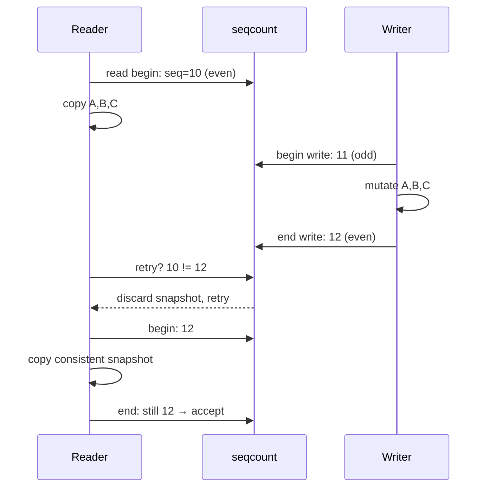
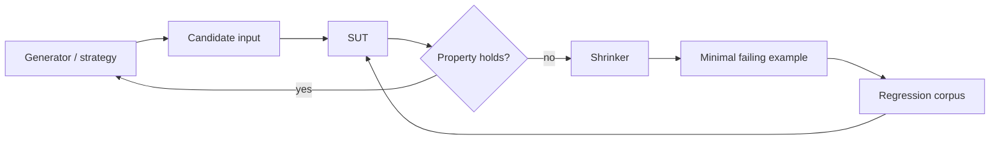

# 2026-09-23 09:00 — Interview Study Packages

README ve yakın `daily/2026-09-23/08-00.md` kontrol edildi. Scheduler domains/load balancing ve speculative JIT/deoptimization tekrar edilmedi. Repo-wide dedup kontrolde `seqcount`/`seqlock` ile property-based testing için canonical içerik bulunmadı. Bu tur yaklaşık %70 temel boşluk kapatma + %20 mülakat pratiği + %10 güncel araç bağlantısı hedefiyle Linux concurrency internals ve testing engineering hattını ilerletiyor.

## Paket 1 — Mid → Principal Foundations/Linux: Sequence Counters, Seqlock & Read-Mostly Consistency
**Süre:** 20–30 dk

### Konu anlatımı
Bazı read-mostly verilerde okuyucunun mutex alması gereksiz contention yaratır. Linux `seqcount_t`, okuyucunun veriyi optimistically kopyalayıp baştaki ve sondaki sequence değerini karşılaştırdığı bir consistency mekanizmasıdır. Writer update başında counter'ı odd, sonunda tekrar even yapar. Reader başlangıç değeri odd ise veya okuma sonunda counter değişmişse snapshot'ı çöpe atıp tekrar dener.

Bu mekanizma bir RW-lock değildir: reader writer'ı kilitlemez; writer da reader'ın bitmesini beklemez. Bedeli, write contention sırasında reader retry maliyetidir. Raw `seqcount_t` writer serialization sağlamaz; writer'ların ayrıca serialize edilmesi ve write section'ın reader'a göre non-preemptible olması gerekir. `seqlock_t` sequence counter ile writer spinlock'unu birlikte sağlar.

En kritik sınır pointer lifetime'dır. Reader bir pointer'ı takip ederken writer o nesneyi free edebiliyorsa yalnız sequence counter yeterli değildir. Böyle lifetime problemlerinde RCU gibi reclamation mekanizması gerekir.

### Mental model

**Invariant:** Reader yalnız başlangıç ve bitiş sequence değeri aynı ve even olduğunda snapshot'ı kabul eder.

### İçeride ne oluyor?
1. Writer begin/end counter değişimleri reader'a update'in sınırlarını gösterir.
2. Reader protected alanları local snapshot'a kopyalar; validation başarısızsa bu değerleri kullanmaz.
3. `seqcount_t` birden çok writer'ı kendi başına serialize etmez; external lock gerekir.
4. Writer kritik bölgesi preempt edilip counter odd kalırsa reader uzun süre spin/retry yapabilir; RT reader ile livelock riski doğabilir.
5. `seqlock_t` embedded spinlock ile writer serialization ve non-preemptibility sağlar.
6. Read-heavy, kısa writer critical section'lı ve küçük snapshot'lı veri ideal kullanım alanıdır; system time benzeri örnekler sezgiseldir.
7. Pointer içeren dinamik yapı için sequence consistency ile object lifetime ayrı problemlerdir; RCU removal ve reclamation'ı ayırır.
8. `seqcount_latch_t` iki veri kopyası arasında geçiş yaparak writer'ın reader tarafından interrupt edilebildiği özel senaryolarda multiversion yaklaşımı sağlar.

### Yüksek getirili mülakat soruları
1. Seqlock ile rwlock arasındaki temel fark nedir?
2. Reader neden sequence değerini iki kez okur?
3. Odd sequence ne anlatır?
4. `seqcount_t` neden writer serialization sağlamaz?
5. Senior: writer preemption neden ciddi bir failure mode olabilir?
6. Staff: pointer lifetime varsa neden yalnız seqcount yetmez; RCU hangi ayrı problemi çözer?
7. Principal: read-mostly config snapshot'ında mutex, seqcount, RCU ve immutable copy-on-write arasında nasıl seçim yaparsın?

### Beklenen cevap derinliği
- **Mid:** even/odd counter, optimistic read ve retry modelini doğru anlatır.
- **Senior:** writer serialization, preemption, memory-ordering API sınırı ve retry starvation'ı tartışır.
- **Staff:** consistency ile lifetime/reclamation'ı ayırır; seqcount ve RCU'yu doğru yerde birleştirir.
- **Principal:** workload read/write oranı, snapshot boyutu, latency SLO, RT constraints ve memory cost üzerinden primitive seçer.

### Kısa alıştırma
`{seconds, nanos}` iki alanlı bir clock snapshot'ı düşün. Writer `seconds` değerini artırdıktan sonra preempt oluyor; reader iki alanı okuyor. Mutex olmadan torn/inconsistent snapshot'ın nasıl oluşacağını, seqcount retry loop'unun bunu nasıl tespit edeceğini adım adım yaz.

### Proje fikri
`seqcount-lab`: userspace'te atomik version counter + iki integer ile küçük bir optimistic snapshot prototipi kur. Bir writer ve çok reader altında mutex sürümüyle kıyasla. Retry count, read throughput ve p99 read latency ölç. Bunun Linux kernel `seqcount_t`'nin birebir yerine geçmediğini; memory ordering ve preemption semantiğinin platforma bağlı olduğunu README'de açıkça belirt.

### Failure modes / trade-off / production
Write storm reader retry storm'a dönüşebilir. Uzun/preempted writer latency'yi patlatabilir. Pointer lifetime'ı göz ardı etmek use-after-free üretir. Yanlış memory ordering veya validation dışına taşan read correctness'i bozar. Production'da retry oranı, writer critical-section süresi, CPU spinning, p99 latency ve update frequency birlikte izlenmelidir.

### Kaynaklar
- Linux Kernel — Sequence counters and sequential locks: https://docs.kernel.org/locking/seqlock.html
- Linux Kernel — What is RCU?: https://docs.kernel.org/RCU/whatisRCU.html
- Linux Kernel — PREEMPT_RT differences / sequence locks: https://docs.kernel.org/core-api/real-time/differences.html

---

## Paket 2 — Junior → Staff Testing Engineering: Property-Based Testing, Generators, Shrinking & Oracles
**Süre:** 20–30 dk

### Konu anlatımı
Example-based test `sort([3,1,2]) == [1,2,3]` gibi seçilmiş birkaç örneği doğrular. Property-based testing (PBT) ise tek tek örneklerden önce genel bir invariant tanımlar ve çok sayıda input üretir. Sorting için örnek property'ler: çıktı sıralıdır, input ile aynı multiset'i taşır ve `sort(sort(xs)) == sort(xs)`.

PBT'nin üç parçasını ayrı düşün: **generator** ilginç input uzayını üretir; **property/oracle** doğru davranışın gözlenebilir invariant'ını söyler; **shrinker** failure bulunduğunda onu daha küçük ve anlaşılır bir counterexample'a indirger. Güçlü generator + zayıf property veya güçlü property + kötü dağılımlı generator yine zayıf testtir.

Metamorphic testing, tam expected output'u hesaplamanın zor olduğu yerde input dönüşümü ile output ilişkisi kurar. Örneğin graph shortest-path implementasyonunda tüm edge weight'lerini pozitif sabit katsayıyla çarpmak seçilen shortest path'i belirli koşullarda değiştirmemelidir.

### Mental model

**Invariant:** PBT rastgele input üretmekten ibaret değildir; input distribution + falsifiable property + failure minimization birlikte değer üretir.

### İçeride ne oluyor?
1. Generator domain constraints'i korurken edge cases'e ulaşacak dağılım üretmelidir.
2. `filter` ile neredeyse tüm generated input'u atmak test budget'ını boşa harcar; constraint-aware strategy tercih edilir.
3. Shrinking failure-preserving daha küçük adaylar arar; hedef yalnız küçük byte sayısı değil, teşhis edilebilir counterexample'dır.
4. Algebraic properties — idempotence, inverse, associativity (gerçekten geçerliyse), round-trip — güçlü oracle kaynaklarıdır.
5. Differential testing aynı input'u bağımsız iki implementation'a verip sonuçları karşılaştırabilir.
6. Metamorphic relations tam oracle bulunmadığında ilişkisel correctness sağlar.
7. Stateful PBT command sequence üretip model state ile SUT state'i karşılaştırabilir; fakat deterministic concurrency testing'in yerine geçmez.
8. Güncel Hypothesis dokümantasyonunda test yaşam döngüsü explicit/reuse/generate/target/shrink/explain fazlarına ayrılır; önceki failures database'den yeniden kullanılabilir.

### Yüksek getirili mülakat soruları
1. Property-based test ile fuzz test arasındaki farkı nasıl açıklarsın?
2. Shrinking neden bug bulmak kadar önemlidir?
3. Generator distribution neden correctness testinin bir parçasıdır?
4. Oracle yoksa hangi property türlerini kullanabilirsin?
5. Mid: round-trip property hangi bug sınıflarını kaçırabilir?
6. Senior: stateful API için model-based property testini nasıl kurarsın?
7. Staff: PBT, coverage-guided fuzzing, deterministic concurrency ve contract testlerini CI piramidinde nasıl konumlandırırsın?

### Beklenen cevap derinliği
- **Junior:** example vs property farkını ve invariant fikrini açıklar.
- **Mid:** generator, shrinking, round-trip ve metamorphic property kurabilir.
- **Senior:** stateful model, differential oracle, distribution bias ve flaky nondeterminism'i tartışır.
- **Staff:** test tekniklerini failure class, runtime budget, reproducibility ve ownership'e göre portföy olarak tasarlar.

### Kısa alıştırma
Bir URL normalizer için en az beş property yaz: idempotence, parse/serialize ilişkisi, scheme/host case davranışı, percent-encoding ve invalid-input invariants. Sonra naive random-string generator'ın neden kötü olduğunu ve domain-aware generator'ın hangi bileşenleri ayrı üreteceğini yaz.

### Proje fikri
`property-lab`: küçük bir interval-set veya LRU cache implementation'ı yaz. Reference model olarak basit ama yavaş bir yapı kullan. Random operation sequences üret; SUT ile model sonuçlarını karşılaştır. Failure'ları shrink edip minimal sequence'i regression test olarak sakla. CI'da sabit budget ve reproducible failure seed/database yaklaşımı kullan.

### Failure modes / trade-off / production
Implementation'ı testte yeniden yazmak correlated bug üretir. Aşırı `filter` input çeşitliliğini öldürür. Yalnız round-trip property iki taraf aynı hatayı yapıyorsa false confidence verebilir. Nondeterministic test shrinking'i kararsızlaştırır. PBT suite'i unit tests'i silmek için değil, insanın seçmediği input uzayını sistematik genişletmek için kullanılmalıdır. Production incident'larından çıkan minimal counterexample'ları regression corpus'a geri beslemek yüksek getirili döngüdür.

### Kaynaklar
- Hypothesis 6.168 — Phases/settings: https://hypothesis.readthedocs.io/en/latest/settings.html
- Hypothesis 6.168 — Glossary / minimal failing test: https://hypothesis.readthedocs.io/en/latest/glossary.html
- Hypothesis — External fuzzers integration: https://hypothesis.readthedocs.io/en/latest/how-to/external-fuzzers.html
- Claessen/Hughes lineage — Chalmers property-based testing research: https://research.chalmers.se/en/publication/517894
