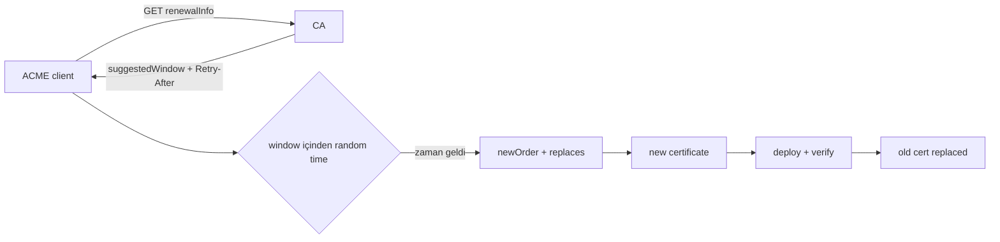
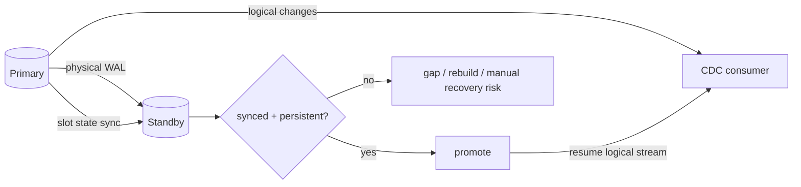

# 2026-09-23 10:00 — Interview Study Packages

README ve yakın `daily/2026-09-23/09-00.md` kontrol edildi. 09:00 turundaki sequence counters/seqlock ve property-based testing tekrar edilmiyor. Repo-wide aramada ACME Renewal Information (ARI) ve PostgreSQL logical replication failover slot synchronization için doğrudan canonical içerik bulunmadı.

## Paket 1 — Junior → Staff Cybersecurity / Cloud / SRE: ACME Renewal Information (ARI), Renewal Windows & Certificate Fleet Safety
**Süre:** 20–30 dk

### Konu anlatımı
TLS sertifikası yenilemek yalnızca `notAfter` tarihinden birkaç gün önce cron çalıştırmak değildir. Büyük certificate fleet'lerinde aynı ömür politikasına sahip sertifikalar aynı zaman aralığında yenilenmeye çalışırsa CA ve istemci tarafında renewal spike oluşabilir. Ayrıca CA bir incident veya mass-revocation öncesinde normalden erken renewal isteyebilir.

RFC 9773 ile standartlaşan ACME Renewal Information (ARI), CA'nın istemciye bir `suggestedWindow` vermesini sağlar. İstemci bu pencere içinden rastgele bir zaman seçerek renewal yükünü dağıtır. `Retry-After`, ARI bilgisinin ne zaman yeniden kontrol edilmesi gerektiğini belirtir. Yeni order'daki `replaces` alanı da yeni sertifikanın hangi eski sertifikayı değiştirdiğini CA'ya bildirir.

ARI bir availability primitive'idir: amaç yalnız sertifikayı yenilemek değil, milyonlarca certificate'ın yenileme zamanını koordine etmeden güvenli biçimde dağıtmaktır. Fallback schedule yine gerekir; ARI endpoint erişilemezse sertifika expiration'a sürüklenmemelidir.

### Mental model

**Invariant:** CA'nın önerdiği pencere scheduling sinyalidir; istemci expiration safety, retry/backoff ve fallback sorumluluğunu bırakmaz.

### İçeride ne oluyor?
1. ARI destekleyen ACME server Directory object içinde `renewalInfo` URL'si yayınlar.
2. Client certificate AKI keyIdentifier + serial number'dan renewal-info identifier üretir.
3. Server `suggestedWindow.start/end` döndürür; client pencere içinden uniform random bir zaman seçebilir.
4. `Retry-After` client'ın renewal bilgisini ne sıklıkla yeniden kontrol edeceğini yönlendirir.
5. Temporary error'larda bounded exponential backoff; uzun süreli hatalarda fallback check/renewal policy gerekir.
6. `replaces` eski-yeni certificate lifecycle'ını ilişkilendirir; incident/mass-revocation operasyonlarında değerlidir.

### Yüksek getirili mülakat soruları
- Sabit `expiry - 30 days` renewal neden büyük fleet'te risklidir?
- ARI `suggestedWindow` neyi çözer, neyi çözmez?
- Randomization neden yalnız optimization değil reliability tekniğidir?
- `Retry-After` ile exponential backoff nasıl birlikte çalışır?
- Senior: ARI endpoint 24 saat unavailable olursa client state machine nasıl davranmalı?
- Staff: milyonlarca cert için renewal SLO, CA rate limits ve emergency revocation planını nasıl tasarlarsın?

### Seviyeye göre cevap derinliği
- **Junior:** certificate expiration, ACME order ve renewal temelini açıklar.
- **Mid:** suggested window, jitter/randomization, Retry-After ve fallback'i ayırır.
- **Senior:** idempotency, persistent retry state, deployment verification ve clock skew'u tasarıma katar.
- **Staff:** fleet-wide renewal waves, CA dependency, incident response ve observability/SLO'ları birlikte ele alır.

### Kısa alıştırma
1 milyon sertifikanın tamamı 24 saatlik aynı sabit renewal anına yığılmak yerine 48 saatlik bir window'a uniform dağıtılsın. Ortalama request/s değerini hesapla; sonra gerçek kapasite planında neden yalnız ortalamanın yetmediğini açıklayıp jitter, retry storm ve CA error burst'ünü ekle.

### Proje fikri
`ari-renewal-sim`: certificate expiry, suggestedWindow, Retry-After, temporary/long-term error ve clock skew modelleyen küçük bir simulator yaz. 100k sanal certificate için fixed-date renewal ile randomized ARI scheduling'i peak RPS, expired-before-replacement ve retry count açısından karşılaştır.

### Failure modes / trade-off / production bağlantısı
ARI endpoint outage, bozuk window, clock skew, client'ın Retry-After'ı yok sayması, renewal başarılı olduğu halde deployment'ın başarısız olması ve retry storm temel failure mode'lardır. Çok sık ARI polling CA yükünü artırır; çok seyrek polling emergency window değişikliklerini geç öğrenir. Production'da `time_to_expiry`, `time_to_scheduled_renewal`, renewal success/error rate, replacement deployment success, ARI fetch latency/error, retry count ve cert-age histogram izlenmelidir.

### Kaynaklar
- RFC 9773 — ACME Renewal Information Extension (June 2025): https://www.rfc-editor.org/rfc/rfc9773.html
- RFC 8555 — Automated Certificate Management Environment (ACME): https://www.rfc-editor.org/rfc/rfc8555.html

---

## Paket 2 — Mid → Principal Databases / Distributed Systems: PostgreSQL Logical Replication Failover Slots & CDC Continuity
**Süre:** 20–30 dk

### Konu anlatımı
Logical replication/CDC consumer'ın ilerleme noktası yalnız WAL içinde değildir; replication slot hangi WAL ve catalog state'in hâlâ gerekli olduğunu temsil eder. Primary çöktüğünde standby'ı promote etmek database write availability'yi geri getirebilir, fakat logical slot state yeni primary'de yoksa CDC consumer güvenli continuation noktasını kaybedebilir.

PostgreSQL 18, failover-enabled logical slots'ın primary'den physical standby'a senkronize edilmesini destekler. Subscription/slot `failover=true` ile işaretlenir; standby'da `sync_replication_slots=true` slot-sync worker'ını etkinleştirir. Primary'deki `synchronized_standby_slots`, logical sender'ın consumer'a standby'ın henüz almadığı WAL'ı ilerletmesini önleyerek failover continuity için ordering constraint oluşturur.

Buradaki önemli ayrım şudur: slot'ın standby'da görünmesi tek başına readiness değildir. Failover anında gerekli slot persistent ve `synced=true` olmalı; required WAL/catalog rows standby'da bulunmalıdır. Ayrıca logical decoding crash sonrası bazı değişiklikleri tekrar gönderebilir; downstream consumer idempotency/dedup tasarımı yine gerekir.

### Mental model

**Invariant:** Consumer'ın logical progress'i standby'ın durable WAL/slot state'inin önüne güvenli biçimde geçmemelidir.

### İçeride ne oluyor?
1. Logical slot consumer progress ve required WAL/catalog horizon'u tutar; slot connection'dan bağımsız yaşar.
2. Failover slot primary'de `failover=true` olarak işaretlenir.
3. Standby `sync_replication_slots=true` ile failover slot state'ini periyodik senkronize eder.
4. Physical replication slot + `hot_standby_feedback` catalog/WAL continuity için önemlidir.
5. `synchronized_standby_slots`, logical sender'ın standby WAL receipt'ini beklemesini sağlayabilir; continuity karşılığında latency/availability coupling getirir.
6. Promotion öncesi `pg_replication_slots` üzerinde `synced`, persistence ve `invalidation_reason` kontrol edilmelidir.

### Yüksek getirili mülakat soruları
- Physical failover neden logical replication continuity'yi otomatik garanti etmez?
- Replication slot neyi saklar ve neden disk/WAL riski yaratır?
- `sync_replication_slots` ile `synchronized_standby_slots` farkı nedir?
- `synced=true` neden failover readiness için önemlidir?
- Senior: consumer standby'dan daha ilerideyse hangi correctness problemi oluşur?
- Principal: CDC RPO=0 hedefi için commit latency, standby health ve downstream availability arasında nasıl trade-off kurarsın?

### Seviyeye göre cevap derinliği
- **Mid:** WAL, logical slot, LSN ve CDC consumer progress'i açıklar.
- **Senior:** slot sync prerequisites, WAL retention, catalog xmin ve promotion readiness'i teşhis eder.
- **Staff:** multi-subscriber failover, backpressure, disk exhaustion ve runbook/observability tasarlar.
- **Principal:** RPO/RTO, synchronous coupling, regional topology ve downstream exactly-once/idempotency stratejisini birlikte değerlendirir.

### Kısa alıştırma
Consumer LSN=500, standby durable WAL=470 ve failover slot sync point=465 olsun. Primary aniden kaybolursa neden doğrudan promotion + resume güvenli değildir? `synchronized_standby_slots` kullanıldığında hangi ilerleme sınırının değişmesi gerektiğini çiz.

### Proje fikri
`pg-logical-failover-lab`: primary + physical standby + logical subscriber kur. Failover-enabled subscription oluştur; slot sync durumunu `pg_replication_slots` ile izle. Kontrollü workload sırasında promotion yap; duplicate/gap gözlemlerini LSN ile kaydet ve idempotent sink ile karşılaştır.

### Failure modes / trade-off / production bağlantısı
Stale/invalidated slot, WAL retention nedeniyle disk dolması, standby lag, `hot_standby_feedback` eksikliği, consumer'ın standby'dan öne geçmesi ve promotion öncesi readiness kontrolünün atlanması başlıca risklerdir. Daha güçlü synchronization continuity'yi artırırken logical delivery latency ve standby bağımlılığını artırabilir. Production'da slot `confirmed_flush_lsn`/`restart_lsn`, standby replay/flush lag, `synced`, `invalidation_reason`, retained WAL bytes, consumer lag, duplicate-event rate ve failover resume time izlenmelidir.

### Kaynaklar
- PostgreSQL 18 — Logical Replication Failover: https://www.postgresql.org/docs/18/logical-replication-failover.html
- PostgreSQL 18 — Logical Decoding / Replication Slot Synchronization: https://www.postgresql.org/docs/18/logicaldecoding-explanation.html
- PostgreSQL 18 — Replication Configuration (`synchronized_standby_slots`, `sync_replication_slots`): https://www.postgresql.org/docs/18/runtime-config-replication.html
