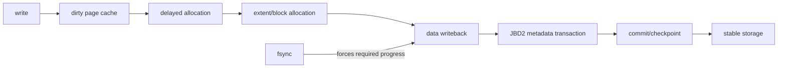
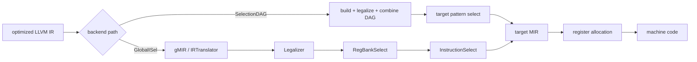

# 2026-09-23 11:00 — Interview Study Packages

README ve yakın `daily/2026-09-23/10-00.md` kontrol edildi. 10:00 turundaki ACME ARI ve PostgreSQL logical-replication failover slot konuları tekrar edilmiyor. Repo-wide dedup aramasında ELF/GOT/PLT, SSA/CFG, calling conventions ve pathname lookup'ın daha önce işlendiği görüldü. Bu tur iki temel boşluğu ilerletiyor: filesystem allocation/crash semantics ve compiler backend instruction selection.

## Paket 1 — Junior → Staff Foundations / Filesystems: ext4 Extents, Delayed Allocation, Journaling & `fsync()` Durability
**Süre:** 20–30 dk

### Konu anlatımı
Bir dosyaya `write()` dönmesi, byte'ların kalıcı medyada güvenli olduğu anlamına gelmez. Buffered I/O'da veri önce page cache'te dirty hale gelebilir. ext4 ayrıca **delayed allocation** ile logical file offset'leri için fiziksel blok seçimini writeback zamanına kadar erteleyebilir. Amaç daha büyük contiguous allocation kararları verip fragmentation ve metadata overhead'ini azaltmaktır.

ext4 büyük/contiguous bölgeleri tek tek block pointer'ları yerine **extent** olarak temsil eder: kabaca `(logical_start, physical_start, length)`. Dosya büyüdükçe extent tree lookup ve update maliyetini ölçekler. Allocation policy inode/data locality, block groups ve multiblock allocation ile birlikte çalışır.

**JBD2 journal** esas olarak metadata crash consistency sağlar. Default `data=ordered` modunda ilgili data blocks metadata commit'inden önce ana filesystem'e yazılmaya zorlanır; `data=writeback` bu ordering garantisini gevşetir, `data=journal` ise data+metadata'yı journal üzerinden geçirir ve daha yüksek maliyetlidir. Journal filesystem'i tutarlı tutmak ile uygulamanın son byte'larını durable yapmak aynı garanti değildir.

`fsync(fd)` uygulamanın durability protokolünün parçasıdır. Özellikle `temp -> fsync(temp) -> rename(temp, target) -> fsync(parent_dir)` modeli, yalnız `rename()` çağırmaktan daha güçlü crash semantics hedefler; dosya içeriğinin ve directory entry değişikliğinin persistence sınırlarını ayrı düşünmek gerekir.

### Mental model

**Invariant:** namespace consistency, file-data durability ve metadata durability aynı şey değildir; crash boundary'sinde hangi state'in kalıcı olması gerektiğini açıkça tanımla.

### İçeride ne oluyor?
1. Buffered write page cache'i dirty eder; block placement hemen yapılmak zorunda değildir.
2. Delayed allocation writeback'e yakın zamanda fiziksel blokları seçerek daha iyi locality/contiguity fırsatı yaratır.
3. Extent tree logical range'i physical range'e map eder; sparse file/hole ile allocated range'i ayırmak gerekir.
4. JBD2 transaction descriptor/data-or-metadata records ve commit record ile crash replay sınırı oluşturur.
5. `data=ordered` metadata journal commit'inden önce ilişkili dirty data'nın ana filesystem'e gitmesini ister; bu, her application-level update'in atomik olduğu anlamına gelmez.
6. `fsync()` latency'si dirty-data writeback, allocation, journal commit ve storage flush/FUA davranışlarından etkilenebilir.

### Yüksek getirili mülakat soruları
- `write()` başarılı döndüğünde hangi durability garantileri yoktur?
- Extent, block pointer modeline göre neden ölçeklenebilir?
- Delayed allocation throughput/fragmentation'ı nasıl iyileştirir; crash ve ENOSPC davranışını nasıl şaşırtabilir?
- Journaling neden database transaction ile aynı şey değildir?
- Senior: atomic config-file replace için neden file `fsync` yanında parent-directory `fsync` düşünürsün?
- Staff: p99 `fsync` latency spike'ını page cache, journal, block layer ve device telemetry ile nasıl ayırırsın?

### Seviyeye göre cevap derinliği
- **Junior:** page cache, inode, block, extent, writeback ve `fsync` kavramlarını ayırır.
- **Mid:** delayed allocation, fragmentation, journaling modes ve rename/durability sınırını açıklar.
- **Senior:** crash-consistency protocol, ENOSPC-late-allocation, ordering ve storage flush semantiğini tartışır.
- **Staff:** workload/fs choice, latency tails, observability, failure injection ve application durability contract'ını birlikte tasarlar.

### Kısa alıştırma
Bir program `write(temp) -> close(temp) -> rename(temp, live)` yapıyor. Power loss'ı her adım arasına yerleştirip olası state'leri yaz. Sonra protokolü `fsync(temp)` ve parent directory `fsync` ile güçlendir; hangi garanti için hangi syscall'ın gerekli olduğunu belirt.

### Proje fikri
`crash-safe-writer-lab`: aynı key/value snapshot'ını üç stratejiyle yaz: doğrudan overwrite, temp+rename, temp+fsync+rename+directory-fsync. Loopback ext4 image üzerinde fault/reboot testleri ve `filefrag`, `strace`, `fio`/latency ölçümleriyle extent sayısı, correctness ve p99 sync maliyetini karşılaştır.

### Failure modes / trade-off / production bağlantısı
Delayed allocation yüzünden ENOSPC write anından sonra görülebilir; fragmentation extent sayısını büyütebilir; journal/device stalls `fsync` tail latency'sini yükseltebilir; yanlış durability varsayımı zero-length/eski dosya gibi crash sonuçları üretebilir. Daha sık sync RPO'yu düşürür fakat throughput ve device wear/latency maliyetini artırır. Production'da dirty/writeback pressure, disk free space, ext4 delayed-allocation blocks, journal/IO latency, device errors ve application commit latency birlikte izlenmelidir.

### Kaynaklar
- Linux kernel — ext4 General Information: https://docs.kernel.org/admin-guide/ext4.html
- Linux kernel — ext4 Block and Inode Allocation Policy: https://docs.kernel.org/filesystems/ext4/allocators.html
- Linux kernel — ext4 Journal (JBD2): https://docs.kernel.org/filesystems/ext4/journal.html
- Linux man-pages — `fsync(2)`: https://man7.org/linux/man-pages/man2/fsync.2.html

---

## Paket 2 — Mid → Principal Foundations / Compiler: Instruction Selection, Legalization, SelectionDAG & GlobalISel
**Süre:** 20–30 dk

### Konu anlatımı
Compiler middle-end optimize edilmiş target-independent IR üretince iş bitmez. Backend bu IR semantiğini hedef ISA'nın gerçekten desteklediği instruction, register class ve operand constraints'e indirmelidir. **Instruction selection (ISel)**, IR operasyonlarını target-specific machine instruction'lara eşleme problemidir; ancak eşlemeden önce/etrafında **legalization** gerekir: target'ın doğrudan desteklemediği type veya operation'lar desteklenen parçalara genişletilir, daraltılır ya da dönüştürülür.

LLVM'de klasik yol **SelectionDAG**'dır: basic-block ölçeğinde data/control dependency DAG'leri oluşturulur, types/operations legalize edilir, DAG combine ve pattern matching ile target instruction'ları seçilir. Target description/TableGen birçok mapping'i declarative pattern'lerden üretir.

**GlobalISel** alternatif pipeline'dır. LLVM IR, `IRTranslator` ile generic Machine IR'a (gMIR) çevrilir; `Legalizer`, `RegBankSelect` ve `InstructionSelect` aşamalarından geçerek target-specific MIR'a iner. Whole-function representation ve reusable pipeline, SelectionDAG'ın ayrı IR/temel-block granularity maliyetlerinin bir kısmını azaltmayı hedefler. Instruction selection ile register allocation'ı karıştırma: ISel hangi machine operations'ın kullanılacağını seçer; register allocation daha sonra virtual register'ları sınırlı physical register'lara yerleştirir/spill eder.

### Mental model

**Invariant:** selected instruction sequence source/IR semantics'ini korumalı ve target'ın type, opcode, register ve ABI constraints'ine legal biçimde uymalıdır.

### İçeride ne oluyor?
1. Target-independent IR, ISA'da birebir opcode bulamayabilir; örneğin unsupported width/division/vector operation expansion isteyebilir.
2. Legalization unsupported operation/type'ı target'ın gerçekleştirebileceği forma dönüştürür.
3. SelectionDAG dependency graph üzerinde combine ve target patterns kullanır; memory side effects ordering dependency'leri gerektirir.
4. GlobalISel generic MIR üzerinden IRTranslator → Legalizer → RegBankSelect → InstructionSelect pipeline'ını kullanır.
5. Pattern selection yalnız opcode çevirisi değildir: addressing modes, fused operations ve immediate constraints code quality'yi etkiler.
6. ISel sonrası scheduling/register allocation/peephole gibi aşamalar son codegen kalitesini değiştirmeye devam eder.

### Yüksek getirili mülakat soruları
- Instruction selection ile register allocation arasındaki sınır nedir?
- Legalization neden gerekir? `i64` işlemi 32-bit target'ta nasıl ele alınabilir?
- SelectionDAG neden DAG kullanır; side effects nasıl temsil edilmelidir?
- Addressing-mode folding neden performans/code-size açısından değerlidir?
- Senior: pattern doğru semantics üretmesine rağmen neden kötü codegen üretebilir?
- Principal: yeni target backend'inde compile time, generated-code quality, fallback ve maintainability ölçümlerini nasıl kurarsın?

### Seviyeye göre cevap derinliği
- **Mid:** IR→ISel→MIR→register allocation→machine code zincirini ve legalization ihtiyacını açıklar.
- **Senior:** target patterns, addressing modes, combine, legality ve code-size/latency trade-off'larını tartışır.
- **Staff:** backend regression triage, MIR/assembly diff, target feature gating ve benchmark methodology kurar.
- **Principal:** selector architecture, declarative-vs-custom lowering, compile-time budget, target coverage ve long-term backend maintenance stratejisini değerlendirir.

### Kısa alıştırma
`y = a*b + c` için iki target düşün: A'da FMA var, B'de yok. Semantics'in floating-point contraction kurallarına bağlı olduğunu not ederek olası IR→machine mapping'leri çiz. Ardından 64-bit multiply'ın native olmadığı 32-bit target'ta legalization'ın hangi ek operasyonları gerektirebileceğini tartış.

### Proje fikri
`isel-observer`: 5–10 küçük C/C++ fonksiyonunu Clang/LLVM ile farklı `-O` ve target seçeneklerinde derle. LLVM IR, MIR ve assembly snapshot'larını sakla; multiply-add, shifts, compares ve addressing-mode örneklerinde hangi dönüşümün ISel/legalization, hangisinin register allocation sonrası olduğunu annotate et. Compiler upgrade'lerinde diff tabanlı regression raporu üret.

### Failure modes / trade-off / production bağlantısı
Yanlış legality tanımı miscompile'a; eksik pattern gereksiz instruction sequence'larına; aşırı pahalı matching compile-time regression'a; target-feature hatası illegal instruction crash'ine yol açabilir. Daha agresif combining code quality'yi artırırken compile time/debuggability maliyeti getirebilir. Production'da compiler upgrade'leri correctness tests, differential/fuzz testing, build time, binary size ve representative CPU benchmark'larıyla canary edilmelidir.

### Kaynaklar
- LLVM — Target-Independent Code Generator: https://llvm.org/docs/CodeGenerator.html
- LLVM — Global Instruction Selection: https://llvm.org/docs/GlobalISel/index.html
- LLVM — GlobalISel InstructionSelect: https://llvm.org/docs/GlobalISel/InstructionSelect.html
- LLVM — Writing an LLVM Backend: https://llvm.org/docs/WritingAnLLVMBackend.html
