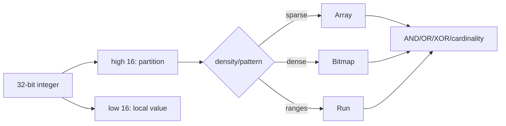

# Roaring Bitmaps, Container Switching & Set-Operation Economics

## Konu anlatımı
Bitmap integer set üyeliğini bit pozisyonuyla temsil eder. Dense domain'de membership ve AND/OR/XOR hızlıdır; sparse geniş domain'de düz bitmap boş alan için gereksiz memory harcar. Roaring Bitmap 32-bit integer uzayını üst 16 bit'e göre partition eder; alt 16-bit değerleri local density/pattern'a göre array, bitmap veya run container'da tutar.

Bu yaklaşımın ana fikri tek compression formatı değil, local representation selection'dır. Sparse partition sorted array, dense partition fixed bitmap, uzun contiguous range ise run container ile ekonomik olabilir. Set operations container-type çiftine göre specialized algorithm seçer; bitmap-bitmap path word/SIMD ve popcount'tan, array-array path merge-style traversal'dan yararlanır.

## Mental model

**Invariant:** compression ratio ile operation speed aynı hedef değildir; container choice workload density ve operation mix'ine bağlıdır.

## İçeride ne oluyor?
- High 16 bits container key, low 16 bits local member'dır.
- Array container sparse sorted values için compact'tır.
- Bitmap container 2^16 membership bit'i ile dense partition'larda hızlı word operations sağlar.
- Run container uzun contiguous ranges için avantajlıdır.
- Dispatch array-array, array-bitmap, bitmap-bitmap gibi specialized path seçer.
- Cardinality metadata, serialization ve cache locality query-engine performansını etkiler.

## Yüksek getirili mülakat soruları
1. Hash set yerine bitmap ne zaman daha iyi olur?
2. Sparse 32-bit domain'de düz bitmap neden pahalıdır?
3. Roaring neden high/low partitioning kullanır?
4. Array→bitmap dönüşümü hangi trade-off'u taşır?
5. Array-array ve bitmap-bitmap intersection nasıl farklıdır?
6. Senior: CPU/cache locality'yi nasıl benchmark edersin?
7. Staff: posting list, hash set ve Roaring arasında nasıl seçim yaparsın?
8. Staff: distributed bitmap index merge/partitioning maliyetini nasıl yönetirsin?

## Seviyeye göre cevap derinliği
- **Junior:** bitset, membership ve set operations.
- **Mid:** sparse/dense representation ve switching.
- **Senior:** SIMD/popcount, cache locality, serialization ve operation mix.
- **Staff:** query/index architecture, distributed partitioning ve memory/CPU economics.

## Kısa alıştırma
A={1,2,3,4}, B={2,4,65000}, C=0..60000 için düz bitmap, sorted array ve Roaring storage davranışını karşılaştır. `A∩B` ve `C∩B` için hangi representation'ın avantajlı olduğunu açıkla.

## Proje fikri
`roaring-index-lab`: 10M integer ID için hash set, sorted vector ve Roaring inverted index benchmark'ı. Membership/intersection/union/cardinality için bytes/value, p50/p99, CPU cycles ve cache misses ölç.

## Failure modes / trade-off / production bağlantısı
Her sparse set için bitmap kullanmak, yalnız compression ratio ölçmek, conversion cost'u yok saymak, density shift test etmemek ve serialization compatibility'yi düşünmemek tipik hatalardır. Production'da bytes/cardinality, container distribution, set-op latency, cache miss, allocation ve serde cost izlenir.

## Kaynaklar
- https://arxiv.org/abs/1709.07821
- https://github.com/RoaringBitmap/CRoaring
- https://roaringbitmap.org/
