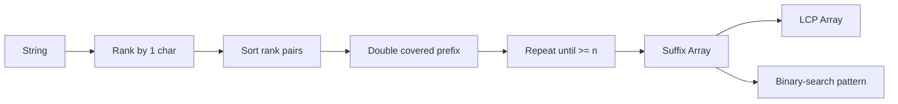

# Suffix Array, LCP & Substring Search

## Konu anlatımı
Suffix array (SA), bir string'in bütün suffix'lerini materialize etmek yerine lexicographic sıradaki başlangıç index'lerini tutar. Böylece pattern lookup sorted suffix'ler üzerinde binary search problemine dönüşür ve index storage `O(n)` olur.

`banana` örneği:
```text
index  suffix
5      a
3      ana
1      anana
0      banana
4      na
2      nana
SA = [5,3,1,0,4,2]
```

Komşu suffix'lerin longest common prefix uzunluğunu tutan LCP array repeated-substring gibi soruları kolaylaştırır. Interview-friendly construction yöntemi prefix doubling'dir: 1 karakterlik rank'lerden başlanır; 2, 4, 8... uzunluklu prefix'ler önceki rank çiftleriyle sıralanır.



## Mental model
Suffix array = **string'in bütün başlangıç noktalarının alfabetik index'i**. Ordered database index range lookup'a nasıl yardım ediyorsa suffix order da substring/prefix lookup'a yardım eder.

## İçeride ne oluyor?
1. Her suffix başlangıcı ilk karakterine göre rank alır.
2. Uzunluğu `2k` olan prefix `(rank[i], rank[i+k])` çiftiyle temsil edilir.
3. Çiftler sıralanır; eşit çiftler aynı yeni rank'i alır.
4. `k` iki katına çıkar. Comparison-sort tabanlı basit yaklaşım yaklaşık `O(n log² n)`, integer rank sorting ile `O(n log n)` varyantı elde edilebilir.
5. Pattern araması SA üzerinde lower/upper-bound benzeri binary search ile yapılır; suffix-pattern comparison maliyeti pattern uzunluğuna bağlıdır.
6. Kasai algoritması inverse-rank ve önceki LCP bilgisini kullanarak LCP array'i `O(n)` zamanda kurar.

## Yüksek getirili mülakat soruları
1. Suffix array ne saklar; suffix tree'den farkı nedir?
2. `banana` için SA'yı elle çıkar.
3. Pattern lookup neden binary search olabilir?
4. Prefix doubling'de rank çifti neden yeterlidir?
5. LCP array neyi temsil eder?
6. Longest repeated substring SA+LCP ile nasıl bulunur?
7. Suffix array ile suffix automaton'u immutable corpus, online update ve memory locality açısından karşılaştır.
8. Unicode normalization ve byte/code-point semantics hangi correctness risklerini yaratır?

## Seviyeye göre cevap derinliği
- **Junior:** suffix, lexicographic order ve binary-search fikrini anlat.
- **Mid:** prefix-doubling invariant'ını ve complexity'yi savun.
- **Senior/Staff:** LCP, construction cost, cache locality, immutable-vs-online workload ve encoding trade-off'larını production tasarımına bağla.

## Kısa alıştırma
`mississippi` için ilk iki prefix-doubling turunun rank çiftlerini çıkar. Hazır SA üzerinde `issi` eşleşme interval'ini iki binary search ile bulacak pseudocode yaz. Bonus: maksimum LCP'nin longest repeated substring uzunluğunu verdiğini açıkla.

## Proje fikri
`tiny-text-index`: byte semantics'i açıkça tanımlayan prefix-doubling SA, Kasai LCP ve `find(pattern)` uygula. Naif scan ile differential correctness test yap; build time, index bytes/character ve query p50/p99 ölç.

## Failure modes / trade-off / production bağlantısı
Suffix string'lerini kopyalamak memory'yi büyütür. Comparator içinde uzun ortak prefix'leri tekrar taramak construction maliyetini artırır. Unicode normalization kararı belirtilmezse semantic bug oluşur. SA static corpus'ta kompakt/cache-friendly olabilir; sık online update'te rebuild maliyeti nedeniyle başka yapılar daha uygundur. Genomics, text search ve compressed full-text indexing suffix-order fikrinden yararlanır.

## Kaynaklar
- Manber & Myers — Suffix Arrays: A New Method for On-Line String Searches: https://www.cs.cmu.edu/~guyb/realworld/papersS04/ManberMyers.pdf
- Kasai et al. — Linear-Time Longest-Common-Prefix Computation: https://doi.org/10.1007/3-540-48194-X_17
- MUMmer4 project/paper: https://www.cs.cmu.edu/~gmarcais/publication/mummer4/
