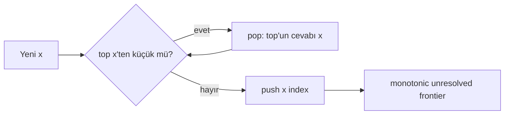

# Monotonic Stack, Next-Greater Queries & Amortized Analysis

## Neden var?
Bir dizide her elemanın sağ/sol tarafındaki ilk daha büyük veya daha küçük sınırı naif biçimde aramak `O(n²)` olabilir. Monotonic stack, henüz çözülmemiş adayları monoton bir frontier halinde tutarak bu boundary sorgularını tek geçişte `O(n)` toplam maliyetle çözer.

## Mental model

Her indeks en fazla bir push ve bir pop gördüğü için içte `while` olsa da toplam operasyon sayısı lineerdir.

## Temel uygulama fikri
Next Greater Element için stack'te cevap bekleyen indeksleri azalan değer düzeninde tut. Yeni `a[i]`, `a[stack.top]` değerinden büyük olduğu sürece pop et ve pop edilen indeksin cevabını `i` yap. Sonra `i`'yi push et.

İndeks tutmak value tutmaktan genellikle daha güçlüdür: hem değere hem distance/boundary bilgisine erişilir. Strict (`<`) ve non-strict (`<=`) karşılaştırma duplicate semantiğini değiştirir; mülakatta bu tercih açıkça belirtilmelidir.

## Amortized analysis
Tek bir `i` adımında stack'in büyük kısmı boşalabilir. Buna rağmen bir eleman pop edildikten sonra tekrar stack'e dönmez. Aggregate analysis ile en fazla `n` push + `n` pop vardır; dolayısıyla stack işi `O(n)`, ek alan `O(n)` olur.

## Nerelerde tekrar eder?
- Next greater / next smaller element
- Daily temperatures
- Stock span
- Largest Rectangle in Histogram
- Previous/next boundary hesapları
- Bazı visibility ve contribution-counting problemleri

Monotonic queue farklıdır: sliding-window min/max için expired elemanları önden, dominated elemanları arkadan çıkarır.

## Mülakat soruları
1. Next Greater Element'i `O(n)` çöz.
2. Nested `while` neden `O(n²)` değildir?
3. Duplicate değerlerde `<` ile `<=` farkı nedir?
4. Histogram probleminde pop edilen barın width'i nasıl bulunur?
5. Ne zaman monotonic stack yerine segment tree gerekir?

## Seviye beklentisi
- **Junior:** temel stack çözümünü kodlar.
- **Mid:** invariant ve amortized complexity'yi açıklar.
- **Senior:** histogram gibi boundary problemlerine transfer eder, off-by-one/duplicate riskini yönetir.
- **Staff:** offline/static varsayımları dynamic range-query veri yapılarıyla kıyaslar.

## Mini alıştırma
`[2,1,2,4,3]` için next-greater indekslerini çıkar; sonra semantiği “greater-or-equal” yap ve duplicate testleri ekle.

## Proje fikri
`monotonic-pattern-lab`: brute-force oracle ile monotonic-stack çözümlerini random inputlarda karşılaştır; push/pop sayacını ölçerek lineer aggregate bound'u deneysel göster.

## Failure modes / production
Strict/non-strict kıyaslamayı yanlış seçmek, index/value karıştırmak, stack'i finalde flush etmemek ve histogram width'inde off-by-one yapmak tipik hatalardır. Static batch boundary analizlerinde çok etkilidir; point update + arbitrary online range query varsa segment tree/Fenwick gibi yapılar daha uygun olabilir.

## Kaynaklar
- CLRS: https://mitpress.mit.edu/9780262046305/introduction-to-algorithms/
- MIT OCW 6.006: https://ocw.mit.edu/courses/6-006-introduction-to-algorithms-fall-2011/
