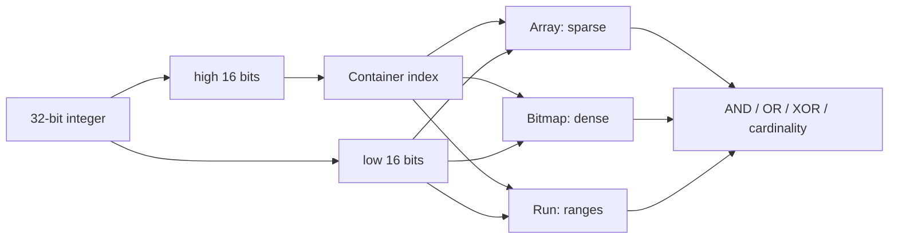

# Roaring Bitmaps, Cardinality & Set-Operation Economics

## Problem
Hash set üyelik için esnektir; plain bitset ise yoğun integer universe üzerinde çok kompakt ve hızlı set operasyonları sağlar. Gerçek veride sparse ve dense bölgeler birlikte bulunabilir. Roaring Bitmap bu iki rejimi container bazında birleştirir.

## Mental model

32-bit value high/low parçalara ayrılır. High bits container'ı seçer; low bits container içinde saklanır. Sparse container sorted array, dense container 65,536-bit bitmap, uzun ardışık değerler run representation kullanabilir.

**Invariant:** yalnız compression ratio optimize edilmez; set-operation throughput, cache/SIMD davranışı ve representation conversion maliyeti de önemlidir.

## İçeride ne oluyor?
- Container partitioning operasyonları yalnız ortak high-key container'lara indirger.
- Array-array intersection sıralı liste algoritmalarıyla yapılabilir.
- Bitmap-bitmap intersection word-level AND + popcount/SIMD için uygundur.
- Density yükselince array→bitmap conversion lookup ve set-operation hızını artırabilir, fakat sabit bitmap memory maliyeti getirir.
- Run container uzun aralıklarda güçlüdür; rastgele sparse data'da ek metadata yararsız olabilir.
- Yalnız cardinality isteyen query'de sonucu materialize etmeden saymak allocation ve memory bandwidth tasarrufu sağlar.

## Mülakat soruları
1. Bitset, sorted array ve hash set hangi density rejimlerinde avantajlıdır?
2. Roaring neden high/low bit partition kullanır?
3. Array-array ve bitmap-bitmap intersection nasıl farklı uygulanır?
4. Senior: conversion threshold'u nasıl benchmark edersin?
5. Staff: bitmap index'i query planner, segment pruning ve distributed aggregation ile nasıl bağlarsın?
6. Staff: serialization compatibility neden production concern'dür?

## Seviye beklentileri
- **Junior:** bitset, sparse set, AND/OR ve cardinality kavramlarını açıklar.
- **Mid:** container partitioning ve array/bitmap trade-off'unu anlatır.
- **Senior:** cache locality, SIMD, allocation, run compression ve workload benchmark'ını tartışır.
- **Staff:** index lifecycle, serialization, distributed merge ve storage/CPU ekonomisini tasarlar.

## Alıştırma
A={1,2,3,65537,65538}, B={2,3,4,65538,131072}. High16 container'larını ayır; intersection/union'ın hangi container çiftlerine dokunduğunu göster. 0..65535 universe'te %1 ve %90 density için array ile 8 KiB bitmap memory sezgisini karşılaştır.

## Proje
`bitmap-index-lab`: 10 milyon integer üzerinde HashSet, sorted array, plain bitset ve Roaring'ı membership, AND, OR, cardinality, serialized bytes ve RSS açısından karşılaştır. Uniform-random, clustered ve long-run distribution kullan.

## Failure modes / production
Yalnız compression ratio ölçmek, temsili olmayan benchmark, conversion churn, mutable/immutable API farkını kaçırmak, serialization version'ını pinlememek ve result materialization maliyetini query cost modeline katmamak tipik hatalardır. Search/analytics bitmap index'leri, access-control set'leri ve large-scale filtering yaygın production bağlantılarıdır. İzle: bytes/cardinality, container mix, operation latency, allocation rate ve merge cost.

## Kaynaklar
- Lemire et al., Roaring Bitmaps: Implementation of an Optimized Software Library: https://doi.org/10.1002/spe.2560
- Preprint: https://arxiv.org/abs/1709.07821
- Lemire et al., Consistently faster and smaller compressed bitmaps with Roaring: https://doi.org/10.1002/spe.2402
- Roaring Bitmap project: https://roaringbitmap.org/
