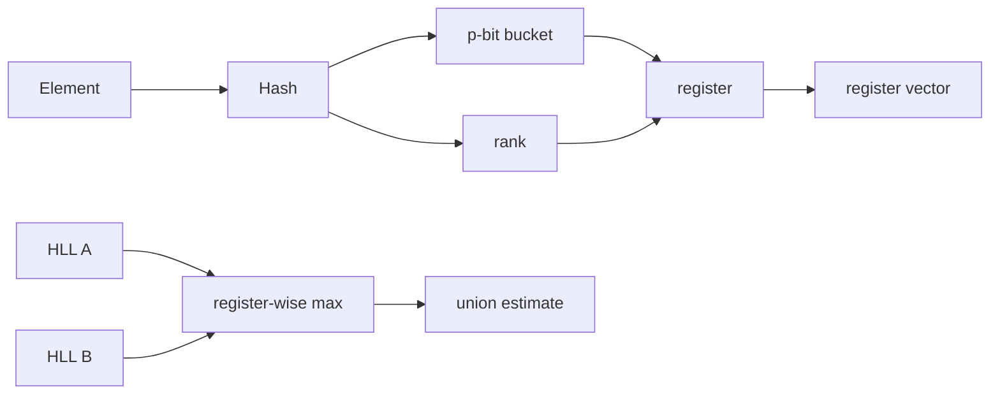

# HyperLogLog, Approximate Cardinality & Mergeable Sketches

## Neden önemli?
Exact distinct-count büyük veri ve dağıtık sistemlerde memory/shuffle maliyetini hızla büyütebilir. HyperLogLog (HLL), elemanları saklamadan hash bit örüntülerinden yaklaşık cardinality tahmin eder ve sabit/bounded memory ile merge edilebilir bir sketch sağlar.

## Mental model

**Elemanları değil, nadir hash olaylarının özetini sakla.** HLL membership testi yapmaz ve elemanları geri vermez.

## İçeride ne oluyor?
- `m=2^p` register kullanılır; hash'in prefix'i register seçer, kalan bitlerdeki ilk 1'in pozisyonu rank olur.
- Register, gördüğü en büyük rank'i tutar. Çok uzun rank nadir olduğundan cardinality hakkında istatistiksel sinyal taşır.
- Precision büyüdükçe memory artar, standard error yaklaşık `1/sqrt(m)` ölçeğinde azalır.
- Aynı hash contract ve precision'a sahip sketch'ler register-wise `max` ile merge edilebilir.
- Sparse encoding küçük cardinality'de memory kazandırabilir; dense vector yüksek cardinality'de daha uygun olur.
- Intersection doğrudan HLL primitive'i değildir; inclusion-exclusion küçük intersection'larda relative error'ı büyütebilir.

## Mülakat soruları
1. Exact set yerine HLL ne zaman seçilir?
2. Leading-zero/rank neden cardinality sinyalidir?
3. Precision-memory-error ilişkisi nedir?
4. Merge neden register-wise max'tir?
5. Günlük ve 30 günlük unique user metriğini nasıl tasarlarsın?
6. Hash-version migration sırasında eski/yeni sketch'leri nasıl yönetirsin?

## Beklenen cevap seviyesi
- **Junior:** approximate vs exact ve distinct-count problemini açıklar.
- **Mid:** bucket/register/rank ve merge modelini kurar.
- **Senior:** precision, sparse/dense, intersection error ve distributed aggregation trade-off'larını tartışır.
- **Staff:** versioned sketch contract, hash migration, data quality ve accuracy budget tasarlar.

## Mini alıştırma
`p=3` ile sekiz register oluştur. Örnek hash'leri bucket/rank'e ayır, register vector üret ve ikinci vector ile elementleri yeniden okumadan union hesapla.

## Proje fikri
`hll-stream-lab`: exact set ile HLL'yi 1K, 100K ve 10M distinct değer simülasyonunda memory, throughput ve relative error açısından karşılaştır. Shard sketch'lerini merge et ve hash-version metadata'sı ekle.

## Failure modes / trade-off
- Exact değer gereken billing/security kararında approximate sketch kullanmak.
- Farklı precision/hash seed'lerini merge etmek.
- Cardinality sketch'ini membership kanıtı sanmak.
- Küçük intersection'ı inclusion-exclusion ile aşırı güvenle tahmin etmek.
- Metric semantics değiştiğinde eski/yeni sketch'leri karıştırmak.

## Production bağlantısı
Unique visitor, unique device, distinct query, telemetry label cardinality ve streaming analytics gibi alanlarda kullanılır. `sketch_version`, precision, estimated cardinality, sampled exact-vs-estimate error, merge failure ve sparse→dense dönüşümü izlenebilir.

## Kaynaklar
- Flajolet et al., *HyperLogLog: the analysis of a near-optimal cardinality estimation algorithm*: https://algo.inria.fr/flajolet/Publications/FlFuGaMe07.pdf
- Redis HyperLogLog: https://redis.io/docs/latest/develop/data-types/probabilistic/hyperloglogs/
- Redis PFCOUNT: https://redis.io/docs/latest/commands/pfcount/
