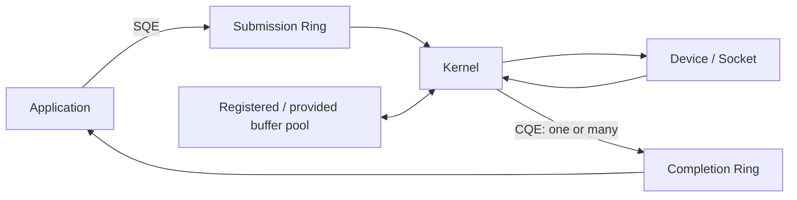

# io_uring Multishot I/O, Registered Buffers & Backpressure

## Konu anlatımı
Linux `io_uring`, shared submission/completion ring'leri üzerinden userspace ile kernel arasında düşük-overhead async I/O akışı kurar. Temel correctness konusu hız değil; queue ownership, buffer lifetime, bounded in-flight work ve cancellation/backpressure invariant'larıdır.

Multishot operation tek submission'ın zaman içinde birden fazla completion üretmesine izin verir. Accept/receive veya kernel-userspace request stream'lerinde submission churn'ünü azaltabilir. Registered/fixed buffers memory registration/pinning maliyetini amortize edebilir; provided-buffer pool ise uygun operasyonlarda kernel'in hazır buffer havuzundan seçim yapmasını sağlar. Pinned memory sınırsız değildir ve resource budget olarak ele alınmalıdır.

## Mental model

**Invariant:** completion gelene kadar kernel'in erişebildiği buffer güvenli lifecycle'da kalır; multishot daha az submission üretir ama sınırsız concurrency hakkı vermez.

## İçeride ne oluyor?
- SQE operasyonu tanımlar; CQE completion sonucunu taşır.
- Multishot request tek SQE'den birden fazla CQE üretebilir; consumer request'in sona erip ermediğini completion semantics/flags ile ayırır.
- Fixed/registered buffer tekrar eden registration maliyetini azaltabilir.
- Provided-buffer pool allocation/copy overhead'ini azaltan pattern'lerde kullanılabilir.
- Queue depth throughput, tail latency ve memory pressure arasında trade-off'tur.
- Slow downstream karşısında admission/backpressure uygulanmazsa ring dışındaki application queue'ları patlayabilir.
- Cancellation, timeout, graceful shutdown ve stale completion path'leri happy-path kadar önemlidir.

## Mülakat soruları
1. Submission/completion ring mental modeli nedir?
2. Multishot neden submission overhead'ini azaltabilir?
3. Tek request birden fazla CQE üretiyorsa lifecycle nasıl takip edilir?
4. Registered buffer'ın faydası ve riski nedir?
5. Queue depth neden sadece büyütülmez?
6. Senior: slow disk/network için backpressure nereye konur?
7. Staff: cancellation, timeout, graceful shutdown ve buffer ownership nasıl test edilir?

## Beklenen cevap seviyesi
- **Junior:** async submission/completion ve buffer lifetime.
- **Mid:** queue depth, multishot, fixed/provided buffer ve backpressure.
- **Senior:** cancellation race, partial completion, memory pinning ve tail latency.
- **Staff:** workload benchmark, fallback/compatibility, observability ve rollout.

## Mini alıştırma
TCP server için `accept -> recv -> process -> send` pipeline çiz. Maksimum 4096 in-flight connection, 512 provided buffer ve bounded downstream worker queue tanımla. Buffer exhaustion, cancellation ve shutdown davranışını belirt.

## Proje fikri
`uring-backpressure-lab`: blocking server ile io_uring server'ı aynı protocol üzerinde karşılaştır. Concurrency, queue depth ve buffer pool size sweep et; throughput, p50/p99 latency, CPU, context switch, memory/pinned-buffer ve cancellation correctness ölç.

## Failure modes / trade-off / production bağlantısı
Completion öncesi buffer reuse, CQ'yu yeterince drain etmemek, unbounded in-flight I/O, pinned-memory budget'ını yok saymak, cancellation sonrası stale completion'ı yanlış request'e bağlamak ve microbenchmark sonucunu production'a genellemek tipik hatalardır. SQ/CQ occupancy, in-flight count, buffer utilization/exhaustion, submit-to-complete latency, cancellation/timeout, error dağılımı, CPU/syscall/context-switch ve downstream saturation izlenir.

## Kaynaklar
- Linux kernel — io_uring: https://docs.kernel.org/io_uring/index.html
- Linux kernel — FUSE over io_uring / buffer pools: https://kernel.org/doc/html/latest/filesystems/fuse/fuse-io-uring.html
- Linux kernel — ublk batch I/O / multishot + provided buffers: https://docs.kernel.org/block/ublk.html
- io_uring man page: https://man7.org/linux/man-pages/man7/io_uring.7.html
