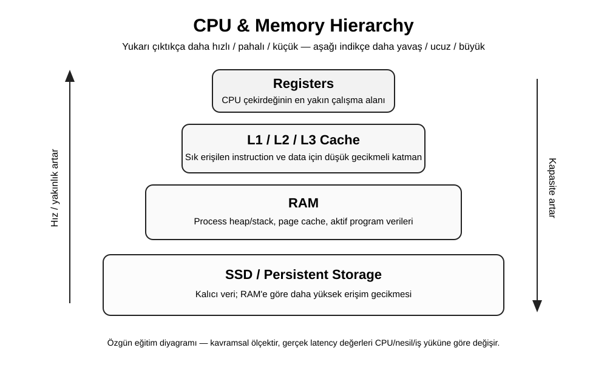

# 01 — CPU, Cache ve Memory Hierarchy



Bu bölümün amacı CPU'yu elektronik devre seviyesinde ezberletmek değil; yazılım performansını, concurrency'yi, cache davranışını ve sistem tasarımındaki latency farklarını anlayacak kadar sağlam bir mental model kurmaktır.

## 1. Büyük fikir

Bir program çalışırken kabaca şu döngü tekrar eder:

```text
instruction getir → decode et → execute et → sonucu yaz → sonraki instruction
```

CPU çok hızlıdır; fakat ihtiyaç duyduğu veri her zaman aynı hızda gelmez. Bu yüzden modern bilgisayarlarda bir **memory hierarchy** vardır:

```text
Registers
   ↓
L1 cache
   ↓
L2 cache
   ↓
L3 cache
   ↓
RAM
   ↓
SSD / persistent storage
```

Genel eğilim: CPU'ya yaklaştıkça erişim daha hızlı fakat kapasite daha küçük ve bit başına maliyet daha yüksektir.

## 2. Register nedir?

Register, CPU çekirdeğinin doğrudan kullandığı çok küçük ve çok hızlı çalışma alanıdır. Arithmetic işlemlerde operandlar, adresler veya ara sonuçlar register'larda bulunabilir.

Örneğin kavramsal olarak:

```text
R1 = 10
R2 = 20
R3 = R1 + R2
```

Gerçekte instruction set architecture'a göre farklı register türleri bulunur: general-purpose registers, instruction pointer/program counter, stack pointer, flags gibi.

### Mülakat sorusu

**Soru:** “RAM varken neden register'a ihtiyaç var?”

**İyi cevap:** CPU'nun her basit işlemde ana belleğe gitmesi çok pahalı olurdu. Register'lar execution unit'lere çok yakın, küçük ve düşük gecikmeli çalışma alanlarıdır.

---

## 3. CPU cache neden var?

CPU ile RAM arasında büyük bir hız farkı vardır. Cache bu farkı azaltmaya çalışır.

Programların iki önemli davranışından yararlanılır:

- **Temporal locality:** Yakın zamanda kullandığın veriyi tekrar kullanma ihtimalin yüksektir.
- **Spatial locality:** Bir adrese eriştiysen yakın adreslere de erişme ihtimalin yüksektir.

Örneğin bir array'i sırayla dolaşmak CPU cache açısından genellikle avantajlıdır:

```c
for (int i = 0; i < n; i++) {
    sum += arr[i];
}
```

Çünkü ardışık elemanlar aynı veya komşu cache line'lar içinde bulunabilir.

## 4. Cache line

CPU cache çoğunlukla tek byte'lar halinde değil, bloklar/cache line'lar halinde veri taşır. Bu nedenle data layout performansı etkileyebilir.

Bu yüzden aşağıdaki iki algoritma teorik Big-O açısından aynı olsa bile gerçek makinede farklı performans gösterebilir:

```text
A) Memory'de ardışık erişim
B) Memory'de rastgele erişim
```

Bu, “Big-O her şeyi açıklamaz” denmesinin önemli örneklerinden biridir.

---

## 5. Cache hit / miss

CPU aradığı veriyi cache'te bulursa **cache hit**, bulamazsa **cache miss** oluşur ve daha aşağı bir memory layer'a gitmek gerekebilir.

```text
CPU
 ↓
L1? ─ hit → kullan
 ↓ miss
L2? ─ hit → kullan
 ↓ miss
L3?
 ↓ miss
RAM
```

Buradaki temel fikir backend cache'leriyle de aynıdır. Redis/Valkey gibi cache sistemleri CPU cache değildir ama aynı yüksek seviyeli problemi çözer: pahalı erişimi daha ucuz bir katmanla azaltmak.

### Habitat bağlantısı

Habitat gibi storage abstraction platformlarında cache kullanımı ile CPU cache arasında güzel bir analoji vardır:

```text
CPU world                 Distributed storage world
---------                 -------------------------
L1/L2/L3 cache            Redis/Valkey/local cache
RAM                       Online database
SSD                       Persistent/object storage
```

Bu birebir teknik eşitlik değildir; **latency katmanları** açısından bir mental modeldir.

---

## 6. Branch prediction

Modern CPU'lar pipeline'ın boş kalmasını önlemek için branch'in hangi yöne gideceğini tahmin etmeye çalışır.

```c
if (x > 0) {
    doA();
} else {
    doB();
}
```

Tahmin doğruysa pipeline verimli kalabilir. Yanlış tahminde yapılan speculative work'in bir kısmı çöpe gider.

Mülakatta CPU performansına inen Senior/Staff aday için önemli mesaj:

> Gerçek performans sadece instruction sayısı değildir; memory access pattern, cache behavior, branch prediction ve parallelism de sonucu etkiler.

---

## 7. Process, thread ve CPU core ilişkisi

Basitleştirilmiş model:

```text
Program
  ↓
Process
  ├─ Thread A
  ├─ Thread B
  └─ Thread C

OS scheduler
  ↓
CPU cores üzerinde zamanlama
```

Thread sayısı arttıkça otomatik olarak performans artmaz. Lock contention, context switching, cache invalidation ve shared state maliyetleri artabilir.

---

## 8. Piyasada tekrar tekrar görülen mülakat soruları

Aşağıdaki liste kesin bir global sıralama değildir; backend, systems, C/C++, Java, Go, performance ve infrastructure görüşmelerinde tekrar eden yüksek getirili soru kümeleridir.

### Junior

1. CPU ile RAM arasındaki fark nedir?
2. Stack ve heap nedir?
3. Process ve thread farkı nedir?
4. Cache ne işe yarar?
5. Big-O neden önemlidir?

### Mid

1. Context switch nedir ve neden maliyetlidir?
2. Cache locality nedir?
3. Array ile linked list'in gerçek performansı neden teorik analizden farklı olabilir?
4. Multi-threading neden her zaman hızlandırmaz?
5. Race condition nedir?

### Senior

1. False sharing nedir?
2. CPU-bound ile I/O-bound workload'u nasıl ayırırsın?
3. Lock contention'ı nasıl teşhis edersin?
4. Latency percentile'ları neden average'dan daha önemlidir?
5. Memory allocation neden performance bottleneck olabilir?

### Staff / Principal

1. Bir servisin CPU saturation yaşadığını nasıl teşhis edersin?
2. Vertical scaling ne zaman horizontal scaling'den daha mantıklıdır?
3. NUMA nasıl problem yaratabilir?
4. Tail latency'yi hangi katmanlarda ölçersin?
5. Hardware characteristics software architecture kararlarını ne zaman değiştirmelidir?

### Engineering Manager / CTO

1. Performance optimization'a ne zaman yatırım yapılmalı?
2. Daha pahalı hardware mı yoksa engineering effort mı ekonomik?
3. Performance regression'ları organizasyon seviyesinde nasıl engellersin?
4. Benchmark kültürü nasıl kurulur?
5. Cloud maliyeti ile latency SLO arasında nasıl trade-off yapılır?

---

## 9. 20 dakikalık mini alıştırma

İki Python veya Java programı yaz:

**A:** büyük bir array/list üzerinde sırayla dolaş.

**B:** aynı elemanlara random sırada eriş.

Aynı miktarda veri işlendiği halde sürelerin değişip değişmediğini ölç. Sonucu tek ölçümle değil, birkaç tekrar ve median/p95 gibi özetlerle değerlendir.

### Ne öğrenmeye çalışıyoruz?

- Algorithmic complexity tek başına yeterli değil.
- Data layout ve access pattern önemlidir.
- Benchmark tasarlamak düşündüğünden daha zordur.

---

## 10. Portföy projesi fikri

### `mini-perf-lab`

Küçük bir repo oluştur:

```text
benchmarks/
├── sequential-vs-random-access
├── single-thread-vs-multi-thread
├── mutex-contention
├── allocation-pressure
└── README.md
```

Her deney için:

- hipotez,
- benchmark kodu,
- sonuç tablosu,
- flame graph/profiler çıktısı,
- öğrendiğin şeyler

yaz. Bu, sıradan “algoritma çözdüm” reposundan daha güçlü bir systems engineering portföyüne dönüşebilir.

---

## 11. Kaynaklar

- Intel® 64 and IA-32 Architectures Software Developer Manuals: https://www.intel.com/content/www/us/en/developer/articles/technical/intel-sdm.html
- Intel® 64 and IA-32 Architectures Optimization Reference Manual: https://www.intel.com/content/www/us/en/developer/articles/technical/intel-sdm.html
- AMD Developer Guides and Manuals: https://www.amd.com/en/search/documentation/hub.html
- Linux `perf` documentation: https://perf.wiki.kernel.org/index.php/Main_Page
- Brendan Gregg — Linux Performance: https://www.brendangregg.com/linuxperf.html

> Kaynakları okurken instruction-set ayrıntılarına boğulmak yerine önce cache, memory access, scheduling ve profiling mental modelini kur.
