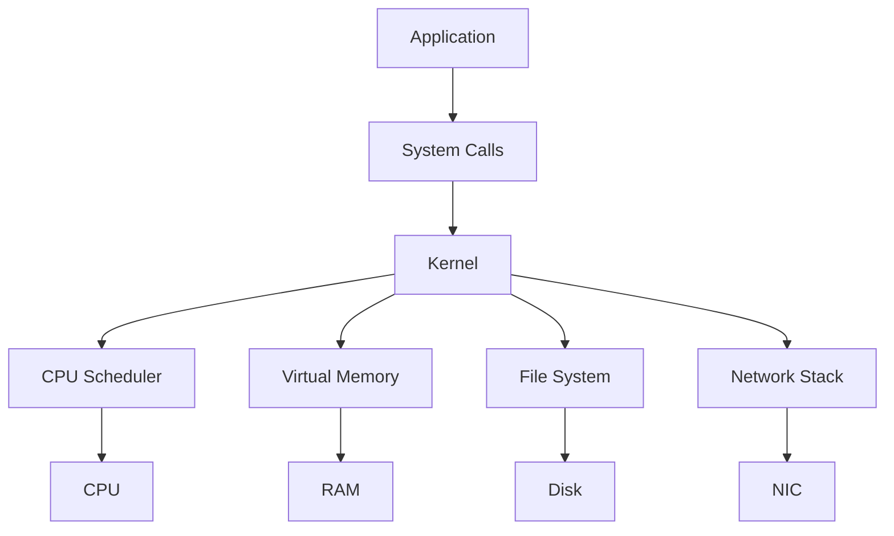

# 02 — Process, Thread, Virtual Memory ve Concurrency

Bu bölümün amacı işletim sistemini ezberletmek değil; bir backend servisinin neden CPU beklediğini, neden memory şişirdiğini, thread sayısının neden bazen performansı düşürdüğünü ve concurrency bug'larının neden zor olduğunu anlayacak mental modeli kurmaktır.

## 1. İşletim sistemi neden var?

Bir uygulama doğrudan donanımla uğraşsaydı CPU zamanı, bellek, disk, ağ kartı ve cihaz erişimini kendisi yönetmek zorunda kalırdı. İşletim sistemi bu kaynakların üzerinde bir soyutlama ve koordinasyon katmanı sağlar.



Bir program `read`, `write`, `open`, `socket` gibi işlemler yaptığında çoğu zaman kernel tarafından sağlanan mekanizmalardan yararlanır.

---

## 2. Program, process ve thread

**Program**, diskte duran çalıştırılabilir kod ve veridir. **Process**, bu programın çalışan örneğidir. Bir process kendi sanal adres alanına, açık dosya tanıtıcılarına ve execution context'ine sahiptir.

Bir process içinde bir veya daha fazla **thread** bulunabilir.

```text
Program
  ↓ çalıştır
Process
  ├─ Thread 1
  ├─ Thread 2
  └─ Thread 3
```

Thread'ler aynı process'in adres alanını paylaşır. Bu paylaşım hızlı iletişim sağlar ama race condition riskini de getirir.

### Process vs thread

| Özellik | Process | Thread |
|---|---|---|
| Address space | Genellikle ayrı | Aynı process içinde ortak |
| Isolation | Daha güçlü | Daha zayıf |
| Communication | IPC gerekir | Shared memory doğal |
| Failure etkisi | Çoğu zaman daha izole | Bir bug tüm process'i etkileyebilir |
| Context switch | Genellikle daha pahalı olabilir | Genellikle daha hafif olabilir |

Bu tablo mutlak bir performans garantisi değildir; işletim sistemi ve workload ayrıntıları önemlidir.

---

## 3. Scheduler ve context switch

CPU core sayısından fazla runnable thread olduğunda işletim sistemi hangi thread'in ne zaman çalışacağını seçer.

```text
Runnable threads: T1 T2 T3 T4 T5
                    ↓
                 Scheduler
                    ↓
CPU0 -> T1
CPU1 -> T3
```

Bir core üzerinde çalışan thread'in değişmesine **context switch** denir. Bu sırada register state, stack pointer, scheduling state gibi bilgiler değişebilir.

### Neden maliyetlidir?

Sadece register kaydetmek yüzünden değil. Fazla switching:

- CPU cache locality'yi bozabilir,
- TLB state ve working set davranışını etkileyebilir,
- scheduler overhead oluşturabilir,
- lock contention'ı artırabilir.

Bu yüzden “daha fazla thread = daha hızlı” değildir.

---

## 4. CPU-bound ve I/O-bound workload

### CPU-bound

Zamanın büyük kısmı hesaplama ile geçer.

Örnekler:

- image/video encoding,
- compression,
- cryptographic computation,
- bazı ML inference işleri,
- yoğun parsing/serialization.

### I/O-bound

Zamanın büyük kısmı disk, network veya başka servisleri beklemekle geçer.

Örnek:

```text
API request
  ↓
5 ms CPU
  ↓
80 ms database wait
  ↓
20 ms network
  ↓
3 ms CPU
```

Bu ayrım concurrency modelini belirler. CPU-bound bir işi sınırsız thread ile paralelleştirmek CPU saturation yaratabilir. I/O-bound sistemlerde async I/O veya daha fazla concurrent request faydalı olabilir.

---

## 5. Virtual memory

Her process fiziksel RAM'i doğrudan adreslemek yerine kendi **virtual address space**'ini görür.

```text
Process A virtual addresses ─┐
                            ├─> page tables -> physical memory
Process B virtual addresses ─┘
```

Bunun başlıca faydaları:

- process isolation,
- aynı virtual address'lerin farklı fiziksel sayfalara eşlenebilmesi,
- memory mapping,
- demand paging,
- shared memory gibi mekanizmalar.

### Page nedir?

Virtual memory ve physical memory çoğunlukla sabit boyutlu page/frame parçaları halinde yönetilir.

Bir process bir virtual address'e eriştiğinde CPU/MMU ilgili page table mapping'ini kullanır.

### Page fault

İstenen page memory'de hazır değilse page fault oluşabilir ve kernel devreye girer. Diskten veri getirilmesi gerekiyorsa maliyet çok büyük olabilir.

---

## 6. TLB neden var?

Her memory access'te page table zincirini baştan çözmek pahalı olurdu. CPU'lar yakın zamanda kullanılan virtual->physical mapping'leri **Translation Lookaside Buffer (TLB)** içinde cache'ler.

CPU cache ile TLB farklı şeylerdir:

```text
TLB cache'ler: address translation
CPU cache'ler: data/instruction
```

Senior systems görüşmelerinde bu ayrım önemlidir.

---

## 7. Stack ve heap

### Stack

Fonksiyon çağrıları, local variables ve call frame'ler gibi yapıların tutulduğu bölgedir.

```text
main()
 └─ foo()
     └─ bar()
```

Her çağrı stack üzerinde yeni bir frame oluşturabilir.

### Heap

Dinamik ömürlü nesneler için ayrılan bellek alanıdır. Runtime veya allocator tarafından yönetilir.

Basitleştirilmiş process memory görünümü:

```text
High address
+------------------+
| Stack            |
|       ↓          |
|                  |
|       ↑          |
| Heap             |
+------------------+
| Data / BSS       |
+------------------+
| Code / Text      |
+------------------+
Low address
```

Gerçek layout OS, architecture, ASLR ve runtime'a göre değişebilir.

---

## 8. Race condition

İki execution flow aynı shared state üzerinde koordinasyonsuz işlem yaparsa sonuç zamanlamaya bağlı hale gelebilir.

```text
counter = 0

Thread A: read 0
Thread B: read 0
Thread A: write 1
Thread B: write 1

Beklenen: 2
Gerçek:   1
```

Bu bir **lost update** örneğidir.

### Çözüm araçları

- mutex/lock,
- semaphore,
- atomic operation,
- message passing,
- immutable state,
- single-writer tasarımı.

Her çözümün throughput, latency ve complexity maliyeti vardır.

---

## 9. Deadlock

İki veya daha fazla execution flow birbirinin tuttuğu kaynağı sonsuza kadar bekleyebilir.

```text
Thread A: Lock 1 aldı -> Lock 2 bekliyor
Thread B: Lock 2 aldı -> Lock 1 bekliyor
```

Klasik deadlock koşulları:

1. Mutual exclusion
2. Hold and wait
3. No preemption
4. Circular wait

Bir sistemi deadlock'tan korumak için bu koşullardan en az birini kırmak gerekir.

---

## 10. Lock contention ve scalability

Bir lock altında uzun iş yapmak throughput'u dramatik biçimde düşürebilir.

```text
100 threads
    ↓
 [one global lock]
    ↓
 shared map
```

Alternatifler:

- sharded locks,
- read/write locks,
- lock-free structures,
- actor/message passing,
- partitioned ownership,
- critical section'ı küçültme.

Buradaki Staff-level düşünce: “hangi lock daha hızlı?”dan önce “shared mutable state'i azaltabilir miyiz?” sorusudur.

---

## 11. Backend bağlantısı

Bir API sunucusunda 20.000 concurrent request varsa bunların her biri için ayrı OS thread açmak bazı runtime'larda pahalı olabilir.

Bu nedenle farklı concurrency modelleri vardır:

- thread-per-request,
- thread pool,
- event loop,
- async/await,
- goroutine/green thread benzeri runtime abstraction'ları.

Doğru model workload'a ve runtime'a bağlıdır.

---

## 12. Habitat / distributed systems bağlantısı

Local concurrency problemlerinin distributed karşılıkları vardır:

| Tek makine | Dağıtık sistem |
|---|---|
| Mutex | Distributed lock / lease |
| Shared memory | Shared database/state |
| Thread contention | Hot partition / centralized bottleneck |
| Deadlock | Distributed dependency cycle |
| Scheduler overload | Queue/backpressure problemi |
| Process isolation | Tenant/service isolation |

Habitat benzeri bir storage platformunda request'lerin aynı partition veya aynı lock üzerinde yoğunlaşması local concurrency probleminden global throughput problemine dönüşebilir.

---

# Mülakat soru bankası

## Junior

**1. Process ve thread farkı nedir?**

İyi cevapta address space paylaşımı, isolation ve execution unit farkı bulunmalı.

**2. Stack ve heap farkı nedir?**

Ezber “stack hızlı, heap yavaş” cevabından kaçın. Ownership/lifetime ve allocation modelini anlat.

**3. Race condition nedir?**

Shared mutable state + timing bağımlılığı üzerinden açıkla.

## Mid

**4. Context switch neden pahalı olabilir?**

Register state yanında cache locality ve scheduler overhead konuş.

**5. Thread pool neden kullanılır?**

Concurrency'yi sınırlamak, thread creation maliyetini amortize etmek ve resource usage'ı kontrol etmek.

**6. Deadlock nasıl önlenebilir?**

Lock ordering, timeout, resource hierarchy ve critical-section redesign örnekleri ver.

## Senior

**7. Bir servis CPU %100 ama throughput artmıyor. Nasıl debug edersin?**

Beklenen düşünce zinciri:

```text
profiling
→ hot functions
→ lock contention
→ GC/allocation
→ syscalls
→ scheduler/run queue
→ cache misses
→ workload decomposition
```

**8. 10k concurrent connection için thread-per-connection tasarımını değerlendir.**

Runtime, memory/thread stack maliyeti, I/O blocking ve event-driven alternatifleri tartış.

## Staff / Principal

**9. Shared state'i organizasyon ölçeğinde nasıl azaltırsın?**

Partition ownership, service boundaries, append-only events, single-writer principle, data contracts.

**10. Concurrency problemi ile distributed consistency problemi arasında nasıl bağ kurarsın?**

İkisinde de ordering, visibility, ownership ve atomicity kavramlarının farklı ölçekte tekrar ettiğini anlat.

## EM / CTO

**11. Performance sorunu için rewrite mı, hardware scaling mi?**

Ölçüm, SLO, cloud cost, engineering cost, risk ve time-to-market birlikte değerlendirilmelidir.

---

# 30 dakikalık uygulama

Bir **bounded thread pool** veya **bounded worker queue** yaz.

Minimum gereksinimler:

- sabit worker sayısı,
- sınırlı queue,
- queue dolduğunda açık policy: reject/block/drop,
- shutdown mekanizması,
- metrics: queue depth, completed jobs, rejected jobs.

Sonra şu deneyleri yap:

1. Worker sayısını 1, 2, 4, 8, 32 yap.
2. CPU-bound ve sleep/I/O simülasyonu ile karşılaştır.
3. Throughput ve p95 latency ölç.
4. “daha çok worker”ın hangi noktada fayda sağlamadığını gözlemle.

## Bununla ne yapabiliriz?

`mini-worker-runtime` adında küçük bir portföy projesi yapılabilir. README içinde yalnızca kodu değil, benchmark sonuçlarını ve neden böyle tasarladığını anlat. Senior görüşmede bu proje üzerinden scheduler, backpressure, bounded queues ve overload protection konuşabilirsin.

---

# Kaynaklar

- Linux kernel documentation: https://docs.kernel.org/
- Linux scheduler documentation: https://docs.kernel.org/scheduler/
- Linux memory management documentation: https://docs.kernel.org/mm/
- POSIX Threads (`pthreads`) overview: https://pubs.opengroup.org/onlinepubs/9699919799/basedefs/pthread.h.html
- man-pages project: https://www.kernel.org/doc/man-pages/
- Brendan Gregg — Linux Performance: https://www.brendangregg.com/linuxperf.html

> İlk hedef kernel implementasyon ayrıntılarını ezberlemek değil; process/thread, scheduling, memory ve synchronization arasındaki ilişkiyi kurmaktır.
