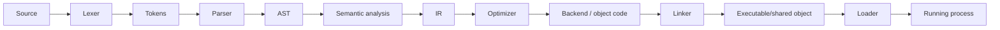

# Compiler Pipeline — Lexer, Parser, AST, IR, Codegen, Linker ve Loader

## Neden önemli?
Compiler mülakatlarında amaç aşama isimlerini ezberlemek değil, her representation boundary'nin hangi problemi çözdüğünü anlamaktır. En yararlı ayrım: **syntax → semantics → lowering/optimization → binary construction → runtime loading**.

## Mental model

## Pipeline
### Lexer
Karakter akışını identifier, literal, keyword ve punctuation gibi token'lara ayırır. Lexical correctness grammar correctness ile aynı değildir.

### Parser ve AST
Parser token'ları grammar'a göre yapılandırır. Recursive descent basit grammar'larda sezgiseldir; binary expressions için precedence/associativity ayrıca ele alınır. AST, concrete parse tree'nin kopyası değil, sonraki aşamalara uygun semantic representation'dır.

### Semantic analysis
Name resolution, scope, type rules ve dilin context-sensitive invariants'ları burada doğrulanabilir. `x + true` syntax olarak geçerli olup type sistemi açısından geçersiz olabilir.

### IR ve optimization
IR source language ile target architecture arasında optimization-friendly kontrattır. LLVM Kaleidoscope tutorial'ı AST'den LLVM IR üretimini gösterir. Optimization semantiği koruyarak constant folding, dead-code elimination, inlining gibi dönüşümler yapabilir; performans, code size ve debuggability arasında trade-off vardır.

### Backend, linker, loader
Backend target instruction/object code üretimine yaklaşır. Object file unresolved symbols ve relocation bilgisi taşıyabilir. Linker object/library parçalarını semboller üzerinden birleştirir. Loader executable/shared objects'i process address space'e map eder ve runtime loading/dynamic linking mekanizmalarıyla execution'a hazırlar. ABI, ayrı derlenen bileşenlerin binary-level kontratıdır.

## Mülakat soruları
1. Lexer ve parser farkı nedir?
2. AST neden parse tree değildir?
3. Syntax ve semantic error örnekleri ver.
4. IR neden değerlidir?
5. Compile, link ve loader error'larını ayır.
6. Optimization debug deneyimini neden zorlaştırabilir?
7. Static vs dynamic linking trade-off'ları nelerdir?
8. Staff: source compatibility ile ABI compatibility neden farklıdır?
9. Staff: JIT vs AOT kararını startup, peak performance, memory ve deployment açısından tartış.

## Seviye beklentisi
- **Junior:** lexer → parser → AST → code sırasını ve temel rolleri bilir.
- **Mid:** semantic analysis, IR, object code ve linker ayrımını açıklar.
- **Senior:** relocation, symbol resolution, optimization/debug ve JIT/AOT trade-off'larını bağlar.
- **Staff:** ABI, reproducible builds, PGO/JIT warmup ve fleet rollout etkilerini tartışır.

## Mini alıştırma
`x = 2 + 3 * 4` için token listesi ve AST çiz. Constant folding sonrası beklenen representation'ı yaz. Operator precedence değişirse ağacın nasıl değişeceğini göster.

## Proje
`tiny-expr-compiler`: lexer, recursive-descent parser, AST interpreter ve stack bytecode backend yaz. Golden parse tests ve execution tests ekle.

## Failure modes / production
Aşamaları ezberleyip invariants'ları açıklayamamak, linker/loader'ı karıştırmak ve optimization'ı bedelsiz sanmak yaygın hatalardır. Production/build sistemlerinde build duration, binary size, startup/JIT warmup, symbolization, debug info, ABI compatibility ve reproducibility izlenir.

## Kaynaklar
- LLVM My First Language Frontend: https://llvm.org/docs/tutorial/MyFirstLanguageFrontend/
- LLVM Parser and AST: https://llvm.org/docs/tutorial/MyFirstLanguageFrontend/LangImpl02.html
- LLVM Codegen to IR: https://llvm.org/docs/tutorial/MyFirstLanguageFrontend/LangImpl03.html
- LLVM Language Reference: https://llvm.org/docs/LangRef.html
