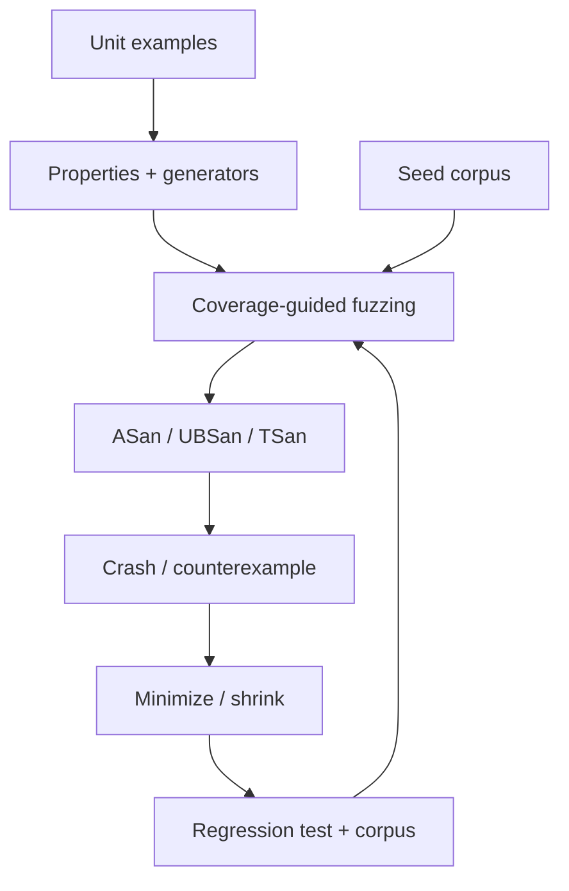

# Property-Based Testing, Fuzzing ve Sanitizers

## Ana fikir
Example-based test bilinen örnekleri doğrular. Property-based testing geniş input uzayında korunması gereken invariant'ları generator'larla sınar. Coverage-guided fuzzing yeni execution path'lerini keşfetmeye çalışır. Sanitizers ise memory/undefined-behavior gibi hata sınıflarını runtime instrumentation ile görünür kılar. Bunlar alternatif değil, tamamlayıcı katmanlardır.

## Mental model

## Property-based testing
İyi property implementation detail değil invariant ifade eder. Örnekler:
- codec: `decode(encode(x)) == x`
- normalization: `normalize(normalize(x)) == normalize(x)`
- sort: output ordered olmalı ve input multiset'ini korumalı

Generator domain'i temsil eder; yalnız kolay input üretmek sahte güven yaratır. Shrinking başarısız örneği daha küçük counterexample'a indirerek root-cause analizini hızlandırır.

## Coverage-guided fuzzing
Fuzzer mutation'ları yeni control-flow coverage üretme sinyaline göre değerlendirir. Seed corpus başlangıç noktasıdır. Parser/codec/protocol hedefleri hızlı, deterministik ve side-effect kontrollü olmalıdır. Bulunan crash minimize edilmeli, root cause düzeltilmeli ve reproducer regression corpus'a alınmalıdır.

## Sanitizers
AddressSanitizer compiler instrumentation + runtime ile heap/stack/global out-of-bounds, use-after-free ve benzeri memory hatalarını yakalayabilir. Clang dokümanı tipik slowdown'ı yaklaşık 2x olarak belirtir; sanitizer runtime'ı production executable için güvenlik runtime'ı olarak tasarlanmamıştır. UBSan undefined behavior sınıflarını görünür kılar; ThreadSanitizer data race analizi için ayrı bir araçtır.

## Mülakat soruları
1. Unit test ile property test farkı nedir?
2. Shrinking neden önemlidir?
3. Coverage-guided fuzzing random testing'den nasıl ayrılır?
4. Seed corpus nasıl seçilir?
5. ASan hangi bug sınıflarını yakalar?
6. Senior: parser fuzz harness nasıl tasarlanır?
7. Staff: presubmit fuzz budget ile nightly campaign'i nasıl ayırırsın?
8. Principal: hangi codebase'leri önce fuzz edersin ve ROI'yi nasıl ölçersin?

## Seviye beklentisi
- **Mid:** property, generator, corpus, fuzzer ve sanitizer rollerini ayırır.
- **Senior:** deterministic harness, minimization, deduplication ve regression döngüsünü kurar.
- **Staff:** CI/nightly/continuous fuzzing, sanitizer matrix ve ownership tasarlar.
- **Principal:** untrusted-input riskini, exploitability'yi, compute cost'u ve developer feedback latency'yi birlikte yönetir.

## Mini alıştırma
URL parser için round-trip, normalization idempotence ve malformed-input bounded-execution property'leri yaz. Bir fuzzer crash'ini minimal reproducer ve regression test'e dönüştürme adımlarını çıkar.

## Proje
`parser-fuzz-lab`: binary parser + libFuzzer harness + ASan/UBSan. Seed corpus oluştur, kasıtlı length bug'ı bul/minimize et, fix sonrası reproducer'ı corpus'a al; ayrıca round-trip property tests ekle.

## Failure modes / production
Coverage'i correctness sanmak, oracle/property olmadan random input üretmek, fuzzer target'ına network/database bağımlılığı koymak, corpus'u kaybetmek ve sanitizer overhead'ini production benchmark'ıyla karıştırmak tipik hatalardır. Untrusted parsers, codecs, protocol gateways ve native extensions yüksek getirili hedeflerdir. Unique crashes, coverage growth, flaky harness rate, sanitizer findings ve fix SLA izlenebilir.

## Kaynaklar
- LLVM libFuzzer: https://llvm.org/docs/LibFuzzer.html
- Clang AddressSanitizer: https://clang.llvm.org/docs/AddressSanitizer.html
- Clang UndefinedBehaviorSanitizer: https://clang.llvm.org/docs/UndefinedBehaviorSanitizer.html
- Hypothesis: https://hypothesis.readthedocs.io/
