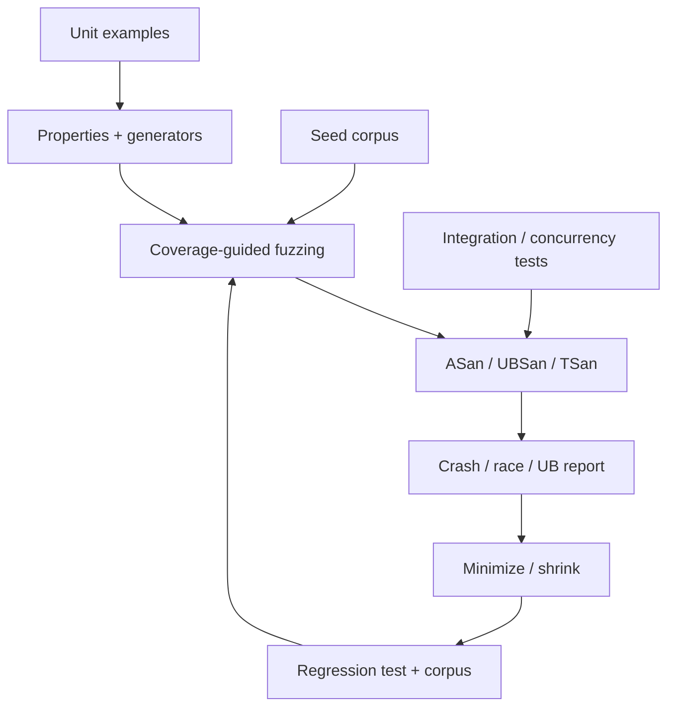

# Property-Based Testing, Fuzzing ve Sanitizers

## Ana fikir
Example-based test bilinen örnekleri doğrular. Property-based testing geniş input uzayında korunması gereken invariant'ları generator'larla sınar. Coverage-guided fuzzing yeni execution path'lerini keşfetmeye çalışır. Sanitizers ise çalışan programın memory/race/undefined-behavior invariant'larını compiler instrumentation + runtime ile görünür kılar. Bunlar alternatif değil, tamamlayıcı katmanlardır.

## Mental model

**Test input üretir; sanitizer execution'ın görünmeyen kurallarını denetler.** Sanitizer temizliği correctness kanıtı değildir; yalnız çalıştırılan path'lerde kendi bug sınıfını gözler.

## Property-based testing
İyi property implementation detail değil invariant ifade eder. Örnekler:
- codec: `decode(encode(x)) == x`
- normalization: `normalize(normalize(x)) == normalize(x)`
- sort: output ordered olmalı ve input multiset'ini korumalı

Generator domain'i temsil eder; yalnız kolay input üretmek sahte güven yaratır. Shrinking başarısız örneği daha küçük counterexample'a indirerek root-cause analizini hızlandırır.

## Coverage-guided fuzzing
Fuzzer mutation'ları yeni control-flow coverage üretme sinyaline göre değerlendirir. Seed corpus başlangıç noktasıdır. Parser/codec/protocol hedefleri hızlı, deterministik ve side-effect kontrollü olmalıdır. Bulunan crash minimize edilmeli, root cause düzeltilmeli ve reproducer regression corpus'a alınmalıdır. Fuzzer + sanitizer yüksek getirili kombinasyondur: fuzzer yeni path üretir, sanitizer o path'teki memory/UB ihlalini güçlü bir oracle'a dönüştürür.

## Sanitizers
### AddressSanitizer — ASan
ASan heap/stack/global out-of-bounds, use-after-free ve invalid/double free gibi memory hatalarını compiler instrumentation + runtime metadata ile yakalayabilir. Shadow memory addressability durumunu izler; allocator quarantine use-after-free yakalama penceresini büyütebilir. Clang dokümantasyonu tipik slowdown'ı yaklaşık 2x olarak belirtir.

### ThreadSanitizer — TSan
TSan data race detection'a odaklanır. Race, en az bir write içeren conflicting memory access'lerin uygun happens-before/synchronization ilişkisi olmadan gerçekleşmesidir. TSan memory access ve synchronization event'lerini instrument eder; deadlock detector ile aynı problem değildir. Güncel Clang dokümantasyonu tipik 5–15x slowdown ve ciddi memory overhead belirtir; bu nedenle concurrency suite/nightly job gibi ayrı bütçe gerekebilir.

### UndefinedBehaviorSanitizer — UBSan
UBSan signed overflow, invalid shift, misaligned/null dereference gibi seçili C/C++ undefined behavior noktalarına runtime checks ekler. Recovery veya trap davranışı kullanım amacına göre seçilebilir.

### Instrumented CI
Sanitizer runtime'ları production executable için güvenlik sınırı olarak tasarlanmamıştır. Yaygın yaklaşım ayrı build/job'lardır: ASan+UBSan integration suite, TSan concurrency suite ve ASan-backed fuzzing. Debug info + symbolization actionable stack trace için kritiktir. Partial instrumentation blind spot/false-negative yüzeyi yaratabilir; suppression/ignorelist minimum tutulmalı ve ownership/SLA ile yönetilmelidir.

## Mülakat soruları
1. Unit/integration test ile sanitizer arasındaki fark nedir?
2. Shrinking neden önemlidir?
3. Coverage-guided fuzzing random testing'den nasıl ayrılır?
4. ASan hangi bug sınıflarını yakalar, hangilerini garanti etmez?
5. TSan race ile deadlock'u aynı şey olarak mı görür?
6. Mid: sanitizer build neden normal build'den yavaştır?
7. Senior: ASan + fuzzing neden yüksek getirili kombinasyondur?
8. Senior: partial instrumentation hangi false-negative riskini getirir?
9. Staff: presubmit/nightly/continuous fuzzing ve sanitizer matrix nasıl bütçelenir?
10. Principal: hangi codebase'leri önce fuzz/sanitize edersin ve ROI'yi nasıl ölçersin?

## Seviye beklentisi
- **Junior:** ASan=memory safety bug detection, TSan=data race, UBSan=undefined behavior ayrımını bilir.
- **Mid:** compiler instrumentation, runtime metadata, corpus, symbolization ve CI placement anlatır.
- **Senior:** happens-before, deterministic harness, partial instrumentation, minimization ve false-negative yüzeyini tartışır.
- **Staff:** CI/nightly/continuous fuzzing, sanitizer matrix, compute budget ve ownership tasarlar.
- **Principal:** untrusted-input riskini, exploitability'yi, compute cost'u ve developer feedback latency'yi birlikte yönetir.

## Mini alıştırma
Üç küçük program yaz: heap use-after-free, unsynchronized shared counter ve signed-overflow edge case. Sırasıyla `-fsanitize=address`, `-fsanitize=thread`, `-fsanitize=undefined` ile çalıştır. Her raporda bug site ile symptom site'ın aynı olup olmadığını not et. Ardından URL parser için round-trip ve malformed-input bounded-execution property'leri ekleyip ASan-backed fuzz target oluştur.

## Proje
`sanitizer-ci-lab`: küçük C/C++ servisine ASan+UBSan integration, TSan concurrency ve ASan-backed fuzz job'ları ekle. Symbolized log ve minimized reproducer artifact'ı sakla; normal build'e göre wall-clock/memory overhead ölç. Bulunan reproducer'ları regression corpus'a ekle.

## Failure modes / production
Coverage'i correctness sanmak, sanitizer-clean sonucu proof kabul etmek, partial instrumentation, fuzzer target'ına network/database bağımlılığı koymak, corpus'u kaybetmek ve suppression listesini sınırsız büyütmek tipik hatalardır. Optimized production binary sanitizer build'den farklı davranabilir; release-like flags ve reproducibility stratejisi gerekir. Native backend, database engine, browser/mobile runtime, parser/codec ve high-performance service ekiplerinde sanitizer CI memory corruption ve race'i müşteriye ulaşmadan yakalamak için yüksek getirili bir katmandır. Unique crashes, coverage growth, flaky harness rate, sanitizer findings ve fix SLA izlenebilir.

## Kaynaklar
- LLVM libFuzzer: https://llvm.org/docs/LibFuzzer.html
- Clang AddressSanitizer: https://clang.llvm.org/docs/AddressSanitizer.html
- Clang ThreadSanitizer: https://clang.llvm.org/docs/ThreadSanitizer.html
- Clang UndefinedBehaviorSanitizer: https://clang.llvm.org/docs/UndefinedBehaviorSanitizer.html
- Clang Sanitizer special case list: https://clang.llvm.org/docs/SanitizerSpecialCaseList.html
- LLVM compiler-rt: https://compiler-rt.llvm.org/
- Hypothesis: https://hypothesis.readthedocs.io/
