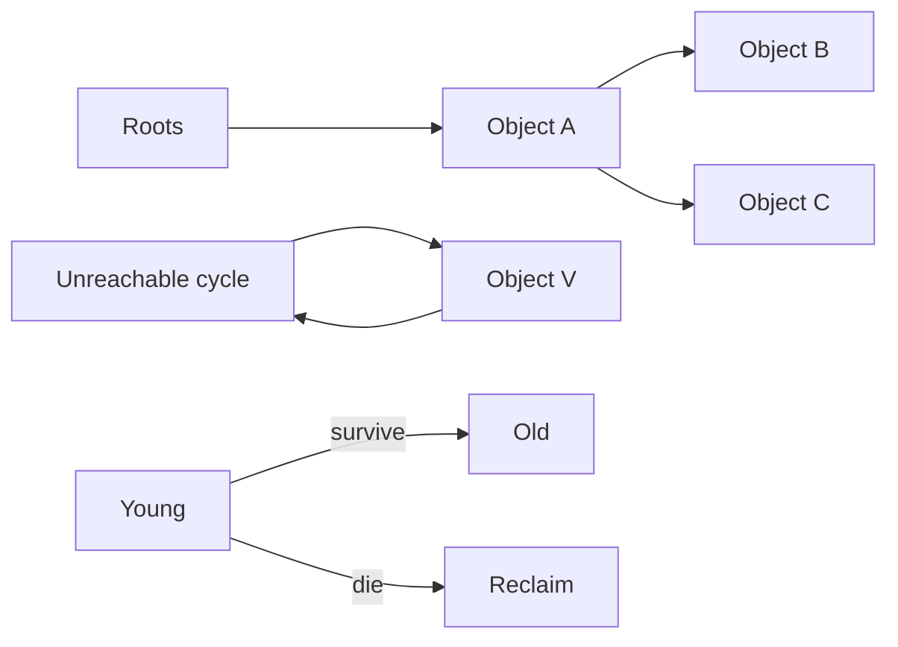

# Garbage Collection: Reachability, Generations, Pauses & Heap Economics

## Konu anlatımı
GC'nin temel sorusu hangi object'in artık erişilebilir olmadığıdır. Tracing GC root set'ten object graph'ını dolaşır; unreachable nesneler reclaim adayıdır. Reference counting hızlı reclaim sağlayabilir fakat cycle'lar ek mekanizma gerektirir. Generational GC kısa ömürlü nesnelerin yaygınlığından yararlanır; compacting fragmentation'ı azaltabilir; concurrent/incremental çalışma pause süresini azaltırken barrier/CPU maliyeti doğurabilir.

Production tuning tek bir pause metriğine indirgenmemelidir: allocation rate, live heap, RSS/headroom, GC CPU ve p99 latency birlikte değerlendirilir. Güncel runtime değişiklikleri workload-sensitive trade-off'u gösterir: Python 3.14.0–3.14.4 incremental GC'yi kullandı fakat production memory-pressure raporları sonrası Python 3.14.5'te önceki generational GC'ye döndü. Go 1.26'da Green Tea GC varsayılan hale geldi.

## İçeride ne oluyor?
- Tracing: root → reachability → reclaim.
- Reference counting: count sıfırında reclaim; cycle ek problem.
- Generational GC: young mortality; cross-generation pointers için barrier/remembered-set gerekebilir.
- Compacting: fragmentation/locality kazanımı karşılığında relocation maliyeti.
- Concurrent/incremental: daha kısa pause hedefi karşılığında CPU/barrier/complexity.
- Büyük heap daha seyrek GC sağlayabilir fakat memory headroom ve OOM riskini artırabilir.

## Mülakat soruları
1. Reachability nedir?
2. Reference counting cycle'larda neden zorlanır?
3. Generational hypothesis nedir?
4. Mark-sweep ile compacting/copying trade-off'u nedir?
5. Write barrier neden gerekir?
6. Allocation rate yüksek ama live heap sabitse leak midir?
7. Latency-sensitive serviste GC tuning nasıl ölçülür?
8. Runtime GC değişikliği fleet'e nasıl rollout edilir?

## Beklenen cevap seviyesi
- **Junior:** heap, reachable/unreachable, GC amacı.
- **Mid:** tracing/reference counting, generations, mark/sweep/compact.
- **Senior:** barriers, promotion, allocation rate, pause/throughput, profiling.
- **Staff:** fleet memory economics, SLO, benchmarking ve rollout.

## Mini alıştırma
İki root, bir unreachable cycle ve bir cross-generation pointer içeren object graph çiz. Tracing collector'ın reclaim edeceği nesneleri ve reference counting'in zorlanacağı cycle'ı göster.

## Proje fikri
`gc-pressure-lab`: short-lived churn, long-lived cache ve accidental-retention workload'larında allocation rate, live heap, RSS, GC duration ve p99 latency ölç.

## Failure modes / production bağlantısı
RSS artışını otomatik leak saymak, yalnız average pause'a bakmak ve heap büyütmenin container OOM etkisini unutmak yaygın hatalardır. Allocation rate, live heap, RSS, GC CPU, collection frequency/duration ve tail latency birlikte izlenmelidir.

## Kaynaklar
- Python 3.14.5 release — GC revert: https://www.python.org/downloads/release/python-3145/
- Go 1.26 Release Notes — Green Tea GC: https://go.dev/doc/go1.26
- Go GC Guide: https://go.dev/doc/gc-guide
