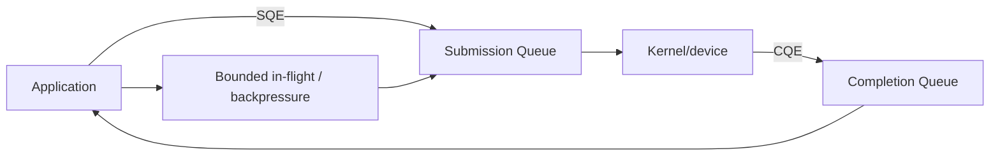

# Linux Async I/O — epoll, io_uring, SQ/CQ ve Backpressure

## Neden önemli?
High-concurrency backend'lerde performans yalnız thread sayısı değildir. I/O'nun nasıl bekletildiği, kernel/userspace arasında nasıl bildirildiği, kaç operation'ın aynı anda uçuşta olduğu ve downstream kapasitesinin nasıl korunduğu belirleyicidir.

## Üç mental model
1. **Blocking:** operation tamamlanana kadar execution context bekler.
2. **Readiness (`epoll`):** kernel hangi fd'nin I/O'ya hazır olduğunu bildirir; uygulama I/O syscall'ını yapar.
3. **Completion (`io_uring`):** uygulama operation'ı submit eder; sonuç completion olarak döner.

## epoll
`epoll` interest list ve ready list mental modeliyle çalışır. Descriptor readiness'i level-triggered veya edge-triggered biçimde bildirilebilir. Edge-triggered kullanım daha dikkatli drain/nonblocking logic gerektirir.

## io_uring
SQ ve CQ userspace/kernel arasında shared ring buffers'dır. SQE operation'ı tanımlar; CQE result/completion taşır. Birden fazla operation batch edilebilir. Batching kernel transition maliyetini azaltabilir fakat queue depth'i sınırsız büyütmek throughput optimizasyonu değildir: memory, tail latency ve downstream saturation artabilir.

### Buffer lifetime
Request metadata ile gerçek I/O buffer'ının lifetime kuralları aynı olmayabilir. Read/write buffer'ı operation tamamlanana kadar geçerli tutulmalıdır. Completion gelmeden reuse/free etmek data corruption veya memory-safety problemi doğurabilir.

### Backpressure
Async API kapasite yaratmaz. In-flight operation, SQ/CQ occupancy, downstream connection/QPS ve memory için budget gerekir. Bounded concurrency, cancellation/deadline ve admission control tasarımın parçasıdır.

### Zero-copy
Copy avoidance bazı workload'larda CPU/memory-bandwidth maliyetini azaltabilir fakat page pinning, accounting, completion bookkeeping ve hardware constraints getirir. Linux io_uring zero-copy receive yolunda payload userspace memory'ye doğrudan alınabilirken kernel TCP stack header processing'i sürdürür; NIC queue/flow-steering gereksinimleri vardır.

## Mülakat soruları
1. Blocking, readiness ve completion modellerini ayır.
2. `epoll` interest/ready list nedir?
3. SQE/CQE nedir?
4. Batching neden yardımcı olabilir?
5. Queue depth neden sınırsız artırılmaz?
6. Buffer lifetime bug'ları nasıl görünür?
7. Backpressure'ı io_uring server'da nereye koyarsın?
8. Zero-copy benchmark'ını nasıl tasarlarsın?

## Seviye beklentisi
- **Mid:** modelleri ve SQ/CQ'yu doğru açıklar.
- **Senior:** batching, lifetime, queue depth, timeout/cancellation ve backpressure konuşur.
- **Staff:** ring/thread topology, CPU locality, downstream budgets, zero-copy ve rollout ölçümlerini bağlar.

## Alıştırma
Aynı HTTP proxy request path'ini `epoll` ve `io_uring` ile çiz. Queue, timeout/cancellation ve downstream admission noktalarını işaretle.

## Proje
`async-io-lab`: blocking threads, epoll ve liburing ile aynı echo/file server'ı kur. Farklı concurrency ve queue-depth değerlerinde throughput, p99, syscalls, context switches, CPU ve RSS karşılaştır.

## Production failure modes
- `io_uring` her workload'da daha hızlı varsayımı.
- Sınırsız in-flight operation.
- CQ'yu geç drain etmek.
- Buffer'ı completion öncesi reuse etmek.
- Downstream limitlerinden bağımsız queue büyütmek.

İzlenecek metrikler: in-flight, SQ/CQ pressure, completion latency, CPU, memory, syscalls/context switches ve downstream saturation.

## Kaynaklar
- https://man7.org/linux/man-pages/man7/epoll.7.html
- https://man7.org/linux/man-pages/man7/io_uring.7.html
- https://man7.org/linux/man-pages/man2/io_uring_enter.2.html
- https://kernel.org/doc/html/latest/networking/iou-zcrx.html
