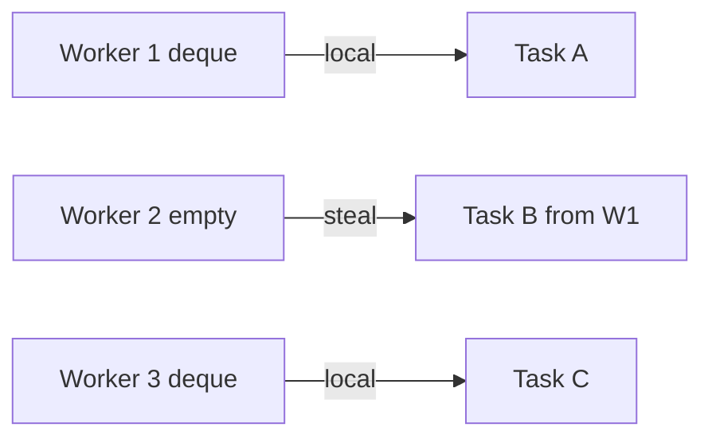

# Work-Stealing Schedulers, Deques & Parallelism Economics

## Konu anlatımı
Sabit bir global task queue çok çekirdekte contention ve load imbalance yaratabilir. Work stealing'de her worker çoğunlukla kendi local deque'undan iş yürütür; boş kalan worker başka worker'dan task çalar. Böylece common path local kalırken düzensiz parallel workload dinamik dengelenir.

Fork/join modelinde worker bir branch'i yürütürken diğer branch'i steal edilebilir iş olarak bırakabilir. Work stealing özellikle recursive/data-parallel CPU workload'larında etkilidir; blocking I/O, nested pools ve kötü task granularity ise avantajı tersine çevirebilir.

## İçeride ne oluyor?
- Local deque merkezi queue contention'ını azaltır.
- Idle worker victim seçerek steal dener.
- Çok küçük task scheduling overhead; çok büyük task load imbalance üretir.
- CPU count usable parallelism değildir: affinity, cgroup quota, SMT ve topology önemlidir.
- Blocking task CPU-bound worker pool'unu tüketebilir.
- Nested runtimes oversubscription ve lock interaction yaratabilir.

## Mülakat soruları
1. Work stealing global queue'ya göre neden ölçeklenebilir?
2. Deque neden uygundur?
3. Task granularity nasıl seçilir?
4. Blocking I/O neden problem olabilir?
5. Senior: oversubscription nasıl ölçülür?
6. Staff: NUMA ve heterogeneous core ortamında hangi trade-off'lar vardır?

## Beklenen cevap seviyesi
- **Mid:** local queue, steal, fork/join.
- **Senior:** granularity, locality, blocking ve metrics.
- **Staff:** topology, nested runtime contracts, fairness ve CPU economics.

## Mini alıştırma
8 worker üzerinde 1.000 x 50 µs task ile 10 x 5 ms task'ı scheduling overhead ve load balance açısından karşılaştır; batching stratejisi öner.

## Proje fikri
`work-steal-lab`: per-worker deque'lu executor ile global-queue baseline'ı throughput, steal count, queue depth ve p99 completion time açısından karşılaştır.

## Production bağlantısı / failure modes
Oversubscription, blocking task, aşırı küçük task, nested pool deadlock'u ve yalnız average CPU utilization'a bakmak tipik hatalardır. Runnable task count, local/steal ratio, steal failures, worker park time, CPU throttling ve context switches izlenmelidir.

## Kaynaklar
- Rayon FAQ: https://github.com/rayon-rs/rayon/blob/main/FAQ.md
- Rayon `join`: https://docs.rs/rayon/latest/rayon/fn.join.html
- Rust `available_parallelism`: https://doc.rust-lang.org/std/thread/fn.available_parallelism.html
