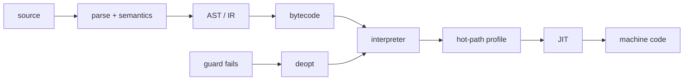

# Bytecode, Interpreter, JIT & Runtime Pipeline

## Neden önemli?
Kaynak kodun CPU'da çalışmasına giden yol tek bir compile adımı değildir. Runtime tasarımına göre source → parser/semantic analysis → AST/IR → bytecode veya native code → interpreter/JIT → CPU zinciri oluşur. Bu ayrım startup latency, peak throughput, memory, portability ve debugging davranışını belirler.

## Mental model

## İçeride ne oluyor?
Bytecode fiziksel CPU ISA'sı olmak zorunda değildir; VM için compact instruction set olabilir. Interpreter opcode decode/dispatch eder. Adaptive runtime generic operation'ları gözlenen type/shape bilgisiyle specialize edebilir. JIT sıcak method/loop'u native code'a derler; speculative optimizasyon guard'larla korunur. Varsayım bozulduğunda deoptimization daha generic execution tier'ına dönebilir.

AOT startup ve deployment öngörülebilirliği sağlayabilir; JIT runtime profile ile daha agresif optimizasyon yapabilir. Bedeli warm-up, compiler CPU/RSS, code cache ve deopt karmaşıklığıdır. GC, allocator, exception handling, stack walking ve safepoint mekanizmaları generated code ile runtime arasında sıkı kontratlar kurar.

## Mülakat soruları
1. Interpreter ile compiler farkı nedir?
2. Bytecode neden machine code değildir?
3. JIT neden peak throughput'u artırırken startup'ı kötüleştirebilir?
4. Hot path nasıl bulunur?
5. Deoptimization neden gerekir?
6. Senior: inline cache/type specialization ne zaman işe yarar?
7. Staff: latency-sensitive serviste warm-up ve code-cache riskini nasıl yönetirsin?

## Seviye beklentisi
Junior execution pipeline'ı doğru ayırır. Mid interpreter/JIT/warm-up trade-off'unu açıklar. Senior specialization, guards, deopt ve GC etkileşimini tartışır. Staff runtime upgrade'ini startup, steady-state, tail latency, CPU/RSS ve fleet rollout economics'iyle değerlendirir.

## Mini alıştırma
`x + y` için küçük stack bytecode tasarla. Generic `ADD` 1.000 çağrı boyunca integer görürse `ADD_INT` fast path'e specialize et; sonra string operand geldiğinde guard failure → deopt akışını çiz.

## Proje fikri
`tiny-tiered-vm`: `LOAD_CONST`, `LOAD_LOCAL`, `ADD`, `JUMP`, `RETURN` opcode'ları olan stack VM yaz. Opcode counter ile hot operation bul ve integer fast path ekle. Generic/specialized throughput, startup ve branch davranışını karşılaştır.

## Failure modes / production
JIT'i otomatik hız garantisi sanmak, yalnız steady-state benchmark yapmak, warm-up'ı gerçek trafiğe ödetmek, deopt storm/code-cache pressure'ı izlememek ve runtime upgrade'ini workload benchmark'ı olmadan rollout etmek tipik hatalardır. Production'da startup latency, p95/p99, throughput, CPU, RSS, allocation/GC, compilation time, deopt ve code-cache birlikte izlenir.

## Kaynaklar
- CPython `dis`: https://docs.python.org/3/library/dis.html
- CPython 3.13 experimental JIT: https://docs.python.org/3/whatsnew/3.13.html
- OpenJDK HotSpot VM Performance Enhancements: https://docs.oracle.com/en/java/javase/24/vm/java-hotspot-virtual-machine-performance-enhancements.html
- LLVM ORC JIT tutorial: https://llvm.org/docs/tutorial/BuildingAJIT1.html
