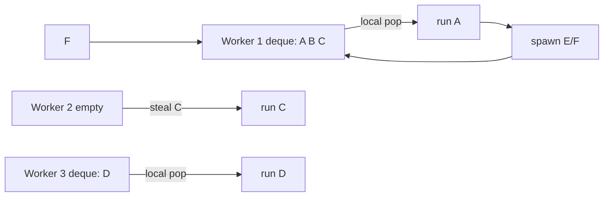

# Work-Stealing Schedulers, Deques & Parallelism Economics

## Konu anlatımı
Sabit bir global task queue basit olsa da çok çekirdekte contention ve load imbalance yaratabilir. Work stealing yaklaşımında her worker çoğunlukla kendi local deque'undan iş tüketir; işi biten worker başka worker'ın kuyruğundan task çalmaya çalışır. Amaç merkezi scheduler hot spot'ını azaltırken düzensiz parallel workload'u dinamik dengelemektir.

Fork/join workload'larında çalışan worker yeni işi local queue'ya bırakır ve bir branch'i kendisi yürütür. Idle worker diğer branch'i steal edebilir. Bu model parallel recursive algorithms, build systems ve data-parallel runtimes için güçlüdür; fakat blocking I/O, nested pools, oversubscription ve lock interaction performans/correctness sürprizleri yaratabilir.

## İçeride ne oluyor?
- Her worker'ın local deque'u common-path contention'ı azaltır.
- Worker local işi varken locality avantajıyla onu yürütür; boş kalınca victim seçip steal dener.
- Fork/join'de task granularity çok küçükse scheduling overhead faydayı yiyebilir.
- Çok büyük task'lar ise bir worker'ı uzun süre meşgul edip parallelism'i düşürür.
- CPU count gerçek usable parallelism ile aynı değildir; container/cgroup, affinity, SMT ve heterogeneous cores etkiler.
- Blocking task worker pool'u tüketebilir; CPU-bound ve blocking workload'ları ayırmak gerekebilir.
- Nested parallel runtimes oversubscription ve lock-order sorunları yaratabilir.

## Mülakat soruları
1. Work stealing neden tek global queue'dan daha ölçeklenebilir olabilir?
2. Deque neden scheduler için yararlıdır?
3. Task granularity çok küçük veya çok büyük olursa ne olur?
4. CPU sayısı ile ideal worker sayısı neden her zaman aynı değildir?
5. Blocking I/O work-stealing pool'u nasıl bozabilir?
6. Nested thread pool + lock kombinasyonunda deadlock/oversubscription riskini nasıl analiz edersin?
7. NUMA ve heterogeneous cores varsa scheduler politikasını nasıl ölçersin?

## Beklenen cevap seviyesi
- **Mid:** local queues, steal, fork/join ve load balance.
- **Senior:** granularity, blocking, locality, oversubscription ve instrumentation.
- **Staff:** NUMA/topology, nested runtime contracts, fairness ve fleet-level CPU economics.

## Mini alıştırma
8 worker'lı pool'da 1.000 adet 50 µs task ile 10 adet 5 ms task'ı karşılaştır. Scheduling overhead, load balance ve tail latency açısından hangi batching/granularity stratejisini denersin? Ölçeceğin üç metriği yaz.

## Proje fikri
`work-steal-lab`: per-worker deque'lu küçük bir executor kur. Global-queue baseline ile recursive parallel sum ve düzensiz task-duration workload'larında throughput, steal count, queue depth ve p99 completion time karşılaştır.

## Production bağlantısı / failure modes
Oversubscription, blocking task'ların CPU pool'unu işgal etmesi, aşırı küçük task, nested pool deadlock'u ve yalnız average CPU utilization'a bakmak tipik hatalardır. Production'da runnable task count, local/steal ratio, steal failures, worker park time, task duration distribution, CPU throttling ve context-switch rate birlikte izlenir.

## Kaynaklar
- Rayon FAQ — work stealing: https://github.com/rayon-rs/rayon/blob/main/FAQ.md
- Rayon `join`: https://docs.rs/rayon/latest/rayon/fn.join.html
- Rust `available_parallelism`: https://doc.rust-lang.org/std/thread/fn.available_parallelism.html
