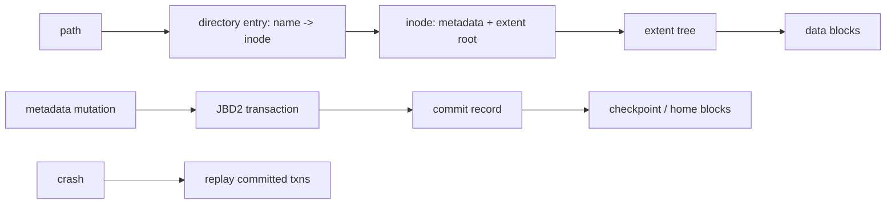

# ext4 On-Disk Internals, Directories & JBD2 Journaling

## Mental model

## Path'ten diske
Bir filesystem yalnız `open/read/write` API'si değildir. ext4 diski block group'lara böler; inode table, allocation bitmap'leri ve data blocks locality için bölgesel tutulur. Directory entry filename'i inode numarasına bağlar. Inode filename taşımaz; metadata ve data extent'lerini tarif eder. Bu ayrım hard link semantiğini açıklar: farklı directory entry'ler aynı inode'u gösterebilir.

Extents contiguous block aralıklarını kompakt biçimde temsil eder. Büyük directory'lerde hashed htree index lookup maliyetini düşürür. `unlink` directory entry'yi kaldırır; açık file descriptor veya başka hard link varsa inode hemen yok olmak zorunda değildir.

## JBD2 ve crash recovery
Journaling'in amacı her application byte'ını otomatik durable yapmak değil, özellikle metadata mutation'larının crash sonrası filesystem'i yapısal olarak tutarsız bırakmasını önlemektir. JBD2 transaction commit record'a ulaştığında recovery sırasında replay edilebilir. Checkpoint ise committed değişikliklerin final/home bloklara taşınmasıdır; commit ve checkpoint aynı boundary değildir.

Varsayılan `data=ordered` yaklaşımında metadata journal edilir ve ilgili file data metadata commit'inden önce yazılır. `data=journal` data'yı da journal'a alarak daha yüksek write maliyeti karşılığında daha güçlü ordering sağlar. `data=writeback` data ordering garantisini azaltır.

## Durability kontratı
Journal uygulamanın yanlış update protokolünü düzeltmez. Crash-safe replace için yaygın mental model `write temp -> fsync(temp) -> rename -> fsync(directory)` zinciridir; her adım farklı persistence boundary'sini hedefler. Device write cache, flush/barrier davranışı ve storage stack de sonucun parçasıdır.

## Mülakat soruları
1. Filename inode'un içinde midir? Directory entry ne tutar?
2. Hard link neden aynı filesystem sınırındadır?
3. Inode ile extent arasındaki fark nedir?
4. Journal neden vardır; database WAL ile benzerliği/farkı nedir?
5. `data=ordered`, `data=journal`, `data=writeback` neyi değiştirir?
6. Senior: commit olmuş fakat checkpoint edilmemiş transaction crash sonrası ne olur?
7. Staff: `write temp -> fsync(temp) -> rename -> fsync(dir)` hangi failure boundary'lerini hedefler?
8. Staff: corruption, lost write ve application-level stale state'i nasıl ayırırsın?

## Seviye beklentisi
**Mid:** directory entry → inode → extent → block zinciri ve journal amacı. **Senior:** JBD2 replay, ordering, `fsync` ve unlink/open-file semantics. **Staff:** durability contract, device-cache/barrier katmanları, failure injection ve workload trade-off'ları.

## Mini alıştırma / proje
`/a/x` ve `/b/y` iki hard link ile aynı inode'u göstersin. Bir link silinirken process dosyayı açık tutsun; directory entry, link count ve inode yaşam döngüsünü çiz. Ardından loopback ext4 image üzerinde temp-file + rename update protokolü kur; farklı `fsync` noktalarını açıp kapatarak crash sonrası state'i sınıflandır. `debugfs`, `stat` ve `filefrag` ile inode/extent gözlemleri topla.

## Failure modes / production
Journal var diye son `write` durable sanmak, inode ile filename'i özdeşleştirmek, commit/checkpoint'i karıştırmak, `fsync(file)` sonrası directory rename durability'sini varsaymak ve device cache katmanını unutmak tipik hatalardır. Production'da writeback/journal commit latency, dirty pages, IO queue latency, ENOSPC/inode exhaustion ve filesystem errors birlikte incelenir.

## Kaynaklar
- Linux Kernel — ext4 high-level design: https://docs.kernel.org/filesystems/ext4/overview.html
- Linux Kernel — ext4 inode structures: https://docs.kernel.org/filesystems/ext4/inodes.html
- Linux Kernel — ext4 directory entries: https://docs.kernel.org/filesystems/ext4/directory.html
- Linux Kernel — JBD2 journal: https://docs.kernel.org/filesystems/ext4/journal.html
- Linux Kernel — ext4 orphan file: https://docs.kernel.org/filesystems/ext4/orphan.html
