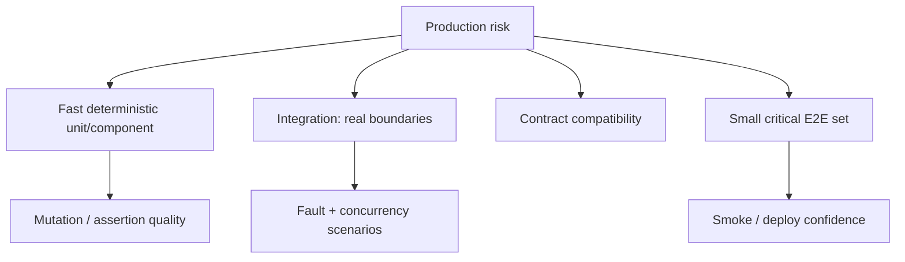

# Testing Engineering: Test Portfolio, Determinism, Mutation & Concurrency

## Neden var?
Testing engineering'in hedefi test sayısını veya coverage yüzdesini maksimize etmek değil, production riskini hızlı ve güvenilir feedback ile azaltmaktır. Test katmanları realism, isolation, speed, diagnosis ve ownership arasında farklı trade-off'lar sunar.

## Mental model

## Test portfolio
- **Unit/component:** dar scope, hızlı feedback ve kolay localization.
- **Integration:** database, filesystem, serialization, network/process boundary veya gerçek adapter davranışını sınar.
- **Contract:** producer/consumer compatibility'yi tüm sistemi ayağa kaldırmadan doğrular.
- **E2E:** kritik user journey'nin gerçek wiring'ini sınar; pahalı ve diagnosis'ı daha zordur.

Property-based testing ve fuzzing ayrı canonical konularda ele alınır; burada bunlar unit/component ve parser/protocol boundary'lerinde daha geniş input-space exploration araçları olarak portfolio'ya yerleşir.

## Determinism
Flaky test aynı code/config altında nondeterministic pass/fail üretir ve CI sinyaline güveni aşındırır. Özellikle zaman ve concurrency testlerinde wall-clock `sleep` yerine fake clock, injected scheduler, barrier/latch ve observable state transition tercih edilir. Randomized test seed'i raporlanmalı ve failure replay edilebilmelidir.

## Mutation testing
Code coverage bir satırın çalıştığını söyler; assertion'ın yanlış davranışı gerçekten yakaladığını söylemez. Mutation testing küçük semantic değişiklikler üretip test suite'in bunları fail ettirip ettirmediğine bakar. Surviving mutant her zaman defect değildir; fakat weak assertion, unreachable behavior veya eksik requirement sinyali olabilir.

## Mocking trade-off
Mock dış boundary'yi kontrol ederek hızlı/deterministic test sağlar. Fakat implementation call sequence'ine aşırı bağlanan mock'lar refactor sırasında davranış değişmeden testleri kırabilir. Domain behavior'ı mümkün olduğunca state/output/invariant üzerinden; remote boundary'leri contract/integration testlerle doğrulamak daha dayanıklıdır.

## Concurrency testing
Tek bir timing sonucunu doğrulamak yerine invariant ve controlled interleaving hedeflenir. Örneğin iki transaction'ın aynı inventory item'ını decrement ettiği senaryoda barrier ile ikisini kritik noktaya getirip race'i reproducible hale getirmek, `sleep(100ms)` kullanmaktan daha güvenilirdir. Database engine'leri de isolation davranışını özel concurrency test harness'larıyla test eder.

## Mülakat soruları
1. Unit ve integration boundary'sini nasıl seçersin?
2. %100 coverage neden reliability garantisi değildir?
3. Flaky test neden ciddi engineering debt'tir?
4. Mock ne zaman faydalı, ne zaman brittle olur?
5. Mutation testing hangi boşluğu doldurur?
6. Retry/backoff testini sleep olmadan nasıl yazarsın?
7. Concurrent race'i deterministic olarak nasıl reproduce edersin?
8. Staff: microservice platformu için test portfolio standardı nasıl kurulur?
9. Principal: CI duration, confidence ve developer throughput nasıl dengelenir?

## Seviyeye göre beklenen cevap
**Junior:** arrange/act/assert, error paths ve temel unit isolation. **Mid:** integration boundary, fixtures, fake clock ve mocking trade-off. **Senior:** concurrency/fault tests, mutation, flaky diagnosis ve CI parallelism. **Staff/Principal:** risk-based portfolio, platform tooling, ownership, release gates ve developer economics.

## Mini alıştırma
`charge(order)` DB transaction açıyor, payment provider çağırıyor ve retry yapıyor. Davranışları unit/integration/contract/E2E olarak sınıflandır. Ardından `sleep(1)` kullanan retry testini fake clock + injected scheduler ile deterministic hale getir.

## Proje fikri
`test-quality-lab`: order service'e unit + PostgreSQL integration + provider contract + tek kritik E2E test ekle. Mutation tool ile surviving mutant'ları incele. Flaky timing testi oluşturup fake clock/barrier ile düzelt. CI'da duration, retry count, flaky rate ve failure localization süresi raporla.

## Failure modes / production
Test pyramid'i dogma yapmak, her dependency'yi mock'lamak, coverage target'ını kalite metriği sanmak, flaky testleri retry ile gizlemek, gerçek adapter boundary'lerini hiç sınamamak ve shared fixtures ile order dependency yaratmak tipik hatalardır. Production incident'larından regression test üretmek, canary/smoke checks ve risk bazlı release gates test portfolio'nun production uzantısıdır.

## Kaynaklar
- PostgreSQL — Regression Tests: https://www.postgresql.org/docs/current/regress.html
- PostgreSQL source — Isolation tests: https://github.com/postgres/postgres/tree/master/src/test/isolation
- LLVM — Testing Infrastructure Guide: https://llvm.org/docs/TestingGuide.html
- GoogleTest — Advanced Guide: https://google.github.io/googletest/advanced.html
