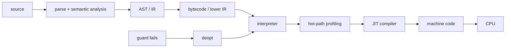

# Bytecode, Interpreter, JIT & Runtime Pipeline

## Neden önemli?
Kaynak kodun CPU'da çalışmasına giden yol tek bir `compile` adımı değildir. Dil implementation'ına göre source lexer/parser ve semantic analysis'ten geçer; AST/IR üretilir; bytecode veya native code'a lower edilir. Bytecode kullanan runtime interpreter dispatch yapabilir; adaptive runtime sıcak yolları specialize veya JIT compile edebilir.

## Mental model

## İçeride ne oluyor?
- Parser syntax structure üretir; semantic analysis name/type/scope kurallarını doğrular.
- Bytecode VM için compact instruction set olabilir; fiziksel CPU ISA'sı olmak zorunda değildir.
- Interpreter opcode decode + handler dispatch eder.
- Adaptive specialization runtime type/shape bilgisiyle generic operation'a fast path ekleyebilir.
- JIT hot method/loop'u native code'a derler; runtime profile speculative optimizasyonlara veri sağlar.
- Guard varsayımı bozulduğunda deoptimization generic execution tier'ına dönüş sağlar.
- GC, allocator, exception handling, stack walking ve safepoint generated code ile runtime arasında sıkı kontratlar oluşturur.

## Trade-off'lar
AOT startup ve deployment öngörülebilirliği sağlar. JIT runtime profile sayesinde daha agresif specialization yapabilir fakat warm-up, compiler CPU/RSS, code cache ve deoptimization maliyeti getirir. Bu nedenle yalnız steady-state throughput benchmark'ı yeterli değildir.

## Mülakat soruları
1. Interpreter ile compiler farkı nedir?
2. Bytecode neden machine code değildir?
3. JIT neden AOT'tan hızlı olabilir ve neden daha yavaş başlayabilir?
4. Hot path nasıl tespit edilir?
5. Deoptimization neden gerekir?
6. Senior: inline cache/type specialization hangi workload'da faydalıdır?
7. Staff: latency-sensitive service'te warm-up ve code-cache risklerini nasıl yönetirsin?

## Beklenen cevap seviyesi
- **Junior:** source → parse → bytecode/native → execute.
- **Mid:** interpreter dispatch, bytecode, JIT, warm-up.
- **Senior:** profiling, specialization, guards, deopt ve GC interaction.
- **Staff:** startup/steady-state economics, fleet rollout ve workload benchmark tasarımı.

## Mini alıştırma
`x + y` için küçük stack bytecode yaz. Generic `ADD` instruction'ı iki operand sürekli integer olduğunda `ADD_INT` fast path'e specialize et. Sonra string operand geldiğinde guard failure ve deopt akışını çiz.

## Proje fikri
`tiny-tiered-vm`: `LOAD_CONST`, `LOAD_LOCAL`, `ADD`, `JUMP`, `RETURN` opcode'ları olan stack VM yaz. Opcode counter ile hot instruction tespit et; `ADD_INT` specialization ekle. Startup, generic/specialized throughput ve branch davranışını ölç.

## Failure modes ve production bağlantısı
JIT'i otomatik hız garantisi sanmak, yalnız steady-state benchmark yapmak, warm-up'ı production traffic'e ödetmek, deopt/code-cache pressure'ı gözlemlememek ve runtime upgrade'ini workload benchmark olmadan rollout etmek tipik hatalardır. Startup latency, throughput, p95/p99, CPU, RSS, allocation/GC, compilation time, deopt ve code-cache birlikte değerlendirilir.

## Kaynaklar
- CPython `dis`: https://docs.python.org/3/library/dis.html
- CPython 3.13 experimental JIT: https://docs.python.org/3/whatsnew/3.13.html
- OpenJDK HotSpot VM Performance Enhancements: https://docs.oracle.com/en/java/javase/24/vm/java-hotspot-virtual-machine-performance-enhancements.html
- LLVM Kaleidoscope JIT tutorial: https://llvm.org/docs/tutorial/BuildingAJIT1.html
