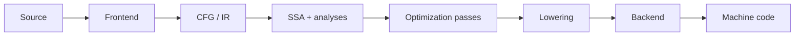

# Compiler Middle-End — SSA, CFG, PHI, Dominators & Optimization Passes

## Neden önemli?
Compiler frontend source'u parse/type-check edip IR'a indirger; middle-end target ISA'dan büyük ölçüde bağımsız analiz ve optimizasyon yapar; backend instruction selection, register allocation ve scheduling ile machine code üretir. Middle-end'i anlamanın temel iki modeli **control-flow graph (CFG)** ve **Static Single Assignment (SSA)** formudur.



## Mental model
SSA'da her sanal değer bir kez tanımlanır. `if/else` gibi kontrol yolları birleştiğinde `phi`, predecessor'a göre hangi tanımın geçerli olduğunu temsil eder. Böylece def-use zinciri açıklaşır ve constant propagation, dead-code elimination, GVN ve loop optimizasyonları kolaylaşır.

```text
entry: x0 = 1
        branch c, T, E
T:     x1 = 2
        jump M
E:     x2 = 3
        jump M
M:     x3 = phi(T:x1, E:x2)
        return x3
```

## CFG, dominance ve PHI
Basic block tek girişli, branch hariç düz kontrol akışlı instruction dizisidir; CFG edge'leri branch/fallthrough ilişkisini taşır. `A`, `B`'yi dominate ediyorsa entry'den B'ye giden her yol A'dan geçer. Immediate dominator ilişkileri dominator tree oluşturur. SSA construction'da dominator frontier, farklı definition yollarının birleştiği ve phi gerekebilecek bölgeleri bulmaya yardım eder.

PHI runtime'da iki değeri eager hesaplayan normal function call değildir. Control hangi predecessor edge'den geldiyse o edge'e ait value'yu seçen IR semantiğidir; lowering sırasında copy/move düzenine dönüşebilir.

## Optimization passes
- **Constant propagation/folding:** bilinen değerleri yayar ve ifadeleri compile time'da sadeleştirir.
- **DCE:** observable etkisi olmayan ölü hesapları kaldırır.
- **GVN/CSE:** eşdeğer hesapların tekrarını azaltır.
- **LICM:** güvenli loop-invariant hesapları loop dışına taşır.
- **Inlining:** call overhead ve optimization visibility kazancı karşılığında code size/compile time büyütebilir.
- **Vectorization:** bağımsız scalar işleri SIMD'e dönüştürmeye çalışır.

Analysis pass bilgi üretir; transform pass IR'ı değiştirir. Transform sonrası daha önce hesaplanmış analysis sonuçları invalidate olabilir. Pass ordering bu nedenle correctness kadar compile-time ve optimization opportunity ekonomisini de etkiler.

## Mülakat soruları
1. Frontend, middle-end ve backend sorumlulukları nedir?
2. Basic block ve CFG nedir?
3. SSA neden optimizer için kullanışlıdır?
4. PHI node neyi temsil eder?
5. Dominator ve dominator frontier neden önemlidir?
6. Senior: alias analysis LICM/GVN'yi neden sınırlar?
7. Staff: pass ordering ve analysis invalidation nasıl yönetilir?
8. Staff: optimizer-induced miscompile şüphesini nasıl triage edersin?

## Beklenen cevap derinliği
**Mid:** AST → IR → machine code, CFG, SSA, phi. **Senior:** dominance, aliasing, DCE/GVN/LICM, lowering ve IR invariants. **Staff:** pass pipeline economics, analysis invalidation, target-independent/target-specific sınırı, debugability ve miscompile isolation.

## Mini alıştırma
`x=1; if(c) x=x+1; else x=x*2; return x+4` kodunu CFG'ye çevir, SSA isimleri ve merge phi'sini yaz. Ardından `c=true` compile-time constant ise propagation + DCE sonrasında hangi block'ların kalacağını açıkla.

## Proje fikri
`mini-ssa-lab`: küçük branch/expression dilini basic-block CFG'ye indir; dominator hesabı, basit phi insertion, constant propagation ve DCE ekle. Her pass öncesi/sonrası IR dump ve differential test üret.

## Failure modes / trade-off / production
SSA'yı source variable modeli sanmak; phi'yi normal function call gibi düşünmek; optimizer'ın aliasing ve language UB kurallarını yok saymak; tek microbenchmark'tan genel sonuç çıkarmak tipik hatalardır. Production compiler upgrade'i correctness, build time, binary size, CPU ve debug-symbol kalitesiyle canary edilmelidir. JIT runtime'da aynı kavramlar profile-guided optimization, guards ve deoptimization ile birleşir.

## Kaynaklar
- LLVM Language Reference: https://llvm.org/docs/LangRef.html
- LLVM Analysis & Transform Passes: https://llvm.org/docs/Passes.html
- LLVM Loop Terminology / LCSSA: https://llvm.org/docs/LoopTerminology.html
- LLVM New Pass Manager: https://llvm.org/docs/NewPassManager.html
