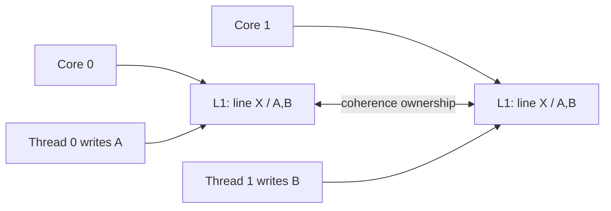

# Cache Coherence, Cache Lines & False Sharing

## Mental model
Çok çekirdekli CPU'da shared write maliyetini yalnız instruction sayısı olarak değil **cache-line ownership migration** olarak düşün. Aynı line iki core arasında sürekli el değiştiriyorsa ucuz görünen increment pahalı koordinasyona dönüşür.

## Coherence neyi çözer?
Her core aynı memory address'in cache'lenmiş kopyasını tutabilir. Cache coherence tek address/cache-line için kopyaların görünürlüğünü koordine eder. Bu, programlama dilinin memory-ordering veya happens-before modelinin yerine geçmez: **coherence ve consistency/order farklı katmanlardır**.

Coherence çoğunlukla cache-line granularity'sindedir. Line boyutu platforma bağlıdır; yaygın x86-64 sistemlerde 64 byte görülse de portable kod bunu evrensel sabit saymamalıdır.

## True sharing vs false sharing
- **True sharing:** thread'ler aynı logical datum üzerinde iletişim kurar.
- **False sharing:** thread'ler farklı datum'lara yazar fakat datum'lar aynı cache line'dadır; line ownership sürekli core değiştirir.

False sharing data race gerektirmez. Her thread kendi atomic counter'ına yazıyor olsa bile counter'lar aynı line'daysa throughput kötü ölçeklenebilir.

## Atomics neden yine pahalı olabilir?
`lock-free` ifadesi `coordination-free` demek değildir. Shared atomic read-modify-write, cache line'ın write ownership'ini isteyen core'lar arasında ping-pong yaratabilir. Core sayısı arttıkça tek global counter serialization noktası olabilir.

Mitigation seçenekleri:
- per-thread/per-CPU sharded counters + periodic aggregation,
- hot mutable alanları layout'ta ayırmak,
- workload uygunsa batching,
- gereksiz shared writes'ı kaldırmak.

Padding/alignment memory footprint, cache/TLB pressure ve layout complexity maliyeti getirir; ölçmeden uygulanmamalıdır.

## Teşhis
Linux kernel false-sharing dokümantasyonu `perf c2c`, `perf stat/report` ve layout incelemesi için `pahole` gibi araçları örnekler. Benchmark'ta CPU affinity, NUMA placement ve scheduler migration kontrol edilmezse yanlış attribution yapılabilir.

## Mülakat soruları
1. Cache coherence ile memory ordering farkı nedir?
2. False sharing data race olmadan nasıl performans sorunu yaratır?
3. Atomic counter neden core sayısıyla kötü ölçeklenebilir?
4. Padding ne zaman işe yarar, maliyeti nedir?
5. Per-CPU counter hangi correctness/freshness trade-off'unu getirir?
6. NUMA sistemde false sharing'i nasıl doğrularsın?
7. Lock contention ile cache-line contention'ı nasıl ayırırsın?

## Beklenen cevap seviyesi
- **Mid:** cache line, invalidation/ownership, true-vs-false sharing.
- **Senior:** atomics, ping-pong, sharding, NUMA ve measurement.
- **Staff:** HITM/coherence sinyalleri, data-layout economics ve architecture-level mitigation.

## Mini alıştırma
8 worker'ın global atomic counter artırdığı benchmark yaz. Sonra counter'ı worker başına shard et. 1/2/4/8 core için throughput/p99 ölç; contiguous ve padded counters'ı karşılaştır.

## Proje fikri
`cacheline-lab`: C/C++ veya Rust ile shared atomic, contiguous per-worker ve padded per-worker counter varyantları oluştur. CPU affinity ile tekrar et; `perf stat` ve mümkünse `perf c2c` ile cache-to-cache davranışını karşılaştır.

## Failure modes / production bağlantısı
Her shared alanı padding ile ayırmak locality'yi bozabilir. Scheduler migration'ı false sharing sanmak veya microbenchmark sonucunu farklı CPU topolojilerine genellemek de hatadır. Production'da metrics counters, allocators, queues, reference counts ve lock metadata hot cache lines yaratabilir; mitigation profiler/perf-counter kanıtına dayanmalıdır.

## Kaynaklar
- Linux Kernel — False Sharing: https://docs.kernel.org/kernel-hacking/false-sharing.html
- Linux perf c2c: https://man7.org/linux/man-pages/man1/perf-c2c.1.html
- C++ memory order reference: https://en.cppreference.com/w/cpp/atomic/memory_order.html
