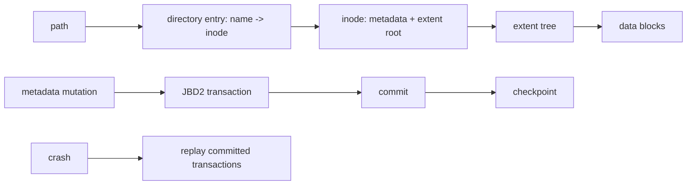

# ext4 On-Disk Internals, Directories & JBD2 Journaling

## Mental model

## Temel model
ext4 block group'larla allocation locality kurar. Directory entry filename'i inode numarasına bağlar; inode metadata ve block/extent mapping'i taşır. Filename inode'un parçası değildir; bu nedenle birden fazla hard link aynı inode'u gösterebilir. Büyük directory'ler hashed htree index kullanabilir.

Extent, contiguous logical block aralığını physical block aralığına eşler. Tek tek block pointer tutmaya göre büyük dosyalarda metadata miktarını ve fragmentation kaynaklı mapping maliyetini azaltabilir.

## JBD2 ve crash consistency
Journal'in amacı uygulamanın her son yazısını otomatik durable yapmak değil, özellikle metadata transaction'larının crash sonrası yapısal tutarlılığını korumaktır. JBD2 transaction descriptor/data veya revocation kayıtlarıyla ilerler ve tamamlanmış transaction commit block ile işaretlenir. Recovery committed transaction'ları replay edebilir; incomplete transaction discard edilir.

Commit ile checkpoint ayrıdır. Commit recovery sınırını belirler; checkpoint committed değişikliklerin home location'larına yazılmasını tamamlar. ext4 varsayılan `data=ordered` modunda metadata'yı journal eder ve ilgili data write'larını metadata commit'inden önce sıralar. `data=journal` data+metadata journaling ile daha güçlü fakat pahalıdır; `data=writeback` daha zayıf ordering sağlar.

## İnce noktalar
- `unlink`, directory entry'yi kaldırır; açık fd varsa inode hemen ölmek zorunda değildir.
- Crash sırasında truncate/unlink gibi yarım kalabilecek durumlar için orphan tracking vardır.
- `fsync(file)` ve directory metadata durability aynı boundary değildir; atomic replace protokollerinde rename sonrası directory sync gerekebilir.
- Filesystem consistency, application-level logical consistency ve device-level durability farklı kontratlardır.

## Mülakat soruları
1. Directory entry ile inode farkı nedir?
2. Hard link neden filesystem sınırını aşamaz?
3. Extent neden kullanılır?
4. Journal ile database WAL hangi açıdan benzer/farklıdır?
5. `data=ordered`, `data=journal`, `data=writeback` trade-off'u nedir?
6. Commit olmuş ama checkpoint edilmemiş transaction crash sonrası ne olur?
7. `write temp -> fsync(temp) -> rename -> fsync(dir)` hangi riskleri hedefler?
8. Corruption, lost write ve stale application state'i nasıl ayırırsın?

## Seviye beklentisi
**Mid:** path → directory entry → inode → extent → block zinciri. **Senior:** JBD2 replay, ordering, fsync ve unlink/open-file semantics. **Staff:** durability boundary'leri, device cache/barrier katmanları, failure injection ve workload trade-off'ları.

## Mini alıştırma ve proje
İki hard link'in aynı inode'u gösterdiği senaryoda link count ve açık fd yaşam döngüsünü çiz. Ardından loopback ext4 image üzerinde temp-file + rename protokolü kur; farklı `fsync` noktalarında kontrollü crash yapıp recovery state'lerini sınıflandır. `debugfs`, `stat`, `filefrag` ile gözlemle.

## Failure modes / production
Journal var diye son `write` durable sanmak, inode=filename varsaymak, commit/checkpoint'i karıştırmak ve storage controller/device cache'i model dışı bırakmak tipik hatalardır. Production'da journal/writeback latency, dirty pages, IO queue latency, ENOSPC/inode exhaustion ve filesystem errors birlikte izlenir.

## Kaynaklar
- Linux Kernel — ext4 overview: https://docs.kernel.org/filesystems/ext4/overview.html
- Linux Kernel — inodes: https://docs.kernel.org/filesystems/ext4/inodes.html
- Linux Kernel — directories: https://docs.kernel.org/filesystems/ext4/directory.html
- Linux Kernel — JBD2 journal: https://docs.kernel.org/filesystems/ext4/journal.html
- Linux Kernel — orphan file: https://docs.kernel.org/filesystems/ext4/orphan.html
