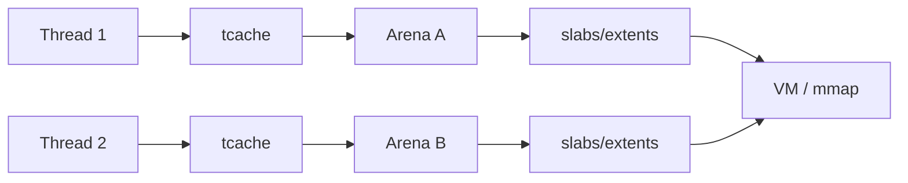

# Memory Allocators, Arenas, Thread Caches & Fragmentation

## Neden önemli?
`malloc/free` ile OS virtual-memory allocation aynı katman değildir. General-purpose allocator, syscall ve synchronization maliyetini amortize etmek için OS'tan büyük bölgeler alır; küçük allocation'ları size class/slab/bin yapılarından servis eder. Production'da bu katman throughput, tail latency, RSS ve container OOM davranışını doğrudan etkileyebilir.

## Mental model

Thread cache küçük raf, arena bölgesel depo, OS büyük tedarikçidir. Daha çok yerel depo coordination'ı azaltır; fakat yarım boş depolar footprint'i büyütebilir.

## İçeride ne oluyor?
- Internal fragmentation request ile size-class allocation arasındaki farktır.
- External fragmentation toplam boş alan olsa bile uygun layout/extent bulunamaması veya sayfaların tamamen boşalamamasıdır.
- jemalloc küçük object'leri slab içinde, büyük object'leri extent ile yönetir.
- Multiple arenas concurrent allocation'ı ölçeklendirebilir; fazla arena cache locality ve fragmentation maliyeti yaratabilir.
- Thread-specific caches common-case allocation'da synchronization'ı azaltır, fakat memory kullanımını artırabilir.
- `free()` object'i allocator'a döndürür; RSS'in hemen azalmasını garanti etmez. Dirty/muzzy/reusable page'lerin kernel'e purge edilmesi ayrı yaşam döngüsüdür.
- OOM analizinde `allocated`, `active`, resident/RSS, mapped memory, arena/tcache stats ve allocation profile birlikte okunmalıdır.

## Mülakat soruları
1. `malloc/free` neden her çağrıda syscall yapmaz?
2. Internal ve external fragmentation farkı nedir?
3. Thread cache throughput'u neden artırır?
4. `free()` sonrası RSS neden yüksek kalabilir?
5. Arena sayısı arttıkça hangi trade-off oluşur?
6. Memory leak ile fragmentation'ı nasıl ayırırsın?
7. Container OOM olurken live heap sabitse nasıl teşhis edersin?
8. Allocator değiştirme/tuning kararını nasıl benchmark edersin?

## Seviyeye göre cevap derinliği
- **Mid:** allocator, size class, fragmentation, cache.
- **Senior:** arenas/tcache, RSS-vs-live bytes, purge/decay, workload lifetime distribution.
- **Staff:** NUMA/container limits, profiling, allocator experiments, throughput-vs-memory-vs-tail-latency economics.

## Mini alıştırma
8 thread ile 64 B, 1 KiB ve 64 KiB allocation/free workload'u kur. Thread count ve object lifetime dağılımını değiştirerek throughput, peak RSS ve allocator stats ölç. Aynı live-set'te RSS değişimini açıklamaya çalış.

## Proje fikri
`allocator-lab`: glibc malloc ve jemalloc ile aynı workload'u çalıştır. Allocation-rate, p99 latency, RSS/allocated oranı ve thread count ilişkisini raporla; heap profile ekle.

## Failure modes / trade-off / production
RSS büyümesini doğrudan leak saymak, reusable fakat OS'a dönmemiş memory'yi gözden kaçırmak, arena sayısını körlemesine artırmak ve production allocation pattern'ini temsil etmeyen microbenchmark'a güvenmek tipik hatalardır. High-QPS server, proxy, database ve runtime'larda allocator contention veya fragmentation latency ve OOM riskine dönüşebilir.

## Kaynaklar
- jemalloc manual: https://jemalloc.net/jemalloc.3.html
- jemalloc project: https://jemalloc.net/
- GNU libc allocator: https://sourceware.org/glibc/manual/latest/html_node/The-GNU-Allocator.html
- GNU libc malloc tunables: https://sourceware.org/glibc/manual/latest/html_node/Memory-Allocation-Tunables.html
