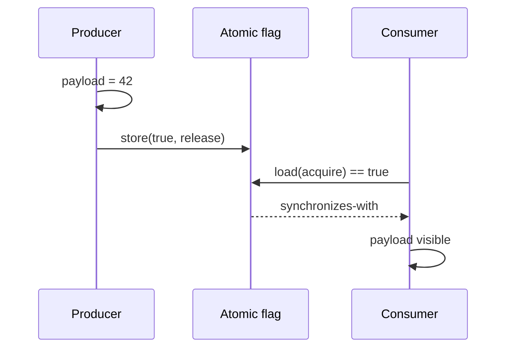

# Memory Ordering, Atomics, Happens-Before & Fences

## Konu anlatımı
Concurrent correctness kaynak kodu satır sırasını başka thread'in aynen gözleyeceği varsayımına dayanamaz. Compiler optimizasyonu, CPU ordering ve language memory model birlikte çalışır. Temel soru instruction zamanlaması değil, erişimler arasında hangi **happens-before** ilişkilerinin garanti edildiğidir.

Conflicting non-atomic erişimler synchronization olmadan data race oluşturabilir. Atomic operation tek başına çevresindeki tüm state'i publish etmez. `relaxed` atomicity sağlar; `release` store ile o değeri okuyan `acquire` load publication için `synchronizes-with` edge kurabilir. `seq_cst` daha güçlü total-order modeli ekler fakat yanlış object lifetime veya data race tasarımını düzeltmez.

## Mental model

## İçeride ne oluyor?
- Atomicity ve visibility/ordering farklı problemlerdir.
- `memory_order_relaxed` atomic update sağlar, synchronization sağlamaz.
- Release/acquire yalnız doğru read-from ilişkisi oluştuğunda publication garantisi verir.
- Mutex unlock/lock synchronization ve happens-before ilişkisi kurar; atomics mutex'in otomatik olarak daha hızlı alternatifi değildir.
- `seq_cst` seq_cst operation'lar için tek total order sağlar.
- Fence, ilişkili atomic handshake ile anlamlıdır; rastgele fence eklemek correctness kanıtı değildir.
- ISA farkları önemlidir: güçlü ordering'e sahip platformda görünmeyen bug weakly ordered platformda ortaya çıkabilir.

## Mülakat soruları
1. Atomicity ile visibility/order farkı nedir?
2. Happens-before neyi ifade eder?
3. Relaxed atomic hangi kullanımda yeterlidir?
4. Release/acquire publication nasıl çalışır?
5. Mutex neden memory-ordering primitive'idir?
6. Senior: double-checked initialization hangi garantileri ister?
7. Staff: x86'da çalışan lock-free kod ARM'de neden bozulabilir?
8. Staff: lock-free yerine mutex ne zaman daha doğru karardır?

## Beklenen cevap derinliği
- **Mid:** race, atomic, mutex, visibility ve happens-before.
- **Senior:** relaxed/acquire/release/seq_cst ve publication invariant'ları.
- **Staff:** compiler + ISA + language memory model ayrımı; portability, reclamation ve test stratejisi.

## Mini alıştırma
`payload + ready` message-passing örneğini normal değişkenler, relaxed atomics ve release/acquire ile üç kez çiz. Her sürümde hangi visibility sonucunun garanti edildiğini yaz.

## Proje
`memory-order-litmus-lab`: message passing, store buffering ve atomic counter örneklerini farklı memory order'larla çalıştır. ThreadSanitizer ve farklı mimari runner'larla correctness/performance sonuçlarını ayır.

## Failure modes / trade-off / production
`volatile`'ı synchronization sanmak; atomic flag'in tüm object graph'i otomatik güvenli yaptığını varsaymak; benchmark için memory order zayıflatmak; lifetime/reclamation problemini ordering ile karıştırmak tipik hatalardır. Production'da kanıtlanabilir synchronization primitive'leri varsayılan olmalı; lock-free tasarım ancak ölçülmüş contention/latency ihtiyacı ve test edilebilir invariant ile gerekçelendirilmelidir.

## Kaynaklar
- C++ reference — memory order: https://en.cppreference.com/w/cpp/atomic/memory_order.html
- C++ reference — multithreading/data races: https://en.cppreference.com/w/cpp/language/multithread.html
- C++ reference — atomic_thread_fence: https://en.cppreference.com/w/cpp/atomic/atomic_thread_fence.html
- Linux kernel — memory barriers: https://docs.kernel.org/core-api/wrappers/memory-barriers.html
