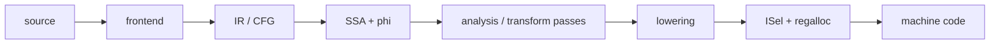

# Compiler Middle-End — SSA, CFG, PHI, Dominators & Optimization Passes

## Konu anlatımı
Compiler pipeline'ında frontend source'u parse/type-check edip IR'a indirger; middle-end hedef ISA'dan büyük ölçüde bağımsız analiz ve transformlar uygular; backend instruction selection, register allocation ve scheduling ile machine code üretir. Middle-end'in temel veri modeli control-flow graph (CFG) ve Static Single Assignment (SSA) formudur.

SSA'da her sanal değer bir kez tanımlanır. Kontrol akışının birleştiği noktada farklı predecessor'lardaki tanımlar `phi` ile birleştirilir. Def-use ilişkilerinin explicit olması constant propagation, dead-code elimination, GVN ve loop optimization gibi pass'leri kolaylaştırır.



## CFG, SSA ve PHI
Basic block tek girişli, branch dışında ortada control transfer olmayan instruction dizisidir. CFG'de block'lar node, branch/fallthrough ilişkileri edge'dir. SSA her value'yu tek definition'a bağlar. LLVM'de `phi`, current block'a hangi predecessor edge'den gelindiğine göre incoming value'yu seçer.

```text
entry
  |
 cond
 /  \
T    F
|    |
x1   x2
 \  /
 merge: x3 = phi(x1, x2)
```

PHI'yi normal eager function call gibi düşünmek yanlıştır; semantic olarak predecessor edge'e bağlı value selection'dır ve backend lowering'de copy/move düzenine dönüşebilir.

## Dominance
A block'u B'yi dominate ediyorsa entry'den B'ye giden her yol A'dan geçer. Immediate-dominator ilişkileri dominator tree oluşturur. SSA construction'da dominator frontier, bir definition'ın farklı control paths üzerinden birleşebileceği ve phi gerekebilecek noktaları bulmaya yardım eder. LLVM `mem2reg` uygun stack slots'u register SSA formuna yükseltirken bu yaklaşımı kullanır.

## Analysis ve transform passes
Analysis pass IR'ı değiştirmeden bilgi üretir; transform pass IR'ı değiştirir ve bazı analysis sonuçlarını invalidate edebilir. Yaygın dönüşümler:

- constant propagation / SCCP
- dead-code elimination
- global value numbering
- loop-invariant code motion
- inlining
- vectorization

Pass ordering önemlidir: bir transform başka bir optimizasyon fırsatını açabilir veya kapatabilir; compile-time ve code-size maliyeti de vardır.

## Alias analysis neden önemlidir?
Optimizer iki pointer'ın aynı memory'yi gösterip göstermediğini bilmiyorsa load/store hareketlerini güvenle yapamayabilir. Örneğin LICM, loop içindeki load'u dışarı taşımadan önce intervening store/call'ın aynı location'ı değiştirmediğini kanıtlamaya ihtiyaç duyar. Dilin undefined-behavior ve aliasing kuralları optimizer'ın proof space'ini doğrudan etkiler.

## Mülakat soruları
1. Frontend, middle-end ve backend ayrımı nedir?
2. Basic block ve CFG nedir?
3. SSA neden optimizasyonu kolaylaştırır?
4. PHI node neyi temsil eder?
5. Dominator ve dominator frontier nedir?
6. Alias analysis LICM/GVN'yi neden sınırlar?
7. Pass ordering neden önemlidir?
8. Optimization-induced miscompile nasıl triage edilir?

## Seviyeye göre cevap
- **Mid:** AST → IR → machine code, CFG, SSA, phi.
- **Senior:** dominance, alias analysis, DCE/GVN/LICM, lowering.
- **Staff:** pass pipeline economics, invalidation, target-independent vs target-specific optimizasyon, debugability ve miscompile isolation.

## Mini alıştırma
`x=1; if(c) x=x+1; else x=x*2; return x+4` kodunu CFG'ye çevir, SSA isimlerini ve merge phi'sini yaz. `c=true` compile-time constant olduğunda constant propagation + DCE sonrasını çiz.

## Proje fikri
`mini-ssa-lab`: küçük branch/expression dilini CFG'ye indir; dominator hesabı, basit phi insertion, constant propagation ve DCE ekle. Her pass öncesi/sonrası IR dump üret ve differential tests kullan.

## Failure modes / production bağlantısı
SSA'yı source variable modeli sanmak; phi'yi normal function call gibi düşünmek; aliasing/UB kurallarını yok saymak; tek microbenchmark'tan pipeline kararı çıkarmak tipik hatalardır. Compiler upgrade'leri production'da correctness, binary size, build time, CPU ve debug-symbol kalitesiyle canary edilmelidir. JIT'lerde aynı kavramlar profiling, speculative optimization ve deoptimization ile birleşir.

## Kaynaklar
- LLVM Language Reference: https://llvm.org/docs/LangRef.html
- LLVM Analysis & Transform Passes: https://llvm.org/docs/Passes.html
- LLVM Loop Terminology / LCSSA: https://llvm.org/docs/LoopTerminology.html
- LLVM New Pass Manager: https://llvm.org/docs/NewPassManager.html
