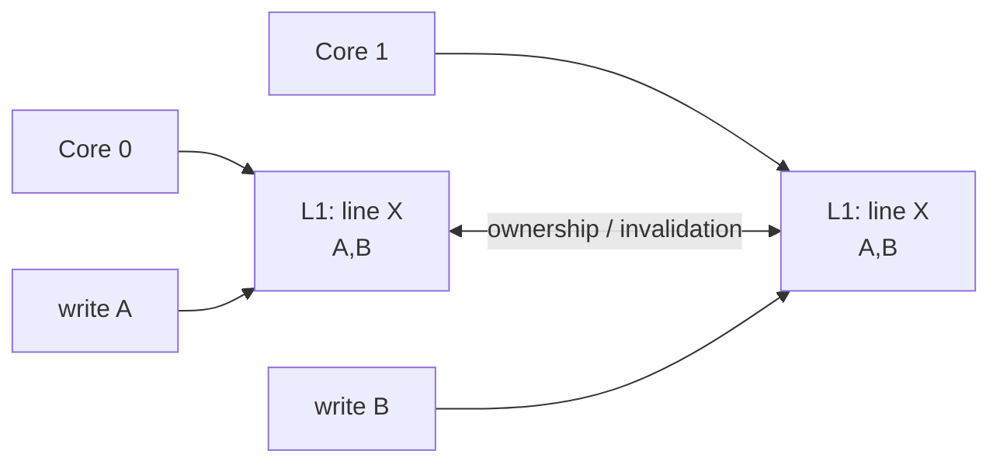

# Cache Coherence, Cache Lines & False Sharing

## Mental model
Çok çekirdekli sistemde aynı memory location birden fazla private cache'te bulunabilir. Coherence donanımı tek bir cache line için kopyaların çelişkili biçimde yaşamasını sınırlar; fakat bu, dil seviyesindeki happens-before/memory-order kurallarının yerine geçmez.

## Coherence neden gerekir?
Her core'un private cache'i performans için gereklidir; ancak write sonrası diğer core'ların eski kopyaları kontrol edilmezse aynı address için farklı gerçeklikler oluşur. Coherence protokolleri line state/ownership ve invalidation/transfer mekanizmalarıyla bunu yönetir. Cache line boyutu mimariye bağlıdır; 64 B yaygındır fakat portable kod bunu sabit varsaymamalıdır.

## True sharing ve false sharing
**True sharing** aynı logical datum'un thread'lerce paylaşılmasıdır. **False sharing** ise farklı datum'ların aynı coherence line'da bulunması nedeniyle bağımsız write'ların line'ı core'lar arasında ping-pong ettirmesidir. Data race olmayabilir; correctness doğruyken scalability kötü olabilir.

Atomics de bu maliyetten kaçmaz. Tek global atomic counter instruction düzeyinde lock-free olsa bile her increment ownership transferi gerektiriyorsa core sayısı arttıkça throughput plato yapabilir.

## Teşhis
Önce workload ve scaling curve ölçülür. 1→2→4→8 core throughput artmıyorsa CPU utilization, scheduler migration, lock contention ve cache-to-cache trafik ayrı hipotezler olarak ele alınır. Linux kernel dokümantasyonu `perf stat/report`, ardından `perf c2c`, `pahole` ve gerekirse address-to-line araçlarını false-sharing analizi için önerir.

## Mitigation trade-off'ları
- Hot writable fields'ı farklı line'lara ayırmak/padding: coherence azalır, memory/cache/TLB footprint artar.
- Per-thread/per-CPU counters: hot shared write azalır, aggregation ve freshness semantics gerekir.
- Read-mostly ve write-heavy alanları ayırmak: layout karmaşıklığı yaratabilir.
- Unconditional write'ı azaltmak: coherence trafiğini düşürebilir fakat branch/logic maliyeti ekler.

Her struct'ı cache-line align etmek çözüm değildir. Cold data'da memory locality kaybı false sharing kazancından pahalı olabilir.

## Mülakat soruları
1. Cache coherence ve memory consistency arasındaki fark nedir?
2. False sharing data race olmadan nasıl oluşur?
3. Global atomic counter neden kötü scale edebilir?
4. Padding hangi maliyetleri getirir?
5. Per-CPU sharding correctness/freshness açısından ne değiştirir?
6. NUMA sistemde cache-line contention'ı nasıl kanıtlarsın?

## Beklenen cevap seviyesi
- **Mid:** line/invalidation/false-sharing sezgisi.
- **Senior:** atomics, ownership migration, per-core sharding, NUMA ve measurement.
- **Staff:** layout economics, HITM/cache-to-cache sinyalleri ve production profiling ile mitigation doğrulaması.

## Mini alıştırma
Global atomic counter ile worker başına counter benchmark'ı kur. 1/2/4/8 core throughput ve p99 karşılaştır; counters contiguous ve padded iken ölçümü tekrarla. CPU affinity kullanarak scheduler migration etkisini kontrol et.

## Proje fikri
`cacheline-lab`: C/C++ veya Rust'ta shared atomic, contiguous sharded ve padded sharded counter varyantları. `perf stat` ve `perf c2c` çıktılarıyla sonuçları README'de açıkla.

## Production bağlantısı / failure modes
Metrics counters, allocators, queues, reference counts ve lock metadata hot cache line yaratabilir. Lock contention'ı false sharing sanmak, affinity kontrolü olmadan benchmark yapmak veya profiler kanıtı olmadan padding eklemek tipik hatalardır.

## Kaynaklar
- Linux Kernel — False Sharing: https://docs.kernel.org/kernel-hacking/false-sharing.html
- perf-c2c: https://man7.org/linux/man-pages/man1/perf-c2c.1.html
- C++ memory order reference: https://en.cppreference.com/w/cpp/atomic/memory_order.html
