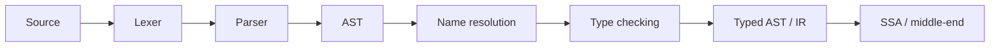

# Compiler Frontend: Lexer, Parser, AST, Name Resolution & Type Checking

## Konu anlatımı
Compiler frontend source text'i semantik olarak anlamlı bir temsile dönüştürür. Temel zincir `source -> lexer -> tokens -> parser -> AST -> name resolution -> type checking -> typed AST/IR` şeklindedir. Lexer karakterleri token'lara ayırır; parser grammar'a göre AST kurar; resolver identifier'ları declaration'lara bağlar; type checker semantic constraint'leri doğrular. Bu çıktı middle-end SSA/optimization katmanına geçer.

## Mental model
Lexer kelimeleri ayırır; parser cümle ağacını kurar; resolver isimlerin kimi gösterdiğini bulur; type checker anlam kurallarını sınar. `1 + * 2` syntax, `unknown + 2` resolution, `"a" - 2` type hatasıdır.

## İçeride ne oluyor?
- Lexer token ile birlikte source span taşır; Unicode, escapes ve comments correctness alanıdır.
- Recursive descent grammar production'larını fonksiyonlara dönüştürür; expressions için Pratt/precedence-climbing kullanılabilir.
- AST parse tree'deki gereksiz punctuation ayrıntılarını azaltıp semantic structure taşır.
- Symbol table/scope stack lexical binding, shadowing ve imports'u çözer.
- Type checker annotation/inference ve operator/call/return constraint'lerini doğrular.
- Error recovery ve source mapping compiler UX'in parçasıdır; incremental compiler'da cache invalidation correctness problemi olur.

## Mülakat soruları
1. Lexer ile parser neden ayrıdır?
2. Token stream, parse tree ve AST farkı nedir?
3. Operator precedence nasıl modellenir?
4. Lexical scope/symbol table nasıl çalışır?
5. Syntax error recovery neden önemlidir?
6. Type inference ve checking farkı nedir?
7. Incremental compilation hangi invalidation risklerini getirir?
8. Yeni language feature frontend, IR ve IDE tooling'i nasıl etkiler?

## Seviye beklentisi
- **Junior:** token/grammar/AST ve syntax-vs-semantic error.
- **Mid:** recursive descent, precedence, symbol table, temel type checking.
- **Senior:** recovery, inference/constraints, incremental compilation, diagnostics.
- **Staff:** representation, compatibility, tooling ve optimizer etkileri.

## Mini alıştırma
`expr := term (('+'|'-') term)*`, `term := NUMBER | IDENT | '(' expr ')'` grammar'ında `price + 2 - tax` girdisini tokenize edip AST çiz. `price:String`, `tax:Int` için type error node ve source span'i belirle.

## Proje fikri
`tiny-compiler-frontend`: lexer + recursive-descent parser + AST + nested-scope symbol table + `Int/Bool/String` checker; ardından interpreter veya LLVM IR emitter. Golden parser tests ve malformed-input corpus ekle.

## Failure modes / trade-off / production
Ambiguous grammar complexity ve kötü diagnostics üretir. AST'yi syntax'a aşırı bağlamak optimizer'ı, aşırı normalize etmek source mapping'i zorlaştırır. Unicode/escape bugs security problemi olabilir. Incremental semantic cache yanlış invalidation ile stale result üretebilir. Aynı teknikler IDE, linter, SQL parser, template engine ve policy/config languages'da kullanılır.

## Kaynaklar
- LLVM Kaleidoscope — Lexer: https://llvm.org/docs/tutorial/MyFirstLanguageFrontend/LangImpl01.html
- LLVM Kaleidoscope — Parser and AST: https://llvm.org/docs/tutorial/MyFirstLanguageFrontend/LangImpl02.html
- LLVM Kaleidoscope — IR generation: https://llvm.org/docs/tutorial/MyFirstLanguageFrontend/LangImpl03.html
- Clang AST: https://clang.llvm.org/docs/IntroductionToTheClangAST.html
