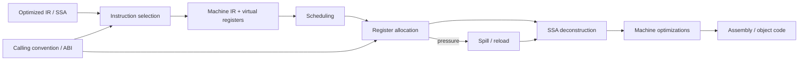

# Compiler Backend — Instruction Selection, Register Allocation, Calling Convention & Spills

## Neden önemli?
Compiler frontend source'u anlamlandırır, middle-end SSA/IR üzerinde target-independent optimizasyon yapar; backend aynı semantiği gerçek ISA'nın instruction, register ve ABI kısıtlarına indirger. Bu katman compile-time ile runtime performance arasındaki en somut köprülerden biridir.

## Mental model


**Backend = semantik → sınırlı makine kaynakları.** Virtual register soyut, fiziksel register kıttır. Live range'ler çakışırsa aynı fiziksel register'ı paylaşamaz; kapasite yetmezse değer stack slot'a spill edilir.

## Instruction selection
Instruction selection IR operation'larını target ISA pattern'larına eşler. Eşleme 1:1 değildir: unsupported operation birkaç instruction'a açılabilir; FMA gibi target instruction birden fazla IR operation'ı birleştirebilir. LLVM target-independent code generator instruction selection, scheduling, machine optimizations ve register allocation gibi aşamaları ayrı ele alır.

Target legalization ISA'nın desteklemediği operation/type'ları desteklenen biçime indirger. SelectionDAG ve GlobalISel farklı instruction-selection altyapılarıdır. Seçim yalnız correctness değil latency, throughput, code size ve register pressure üzerinde de etkilidir.

## Virtual register, liveness ve register pressure
Machine IR instruction selection sonrasında virtual register'larla SSA formunda kalabilir. **Liveness**, bir değerin gelecekte kullanılacağı ve bu nedenle korunması gereken aralığı belirler. Aynı anda canlı değer sayısı ve register-class constraint'leri fiziksel kapasiteyi zorlarsa **register pressure** yükselir.

```text
value A: |-----------|
value B:     |-----------|
value C:         |-----------|

Çakışan live range'ler aynı fiziksel register'ı aynı anda kullanamaz.
```

Allocator graph coloring, greedy veya linear-scan ailesinden olabilir. JIT compiler compile latency'yi sınırlamak için hızlı allocator tercih edebilir; AOT compiler daha pahalı analizle daha iyi code quality arayabilir.

## Spill / reload
Fiziksel register yetmezse değer stack slot'a spill edilir ve kullanım öncesi reload edilir. Bu correctness'i korur fakat instruction count, load/store trafiği, cache pressure ve latency üretir. Hot loop içindeki spill özellikle pahalıdır. İyi spill heuristic'i next-use distance, execution frequency, rematerialization cost ve register-class scarcity gibi sinyalleri hesaba katabilir.

## Calling convention ve pre-colored register'lar
Calling convention argüman/return register'ları, caller-saved/callee-saved register'lar, stack alignment ve call-clobber davranışını belirler. LLVM dokümantasyonu fixed/pre-colored register'ların ISA constraint'leri veya calling convention nedeniyle allocator'a zorunlu yerleşim getirdiğini açıklar.

Bir call instruction caller-saved register'ları clobber edebilir. Call boyunca canlı değerin korunması gerekiyorsa allocator onu callee-saved register'a, başka uygun register'a veya stack'e taşımalıdır.

## SSA deconstruction
Gerçek ISA'larda PHI instruction yoktur. Backend PHI semantics'i predecessor edge'lerindeki copy/move işlemlerine dönüştürür. Parallel copy cycle'ları geçici register/stack slot gerektirebilir. Bu dönüşüm yanlış yapılırsa silent miscompile oluşur.

## Yüksek getirili mülakat soruları
1. Instruction selection ve register allocation neden ayrı problemlerdir?
2. Virtual register neden vardır?
3. Live range ve register pressure nedir?
4. Spill/reload hangi performans maliyetlerini doğurur?
5. Caller-saved ve callee-saved farkı allocation'ı nasıl etkiler?
6. SSA PHI machine code'a nasıl indirilir?
7. Graph-coloring ile linear-scan trade-off'u nedir?
8. JIT ve AOT neden farklı codegen kalite/latency noktaları seçebilir?

## Seviyeye göre cevap derinliği
- **Junior/Mid:** IR → instruction → virtual register → physical register → spill zinciri.
- **Senior:** liveness, interference, ABI constraint, PHI lowering ve hot-loop spill maliyeti.
- **Staff:** compile-time budget, target microarchitecture, code size, PGO ve JIT/AOT economics.

## Mini alıştırma
Dört fiziksel register için beş değerin live range'lerini çiz; aynı anda beş değerin canlı olduğu bir nokta yarat. Spill adayını loop frequency, next-use distance ve reload sayısıyla seç. Sonra araya function call koyup caller-saved constraint'i altında allocation'ı yeniden yap.

## Proje fikri
`tiny-regalloc`: üç-address IR için basic-block liveness + linear-scan allocator + spill slot üretimi yaz. Allocation öncesi/sonrası IR dump et; synthetic pressure benchmark'ında spill sayısı ve generated instruction count ölç.

## Failure modes / trade-off / production
Yanlış liveness silent miscompile üretir. Aşırı spilling memory traffic'i büyütür. ABI ihlali başka function state'ini bozabilir. Aggressive combining register pressure veya code size'ı artırabilir. Backend kararları database hot loop'larından browser JIT'lerine ve ML kernel'larına kadar CPU maliyetini doğrudan etkiler.

## Kaynaklar
- LLVM Target-Independent Code Generator: https://llvm.org/docs/CodeGenerator.html
- LLVM — Writing an LLVM Backend: https://llvm.org/docs/WritingAnLLVMBackend.html
- LLVM GlobalISel: https://llvm.org/docs/GlobalISel/index.html
- System V AMD64 ABI: https://gitlab.com/x86-psABIs/x86-64-ABI