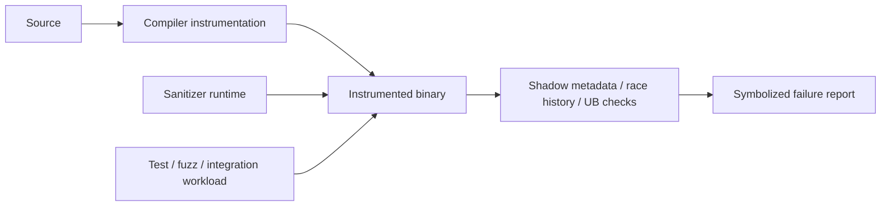

# Testing Engineering — ASan, TSan, UBSan & Instrumented CI

## Neden önemli?
Unit/integration test beklenen davranışı assertion ile kontrol eder. Sanitizer ise çalışan programın runtime invariants'larını gözleyerek test oracle'ının doğrudan görmediği memory, race ve undefined-behavior hatalarını görünür yapar. Sanitizer testin yerine geçmez; test workload'una daha güçlü bir gözlem katmanı ekler.

## Mental model


```text
normal test:    input -> program -> asserted output
sanitized test: input -> instrumented program -> output
                               |
                    memory/race/UB invariants
                               |
                            report
```

## ASan
AddressSanitizer compiler instrumentation ve runtime kullanarak heap/stack/global out-of-bounds, use-after-free, double/invalid free ve bazı use-after-return/scope hatalarını yakalar. Clang dokümantasyonu tipik slowdown'u yaklaşık 2x olarak verir. ASan shadow metadata ile memory'nin addressability durumunu takip eder; allocator davranışı use-after-free yakalama penceresini genişletebilir.

## TSan
ThreadSanitizer data race tespitine odaklanır. Race yalnız iki thread'in aynı değişkene erişmesi değildir: conflicting access'lerde en az bir write bulunur ve uygun happens-before/synchronization ilişkisi yoktur. TSan memory access ve synchronization event'lerini instrument ederek bu ilişkileri izler. Clang dokümantasyonu tipik 5–15x slowdown ve ciddi memory overhead belirtir.

TSan deadlock detector değildir; race-free olmak deadlock-free olmak anlamına gelmez. Ayrıca non-instrumented code synchronization bilgisini görünmez kılarak false-negative veya bazı durumlarda misleading report riski yaratabilir.

## UBSan
UndefinedBehaviorSanitizer signed integer overflow, geçersiz shift, misaligned/null dereference ve başka seçili C/C++ undefined-behavior noktalarına runtime checks ekler. Recovery veya trap davranışı ihtiyaca göre ayarlanabilir. ASan, TSan ve UBSan farklı bug class'larını hedeflediği için biri diğerinin yerine geçmez.

## CI portfolio
Pratik bir pipeline:

```text
PR fast path     -> unit/integration + ASan/UBSan subset
concurrency path -> focused TSan suite
nightly          -> broader sanitizer matrix
fuzzing          -> sanitizer-backed targets + minimized reproducers
release          -> normal hardened production binary
```

Fuzzer + sanitizer yüksek getirili kombinasyondur: fuzzer yeni execution path üretir, sanitizer o path'teki memory/UB violation'ı güçlü bir oracle'a dönüştürür. Symbolization, debug info ve reproducible build bilgisi triage kalitesini belirler.

Clang, ASan ve TSan runtime'larının production executable için tasarlanmadığını özellikle belirtir. Instrumented build'ler genellikle CI, fuzzing, pre-submit veya nightly aşamalarında tutulur.

## Yüksek getirili mülakat soruları
1. Sanitizer ile unit/integration test arasındaki fark nedir?
2. ASan hangi bug sınıflarını yakalar?
3. TSan race ile deadlock'u aynı şey olarak mı görür?
4. Sanitizer build neden yavaştır?
5. Partial instrumentation neden blind spot yaratabilir?
6. ASan + fuzzing neden güçlüdür?
7. Flaky concurrency test ile TSan bulgusu nasıl triage edilir?
8. Suppression/ignorelist neden minimum tutulmalıdır?

## Seviyeye göre cevap derinliği
- **Junior:** ASan=memory safety, TSan=data race, UBSan=undefined behavior ayrımı.
- **Mid:** compiler instrumentation, runtime metadata, symbolization ve CI placement.
- **Senior:** happens-before, partial instrumentation, false-negative yüzeyi, overhead ve fuzzing/sanitizer portfolio tasarımı.

## Mini alıştırma
Üç küçük C/C++ program yaz: heap use-after-free, unsynchronized shared counter ve signed-overflow edge case. Sırasıyla `-fsanitize=address`, `-fsanitize=thread`, `-fsanitize=undefined` ile çalıştır. Her raporda bug site ile symptom site'ın aynı olup olmadığını ve normal testin neden kaçırabileceğini yaz.

## Proje fikri
`sanitizer-ci-lab`: küçük native servise ASan+UBSan integration, TSan concurrency ve ASan-backed fuzz CI job'ları ekle. Symbolized log/minimized reproducer artifact'ı sakla; wall-clock ve memory overhead'i normal build ile karşılaştır.

## Failure modes / trade-off / production
Sanitizer temizliği correctness kanıtı değildir; yalnız yürütülen path'leri gözler. Partial instrumentation false-negative yaratabilir. TSan overhead'i büyük suite'lerde pahalıdır. Suppression listesi zamanla gerçek bug'ları gizleyen borca dönüşebilir. Production binary sanitizer build'den farklı optimization/timing davranışı gösterebilir. Native backend, database engine, browser, mobile runtime ve high-performance service ekiplerinde sanitizer CI memory corruption ve race'i müşteriye ulaşmadan yakalamak için yüksek getirili bir katmandır.

## Kaynaklar
- Clang AddressSanitizer: https://clang.llvm.org/docs/AddressSanitizer.html
- Clang ThreadSanitizer: https://clang.llvm.org/docs/ThreadSanitizer.html
- Clang UndefinedBehaviorSanitizer: https://clang.llvm.org/docs/UndefinedBehaviorSanitizer.html
- Clang Sanitizer special case list: https://clang.llvm.org/docs/SanitizerSpecialCaseList.html
- LLVM compiler-rt: https://compiler-rt.llvm.org/