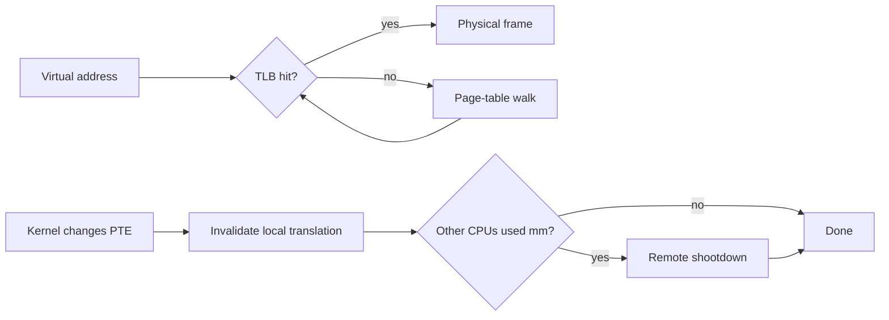

# TLB, Page Walks, Shootdowns, PCID & Huge Pages

## Konu anlatımı
CPU virtual address'i physical frame'e çevirmek için page table kullanır; her memory access'te çok seviyeli page walk yapmak pahalı olduğundan yakın translation'lar TLB'de cache'lenir. TLB hit ile page-table walk, TLB miss ile page fault aynı kavram değildir: miss mevcut mapping için walk ile çözülebilir; page fault ise mapping/permission tarafında OS müdahalesi gerektirir.



## Mental model
```text
page table = authoritative mapping
TLB        = per-CPU cached mapping
PTE update = cached translation invalidation problem
```

Source of truth değişince eski CPU-side translation'ın kullanılmasına izin verilemez. Aynı address space başka CPU'larda çalışmışsa invalidation remote CPU'lara da yayılabilir; bu TLB shootdown maliyetidir.

## İçeride ne oluyor?
1. CPU virtual-page translation'ını TLB'de arar.
2. Miss'te hardware page walker paging structures üzerinden PTE'yi bulabilir.
3. `munmap`, permission change, COW/fault handling veya mapping replacement PTE'yi değiştirebilir.
4. Kernel değişiklik kapsamına göre page/range/mm invalidation yapar.
5. SMP'de address space'i kullanmış CPU'lar stale translation taşımamalıdır. Linux `mm_cpumask()` benzeri bilgiyle gereksiz remote flush'ları azaltabilir.
6. x86 `INVLPG` tek linear-address translation'ını invalidate edebilir; daha geniş invalidation mekanizmaları da vardır.
7. PCID/ASID tagging context switch sırasında unrelated address-space translation'larını korumaya yardım eder; correctness invalidation ihtiyacını ortadan kaldırmaz.
8. Huge pages daha fazla byte'ı tek translation ile kapsayıp TLB reach'i artırabilir; fragmentation, allocation/compaction ve coarse-grained memory-management maliyetleri getirir.

## Yüksek getirili mülakat soruları
1. TLB ile CPU data cache farkı nedir?
2. TLB miss neden page fault değildir?
3. PTE değişince neden invalidation gerekir?
4. `munmap()` neden remote CPU maliyeti yaratabilir?
5. TLB shootdown many-core sistemlerde neden scalability bottleneck olabilir?
6. Huge page hangi workload'da yararlı, hangi durumda zararlı olabilir?
7. PCID/ASID context-switch economics'i nasıl değiştirir?
8. Mapping churn'ün p99 latency etkisini nasıl ölçersin?

## Seviyeye göre cevap derinliği
- **Junior/Mid:** VA → TLB → page walk → PA zincirini ve miss/fault ayrımını açıkla.
- **Senior:** stale translation, invalidation scope, remote shootdown ve huge-page reach ilişkisini bağla.
- **Staff/Principal:** CPU topology, batching, PCID/ASID, mapping churn, NUMA ve tail latency için ölçüm planı kur.

## Kısa alıştırma
4 KiB page ile 2 GiB working set'in translation sayısını, ardından 2 MiB huge page karşılığını hesapla. 32 CPU'da yoğun `mmap/munmap` yapan workload için TLB misses, page faults, cycles, context switches, shootdown/IPI göstergeleri ve p99 latency ölçüm planı çıkar.

## Proje fikri
`tlb-lab`: farklı page size ve mapping-churn stratejileriyle aynı byte miktarını tarayan Linux benchmark'ı yaz. `perf stat` ve latency histogramlarıyla TLB miss, cycles, page faults ve p50/p99'u ölç; worker sayısı arttıkça scaling eğrisini çıkar.

## Failure modes / trade-off / production bağlantısı
TLB miss'i page fault sanmak yanlış teşhistir. Huge page'i evrensel çözüm saymak memory waste ve fragmentation riskini gizler. Allocator, JIT, database buffer manager ve sandbox/runtime'larda sık mapping değişikliği cross-core invalidation yaratabilir. Many-core/NUMA sunucularda memory performance yalnız cache locality değil translation locality ve shootdown davranışına da bağlıdır.

## Kaynaklar
- Linux Kernel — Cache and TLB Flushing Under Linux: https://www.kernel.org/doc/html/latest/core-api/cachetlb.html
- Intel 64 and IA-32 SDM Vol. 3A: https://cdrdv2-public.intel.com/874249/253668-090-sdm-vol-3a.pdf
- Linux Kernel — Transparent Hugepage Support: https://www.kernel.org/doc/html/latest/admin-guide/mm/transhuge.html
