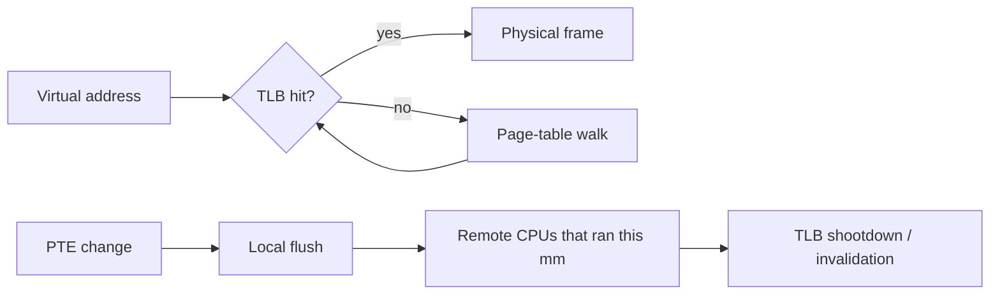

# TLB, Page Walks, Shootdowns, PCID & Huge Pages

## Neden önemli?
Virtual memory yalnız page table değildir. CPU, virtual→physical translation'ları TLB'de cache'ler; bu cache'in hit/miss davranışı ve page-table değişikliklerinde invalidation maliyeti runtime, allocator, database ve kernel performansına doğrudan yansır.

## Mental model
```text
page table = authoritative virtual -> physical mapping
TLB        = per-CPU cached translation
PTE update = cached copies must become stale-proof
```



## Temel mekanizma
TLB miss page fault değildir. Miss'te mapping page table'da mevcutsa hardware page walk translation'ı bulabilir. Page fault ise mapping/permission/residency gibi bir durumun kernel müdahalesi gerektirmesidir.

Page table değiştiğinde cached translation'ın kendiliğinden yok olduğu varsayılamaz. Linux VM, değişikliğin kapsamına göre `flush_tlb_page`, `flush_tlb_range` veya `flush_tlb_mm` benzeri arayüzler kullanır. SMP sistemde aynı address space başka CPU'larda çalıştıysa stale entry'ler oralarda da invalidate edilmelidir. Linux dokümantasyonu `mm_cpumask()` üzerinden address space'i hiç çalıştırmamış CPU'ya flush göndermemeyi bir optimizasyon olarak açıklar.

x86 tarafında `INVLPG` belirli linear address'e ilişkin translation'ları invalidate eder. Intel SDM, paging structures değiştirildikten sonra TLB/paging-structure cache entry'lerinin kalabileceğini ve software invalidation gerektiğini belirtir.

## PCID / ASID fikri
Address-space tag'i olmayan kaba modelde context switch translation cache'ini ağır biçimde bozabilir. PCID/ASID benzeri tag'ler farklı address space translation'larının TLB'de ayırt edilmesini sağlar ve gereksiz flush'ları azaltabilir. Bu bir correctness kaçışı değildir: mapping değiştiğinde ilgili tagged translation yine invalidate edilmelidir.

## Huge pages ve TLB reach
4 KiB page ile 2 GiB working set 524,288 page translation'ı kapsar; 2 MiB page ile aynı alan 1,024 translation'dır. Daha büyük page, aynı TLB entry bütçesiyle daha fazla byte kapsar. Buna karşılık internal fragmentation, huge-page allocation/compaction, memory waste ve coarse-grained management maliyeti vardır.

## Mülakat soruları
1. TLB neyi cache'ler, CPU data cache neyi cache'ler?
2. TLB miss ve page fault neden farklıdır?
3. PTE update neden invalidation gerektirir?
4. `munmap` many-core makinede neden remote CPU maliyeti yaratabilir?
5. Shootdown neden mapping churn yüksek workload'da p99 latency'yi etkileyebilir?
6. Huge pages TLB reach'i nasıl artırır?
7. PCID/ASID context-switch maliyetini nasıl değiştirir?
8. Principal: allocator/JIT/database workload'unda shootdown maliyetini hangi deneyle izole edersin?

## Seviyeye göre cevap
- **Mid:** TLB hit/miss, page walk ve page-fault ayrımı.
- **Senior:** stale translation, local/range/mm flush ve SMP shootdown.
- **Staff:** PCID/ASID, huge pages, batching ve CPU topology trade-off'ları.
- **Principal:** mapping lifecycle'ını allocator/runtime API kararları, NUMA, p99 ve fleet CPU maliyetiyle bağlamak.

## Mini alıştırma
4 KiB ve 2 MiB page'lerle 2 GiB working set için gereken page sayısını hesapla. Sonra 32 worker thread'in sık `mmap/munmap` yaptığı benchmark için `dTLB-load-misses`, cycles, page faults, context switches ve p99 latency ölçüm planı çıkar.

## Proje
`tlb-lab`: farklı page size, working-set ve mapping-churn stratejileriyle memory tarayan Linux benchmark'ı yaz. `perf stat` + latency histogramı ile TLB miss/cycles/page-fault/p99 sonuçlarını worker sayısına göre çiz.

## Failure modes / trade-off / production
TLB miss'i page fault sanmak yanlış teşhistir. Huge pages'i otomatik çözüm saymak fragmentation ve allocation risklerini saklar. Sık mapping değişimi allocator, JIT, sandbox, database buffer manager ve high-core-count service'lerde cross-core invalidation yaratabilir. Translation locality, cache locality kadar gerçek bir performance boyutudur.

## Kaynaklar
- Linux Kernel — Cache and TLB Flushing Under Linux: https://www.kernel.org/doc/html/latest/core-api/cachetlb.html
- Intel 64 and IA-32 SDM Vol. 3A: https://cdrdv2-public.intel.com/874249/253668-090-sdm-vol-3a.pdf
- Linux Kernel — Transparent Hugepage Support: https://www.kernel.org/doc/html/latest/admin-guide/mm/transhuge.html
