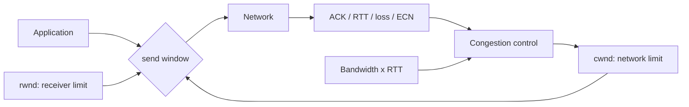

# TCP Congestion Control, cwnd, BDP & CUBIC

## Neden önemli?
TCP reliability, flow control ve congestion control farklı problemlerdir. Production'da düşük throughput veya kötü p99 teşhisi yaparken receiver buffer, sender congestion window, RTT, loss ve queueing'i ayırabilmek gerekir.

## Mental model

**BDP = bandwidth × RTT** path'in yaklaşık in-flight kapasitesini anlatır. `cwnd` sender'ın ağ için dinamik sınırı; `rwnd` receiver'ın flow-control sınırıdır. Etkin outstanding-data sınırı kabaca küçük olan tarafından belirlenir.

## Temeller
- Slow start bilinmeyen path kapasitesini hızlı probe eder.
- `ssthresh` congestion-avoidance davranışına geçişi şekillendirir.
- ACK clock gönderim davranışını besler; loss/timeout/ECN congestion sinyali olabilir.
- RTO ile recovery genellikle duplicate ACK/SACK tabanlı recovery'den daha ağır bir olaydır.
- Yüksek BDP path'te küçük congestion window link kapasitesini dolduramaz.
- Büyük bottleneck queue throughput'u korurken RTT/p99'u şişirebilir: bufferbloat.
- RFC 9438 CUBIC'i Standards Track olarak tanımlar. CUBIC, Reno'nun lineer artışından farklı olarak cubic pencere büyümesiyle fast/long-distance path'lerde scalability ve stability hedefler.

## Örnek
1 Gbit/s × 80 ms = 80 Mbit ≈ 10 MB BDP. İdealize edilmiş durumda yalnız 1 MiB in-flight pencere path'i tam doldurmak için yetersizdir. Gerçek throughput ayrıca protocol overhead, receiver window, loss, pacing ve implementation'a bağlıdır.

## Production teşhis akışı
1. Application throughput ve completion latency ölç.
2. RTT ve RTT değişimini gözle.
3. Retransmission/loss/ECN sinyallerini kontrol et.
4. `ss -ti` gibi araçlarla TCP state/cwnd bilgisini incele.
5. Receiver-window limitini congestion-window limitinden ayır.
6. Tek flow ile paralel flow davranışını karşılaştır; concurrency'nin shared bottleneck'i kötüleştirmediğini doğrula.
7. Host CPU/NIC saturation ile network-path congestion'ı ayrı hipotezler olarak test et.

## Mülakat soruları
1. Flow control ve congestion control farkı nedir?
2. `cwnd` ile `rwnd` arasındaki fark nedir?
3. BDP neden WAN throughput'u için önemlidir?
4. Slow start neden vardır?
5. Bufferbloat nasıl yüksek throughput + kötü latency üretebilir?
6. CUBIC neden Reno'dan farklı büyüme fonksiyonu kullanır?
7. Paralel TCP connection sayısını artırmanın trade-off'u nedir?

## Seviye beklentisi
- **Junior:** ACK/retransmission, `cwnd`/`rwnd`, slow start ayrımını bilir.
- **Mid:** BDP, `ssthresh`, congestion avoidance ve loss recovery ilişkisini kurar.
- **Senior/Staff:** queueing, CUBIC, pacing/ECN, RTT fairness, multiple flows ve application concurrency'yi telemetry ile tartışır.

## Mini alıştırma
1 Gbit/s ve 80 ms RTT için BDP'yi hesapla. `cwnd=1 MiB` iken ideal throughput tavanını RTT başına pencere yaklaşımıyla yaklaşıkla. Sonra RTT iki katına çıkarsa aynı pencerenin etkisini açıkla.

## Proje
`tcp-cc-lab`: Linux network namespace + `tc netem` ile RTT/loss profilleri oluştur. Bulk transfer'ı mevcut congestion-control algoritmaları altında tek ve çoklu flow ile çalıştır; throughput, RTT, retransmission ve p99 completion time karşılaştır.

## Failure modes / trade-off
Düşük throughput'u doğrudan bandwidth eksikliği saymak yanlıştır. Window, RTT, loss, queueing veya application pacing sınırlayıcı olabilir. Körlemesine paralellik tek-flow sınırını aşarken shared bottleneck'te loss ve latency'yi büyütebilir. Cross-region replication, CDN origin fetch ve object transfer'lerinde transport telemetry application SLO'larıyla birlikte okunmalıdır.

## Kaynaklar
- IETF RFC 9293 — Transmission Control Protocol: https://www.rfc-editor.org/rfc/rfc9293.html
- IETF RFC 5681 — TCP Congestion Control: https://www.rfc-editor.org/rfc/rfc5681.html
- IETF RFC 9438 — CUBIC for Fast and Long-Distance Networks: https://www.rfc-editor.org/rfc/rfc9438.html
