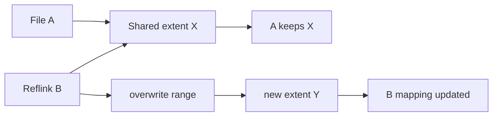

# Extents, Sparse Files, Reflink & Copy-on-Write

## Neden önemli?
Filesystem storage yalnız “dosya -> bloklar” eşlemesi değildir. Büyük dosyalarda metadata ölçeği, sparse allocation, snapshot/clone semantiği ve CoW write path'i performans ile kapasiteyi doğrudan belirler.

## Mental model
**Extent**, tek tek blok adresleri yerine ardışık bir logical aralığı tek mapping ile fiziksel aralığa bağlar. **Sparse file** logical olarak büyük olup bazı range'leri fiziksel storage ayırmadan hole olarak temsil edebilir. **Reflink** iki dosyanın başlangıçta aynı physical extent'leri paylaşmasıdır; bir taraf yazınca **copy-on-write** yeni extent ayırıp yalnız değişen mapping'i günceller.

## İçeride ne oluyor?
- Logical file offset extent metadata'sında aranır ve physical range'e çevrilir.
- Hole fiziksel blok ayırmayabilir; filesystem read'i sıfır üretir.
- Preallocation alanı önceden rezerve edebilir; unwritten extent allocated olsa da initialized user data değildir.
- Delayed allocation fiziksel placement kararını writeback'e erteleyebilir.
- Reflink shared extent/reference metadata kurar; bulk copy başlangıçta gerekmez.
- Shared extent overwrite edildiğinde CoW yeni blok ayırır, veriyi yazar ve metadata mapping'ini değiştirir.
- Snapshot/reflink ucuz başlar; divergent writes zamanla space amplification ve fragmentation yaratabilir.
- Linux `iomap`, buffered/direct I/O, writeback ve FIEMAP gibi yollar için logical-range mapping abstraction'ı sağlar.

## Mülakat soruları
1. Extent neden per-block mapping'den daha ölçeklenebilir?
2. Sparse file'da logical size ile allocated size neden farklıdır?
3. Hole ile unwritten extent farkı nedir?
4. Reflink ile hard link farkı nedir?
5. CoW random overwrite workload'unda neden fragmentation ve write amplification yaratabilir?
6. Snapshot neden backup değildir?
7. Database'i CoW filesystem üzerinde çalıştırırken hangi tail-latency ve durability risklerini ölçersin?

## Seviyeye göre cevap
- **Junior:** block, extent, sparse/hole.
- **Mid:** FIEMAP, preallocation, delayed/unwritten allocation, reflink.
- **Senior:** CoW update path, fragmentation, snapshot/checksum trade-off'ları.
- **Staff:** database, VM/container image ve backup workload'larında capacity + p99 latency etkisi.

## Mini alıştırma
1 GiB sparse file oluştur. `stat`, `du` ve `filefrag -v` ile logical size, allocated blocks ve extent sayısını karşılaştır. Reflink destekleniyorsa clone oluşturup küçük bir range'i değiştir ve space delta'yı ölç.

## Proje
`extent-lab`: FIEMAP ioctl kullanan CLI ile logical/physical extent'leri ve hole/unwritten/shared durumlarını raporla; sequential, sparse ve reflink-clone dosyalarını karşılaştır.

## Failure modes ve production bağlantısı
Reflink “bedava kopya” değildir; overwrite ile alan büyür. Aynı failure domain'deki snapshot backup yerine geçmez. Küçük random writes CoW fragmentation ve p99 latency yaratabilir. FIEMAP eşzamanlı değişen dosya için transaction snapshot garantisi değildir. Capacity, extent count, fragmentation, write amplification, fsync/writeback latency ve snapshot growth birlikte izlenmelidir.

## Kaynaklar
- Linux Kernel — FIEMAP: https://docs.kernel.org/filesystems/fiemap.html
- Linux Kernel — Btrfs: https://docs.kernel.org/filesystems/btrfs.html
- Linux Kernel — iomap design: https://docs.kernel.org/filesystems/iomap/design.html
- Linux Kernel — device-mapper snapshots: https://docs.kernel.org/admin-guide/device-mapper/snapshot.html
