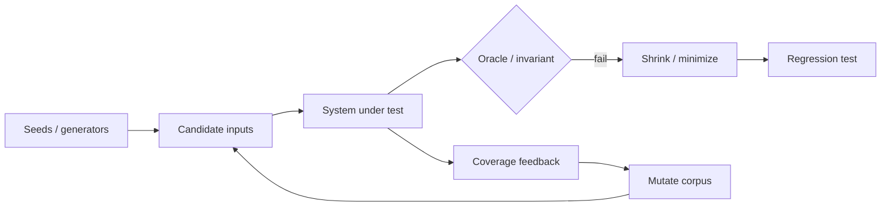

# Property-Based Testing, Coverage-Guided Fuzzing & Shrinking

## Mental model
Testing'i iki eksende düşün: **input'u kim seçiyor?** ve **yanlış olduğunu kim söylüyor?** Generator/fuzzer input-space'i arar; invariant, sanitizer veya differential oracle yanlışlığı bildirir. Coverage correctness kanıtı değil, arama feedback'idir.

## Temel kavramlar
Example-based test seçilmiş input/output çiftlerini doğrular. Property-based testing geniş input uzayında `decode(encode(x)) == x`, idempotence veya ordering/permutation gibi invariant'ları sınar. Failure bulunduğunda shrinking aynı failure'ı koruyarak karşı örneği küçültür.

Coverage-guided fuzzing seed corpus'u mutate eder ve yeni execution coverage açan input'ları saklar. LLVM libFuzzer in-process, coverage-guided evolutionary fuzzing engine'dir; SanitizerCoverage instrumentation ile feedback alır. Sanitizer'lar crash dışındaki memory/UB failure'larını oracle'a dönüştürür. Structured formatlarda dictionary veya structure-aware mutation derin path'lere erişimi hızlandırabilir.

## Mülakat soruları ve cevap derinliği
- **Junior:** example test ile property test farkı; invariant ve minimal counterexample.
- **Mid:** generator, shrinker, seed corpus, mutation ve coverage feedback nasıl bağlanır?
- **Senior:** parser fuzz target'ında sanitizer, round-trip ve differential oracle'ları nasıl kullanırsın? Nondeterminism neden zararlıdır?
- **Staff:** per-PR smoke fuzzing ile continuous campaign'i risk/CPU bütçesine göre nasıl bölersin? Corpus deduplication ve regression promotion nasıl yapılır?

Coverage plateau correctness anlamına gelmez; semantic state-space, oracle strength ve target reachability ayrıca değerlendirilmelidir.

## Kısa alıştırma
Bir URL parser için en az beş property tanımla. Parse→serialize round-trip, normalization idempotence ve malformed-input safety dahil olsun. Sonra PBT ve coverage-guided fuzzing için ayrı input stratejileri yaz.

## Proje fikri
`parser-fuzz-lab`: küçük binary protocol/URL parser'a example tests + property tests ekle; libFuzzer + ASan/UBSan ile fuzz et. Minimal crash input'larını regression corpus'una taşı; CI'da kısa, scheduled pipeline'da uzun campaign çalıştır.

## Failure modes / trade-off / production
Zayıf property implementation'ı yeniden ifade eder. Aşırı reject eden generator input-space'i daraltır. Yavaş/nondeterministic target fuzzing verimini düşürür. Line coverage'a kör optimizasyon semantic states'i kaçırır. Parser, codec, RPC boundary, compiler frontend ve security-sensitive decoder'larda bu teknikler yüksek getiridir.

## Kaynaklar
- LLVM libFuzzer: https://llvm.org/docs/LibFuzzer.html
- LLVM SanitizerCoverage: https://clang.llvm.org/docs/SanitizerCoverage.html
- Hypothesis: https://hypothesis.readthedocs.io/
