# ELF Dynamic Linking: Relocations, GOT/PLT ve ABI

## Neden önemli?
Compiler/runtime zinciri source code'un machine code'a çevrilmesiyle bitmez. Dinamik bağlı Linux programında executable ve shared object'lerin gerçek runtime adresleri process başlarken dynamic linker tarafından tamamlanır. Bu katmanı anlamak; `symbol not found`, yanlış shared-library seçimi, startup latency, ABI drift ve hardening sorunlarını teşhis etmeyi kolaylaştırır.

## Mental model

```mermaid
flowchart LR
 S[Source] --> C[Compiler]
 C --> O[Relocatable object]
 O --> L[Static linker]
 L --> E[ELF executable]
 E --> K[Kernel exec]
 K --> D[.interp -> dynamic linker]
 D --> M[Map shared objects]
 M --> R[Symbols + relocations]
 R --> B[GOT / PLT bindings]
 B --> X[Constructors -> main]
```


Static linker build-time bağlayıcıdır; dynamic linker process startup/`dlopen` zamanında eksik runtime adreslerini tamamlayan son bağlayıcıdır.

## ELF'te dynamic linking için gereken parçalar
- `.interp`: executable için kullanılacak ELF interpreter/dynamic linker yolunu belirtir.
- `DT_NEEDED`: runtime'da gereken shared object bağımlılıklarını kaydeder.
- Dynamic symbol/string tables: export/import edilen sembollerin lookup metadata'sıdır.
- Relocation tables: runtime adresi belli olduğunda hangi konumun nasıl düzeltilmesi gerektiğini söyler.
- GOT: runtime-resolved adresler için tablo/dolaylılık katmanı sağlar.
- PLT: external function çağrılarını GOT ve gerektiğinde resolver üzerinden yönlendiren trampoline katmanıdır.

## Startup zinciri
1. Kernel executable ELF'i açar ve loadable segmentleri map eder.
2. `.interp` varsa dynamic linker da process'e yüklenir ve kontrol alır.
3. Loader `DT_NEEDED` zincirindeki shared object'leri search policy'ye göre bulur ve map eder.
4. Her object'in runtime load address/load bias bilgisi oluşur.
5. Relocation kayıtları işlenir; symbol lookup doğru definition'ı seçer.
6. Eager çözülmesi gereken binding'ler tamamlanır; lazy function binding seçilmişse bazı PLT entry'leri ilk çağrıya kalabilir.
7. Constructors/init kodları çalışır; ardından program entry/startup zinciri `main()`'e ulaşır.

## Relocation neden var?
Build sırasında shared library'nin process içinde hangi virtual address'e map edileceği genellikle bilinmez. PIC/PIE kodu sabit absolute adreslere güvenmek yerine runtime metadata/dolaylılık kullanır. Relocation kabaca `runtime location = object load address + symbol/addend rules` problemini çözer. ASLR ile birlikte aynı binary farklı çalıştırmalarda farklı base address'lerde bulunabilir.

## GOT ve PLT
GOT'u **adres defteri**, PLT'yi **external call santrali** olarak düşün.

Bir external function çağrısında PLT entry, GOT slot'una gider. Slot çözülmüşse doğrudan hedefe atlanır. Lazy binding aktif ve slot henüz çözülmemişse resolver symbol lookup yapar, binding'i kaydeder ve çağrı hedefe devam eder. Mimari ve toolchain ayrıntıları değişebilir; mental modelin özü runtime indirection + symbol resolution'dır.

## Lazy vs eager binding
**Lazy binding:**
- startup'ta daha az function-resolution işi yapabilir;
- hiç çağrılmayan function'lar için çözümleme yapmayabilir;
- ilk çağrıda ek latency ve daha geç failure yaratabilir.

**Eager binding (`-z now` / ilgili runtime policy):**
- relocation/binding maliyetini startup'a taşır;
- missing symbol gibi sorunları daha erken açığa çıkarır;
- RELRO hardening ile birlikte daha sık tercih edilebilir.

## ABI neden API'den farklıdır?
API source-level sözleşmedir; ABI binary-level sözleşmedir. Calling convention, symbol names/versioning, data layout/alignment, exception/runtime beklentileri ve exported symbol set ABI'nin parçası olabilir. Header/source uyumlu görünse bile yanlış library version runtime'da kırılabilir.

## Search path, soname ve deployment
Dynamic linker bağımlılıkları belirli search rules ile bulur. `RUNPATH`/`RPATH`, loader cache, default library directories ve environment etkileri deployment davranışını değiştirebilir. Container image'da build stage'de bulunan fakat runtime stage'e kopyalanmayan DSO klasik production failure'ıdır. Soname/versioning compatible upgrade politikasının parçasıdır.

## Security ve hardening
- **RELRO:** relocation sonrası belirli memory bölgelerini read-only yapar.
- **NX / non-executable stack:** data bölgelerinin code execution için kullanılmasını zorlaştırır.
- **Symbol visibility:** gereksiz export'u azaltarak ABI yüzeyini, relocation işini ve interposition alanını küçültebilir.
- `LD_PRELOAD`/environment tabanlı interposition debugging için güçlüdür; privileged/hardened context'te güvenlik politikası gerektirir.

## Debugging araçları
```bash
readelf -l ./app      # program headers, interpreter
readelf -d ./app      # dynamic section / DT_NEEDED
readelf -r ./app      # relocations
objdump -d ./app      # disassembly / PLT izleri
ldd ./app             # resolved shared objects (untrusted binary'de dikkat)
LD_DEBUG=libs,bindings ./app
```

Untrusted executable üzerinde `ldd` kullanımı güvenlik açısından dikkat ister; dependency inspection için `readelf` gibi statik araçlar daha güvenli başlangıç olabilir.

## Failure modes ve trade-off'lar
- Yanlış/missing shared object → startup failure.
- ABI drift → missing/versioned symbol veya daha subtle memory corruption.
- Yanlış RUNPATH/environment → makineye özgü, CI'da görünmeyen production failure.
- Çok geniş exported symbol surface → daha büyük ABI yükü ve interposition/relocation maliyeti.
- Lazy binding → daha düşük startup işi karşılığında first-call latency/geç failure.
- Eager binding → startup maliyeti karşılığında daha erken doğrulama ve hardening avantajı.

## Mülakat soruları ve beklenen derinlik
1. **Compiler, static linker, loader/dynamic linker farkı?** Mid: build vs runtime görev ayrımı.
2. **Relocation neden gerekir?** Mid: runtime address bilinmezliği + PIC/ASLR.
3. **GOT ve PLT ne yapar?** Senior: data/function indirection ve lazy resolver yolu.
4. **Lazy vs eager?** Senior: startup, first-call latency, failure timing, security.
5. **ABI compatibility nasıl yönetilir?** Staff: soname, symbol versioning/visibility, CI compatibility testleri.
6. **Platform standardı?** Principal: dependency packaging, hardening, startup budget, plugin/isolation ve observability.

## Kısa alıştırma
Bir executable + `.so` üret. `readelf -l/-d/-r` ile interpreter, `DT_NEEDED` ve relocation kayıtlarını bul. `objdump` ile external function call yolunu incele. Library soname/version'ını değiştirip runtime failure'ı gözle.

## Proje fikri
`elf-link-lab`: versioned shared library, executable ve küçük plugin üret. Lazy/eager binding, visibility ve RELRO seçeneklerini değiştir; startup zamanı, relocation sayısı ve failure davranışını raporla.

## Production bağlantısı
Native service, Python/Node native extension, JVM JNI, database extension, GPU/runtime library ve containerized C/C++ workload'larda dynamic linker problemi sıkça “uygulama bug'ı” gibi görünür. Release artifact'ında dependency manifest, ABI compatibility kontrolü ve startup smoke test bu riski küçültür.

## Kaynaklar
- Linux `ld.so(8)`: https://man7.org/linux/man-pages/man8/ld.so.8.html
- Linux `elf(5)`: https://man7.org/linux/man-pages/man5/elf.5.html
- GNU C Library — Dynamic Linker: https://sourceware.org/glibc/manual/latest/html_node/Dynamic-Linker.html
- GNU Binutils `ld`: https://sourceware.org/binutils/docs/ld/
