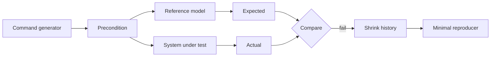

# Model-Based / State-Machine Testing

## Neden önemli?
Example test tek trace'i, ordinary property-based testing geniş input uzayını tarar. Stateful sistemlerde asıl uzay **operation sequence + state transition** kombinasyonudur. Model-based testing, production implementation'dan daha küçük bir reference model ile generated command history'lerini karşılaştırır.

## Mental model
Implementation gerçek şehir; model kuralları açık küçük metro haritasıdır. Test tek durağı değil yolculuk dizilerini üretir ve gerçek sistemin izin verilen transition'lardan sapıp sapmadığını kontrol eder.

## İçeride ne oluyor?
1. Abstract state yalnız correctness için gerekli bilgiyi tutar; production kodunu yeniden implement etmez.
2. Generator mevcut state'e göre command ve parametre üretir.
3. Preconditions illegal/anlamsız operasyonları filtreler; aşırı filtreleme coverage'ı düşürür.
4. Transition reference model'in next state'ini hesaplar.
5. Aynı command SUT üzerinde yürütülür; postcondition expected ve actual observation'ı karşılaştırır.
6. Failure bulunduğunda sequence shrink edilerek minimal reproducer aranır.
7. Seed, model version ve environment kaydedilerek replay sağlanır.
8. Concurrency/distribution eklendiğinde sequential model tek başına consistency kanıtı değildir; history checking ve fault injection ayrı oracle gerektirebilir.

## Mülakat soruları
1. Model-based testing ile property-based testing farkı nedir?
2. Reference model neden production kodunun ikinci kopyası olmamalı?
3. Precondition ve postcondition rolleri nedir?
4. State-space explosion nasıl kontrol edilir?
5. Shrinking neden triage için yüksek değerlidir?
6. Distributed KV store'da sequential modelden concurrent history checking'e nasıl geçersin?
7. Hangi invariants CI modelinde, hangileri production telemetry/canary'de doğrulanmalı?

## Seviyeye göre cevap
- **Junior/Mid:** state, command, transition, expected-vs-actual.
- **Senior:** generator bias, preconditions, shrink, model independence, coverage.
- **Staff:** concurrent histories, determinism, fault injection, reproducibility ve consistency oracle.
- **Principal:** risk-based model scope, CI bütçesi, production feedback ve ownership.

## Mini alıştırma
Capacity=2 LRU cache için `put/get/delete` command'larını ve eviction invariant'ını modelle. `put(A), put(B), get(A), put(C)` history'sinde state'i adım adım çıkar.

## Proje
`state-machine-kv-test`: küçük KV/cache implementasyonu ve state-machine generator kur. Bilerek eviction/versioning bug'ı ekle; failing history'nin minimal trace'e shrink edilmesini göster ve regression test'e dönüştür.

## Failure modes ve production bağlantısı
Model implementation kadar karmaşıksa correlated bug riski büyür. Generator yalnız happy path üretirse coverage yanıltıcıdır. Clock/random/retry nondeterminism replay'i bozar. Tek-node model distributed consistency'yi kanıtlamaz. MBT cache, protocol state machine, storage engine, scheduler, workflow ve API lifecycle testlerinde özellikle değerlidir.

## Kaynaklar
- Hypothesis — Stateful testing: https://hypothesis.readthedocs.io/en/latest/stateful.html
- Chalmers — Model-based testing of data types with side effects: https://research.chalmers.se/en/publication/150539
- Chalmers — Testing a database for race conditions with QuickCheck: https://research.chalmers.se/en/publication/150540
