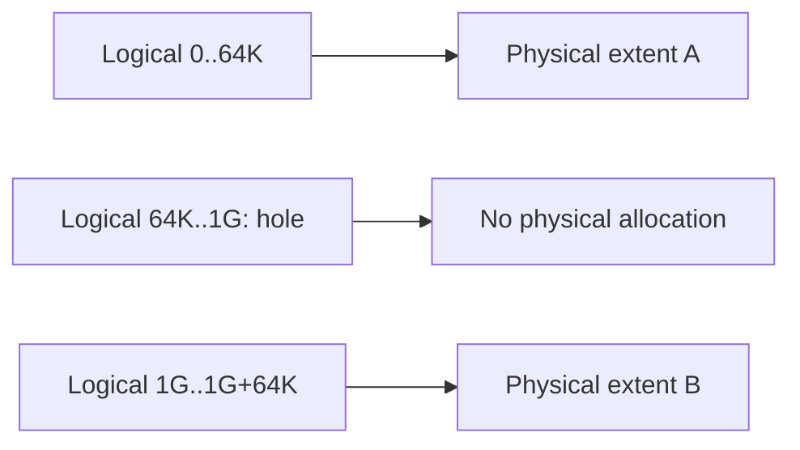
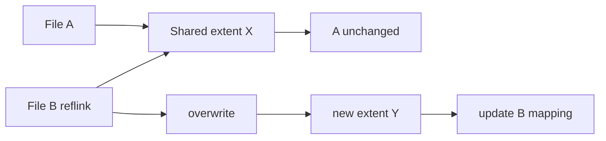

# Filesystem Extents, Sparse Files, Reflink & Copy-on-Write

## Neden önemli?
Filesystem internals mülakatında inode/page-cache/fsync bilgisi tek başına yetmez. Dosyanın logical offset'lerinin fiziksel storage'a nasıl eşlendiği; sparse allocation, extent metadata, clone/snapshot ve copy-on-write davranışı performans, kapasite ve durability kararlarını etkiler.

## Temel model
**Extent**, bir dosyanın ardışık logical byte/block aralığını fiziksel storage'daki ardışık bir aralıkla tek mapping olarak temsil eder. Block-by-block metadata yerine range kullanmak özellikle büyük sequential dosyalarda metadata'yı küçültür. Linux `FIEMAP` userspace'e extent mapping'lerini raporlayabilir.

Sparse file'ın logical size'ı allocated physical space'ten büyük olabilir. Hole bölgeleri fiziksel blok tüketmeden filesystem üzerinden okunduğunda sıfır gibi görünür. Preallocation fiziksel alanı önceden rezerve edebilir; unwritten extent ayrılmış fakat henüz initialized user data içermeyen aralıktır.

## Reflink ve CoW
Reflink clone başlangıçta iki dosyanın aynı fiziksel extent'leri paylaşmasına izin verir. Shared extent'e yazma geldiğinde CoW yolu yeni blok ayırır, yeni veriyi yazar ve yalnız değiştiren dosyanın mapping'ini yeni extent'e geçirir.

Bu mekanizma snapshot/clone oluşturmayı hızlı ve başlangıçta space-efficient yapar; fakat sonraki divergent writes space amplification, metadata churn ve fragmentation yaratabilir. Snapshot aynı cihaz/failure domain üzerinde kaldığında backup değildir.

## Linux mapping ayrıntıları
- `FIEMAP` logical offset, physical offset, length ve extent flags döndürür.
- `FIEMAP_EXTENT_DELALLOC`: data vardır fakat fiziksel konum henüz seçilmemiş olabilir.
- `FIEMAP_EXTENT_UNWRITTEN`: fiziksel alan ayrılmıştır fakat initialized user data değildir.
- `FIEMAP_EXTENT_SHARED`: extent başka file mapping'leriyle paylaşılabilir.
- Güncel Linux `iomap` katmanı page-cache I/O, writeback, direct I/O, DAX ve FIEMAP gibi yollar için range-mapping abstraction sağlar.
- Btrfs extent-based storage, writable snapshots, checksums, reflink ve CoW özelliklerini birlikte sunar.

## Mülakat soruları
1. Extent neden block pointer listesine göre avantajlı olabilir?
2. Sparse file'da `stat` ve `du` neden farklı büyüklük gösterebilir?
3. Hole, delayed allocation ve unwritten extent'i ayır.
4. Reflink ile hard link arasındaki semantik fark nedir?
5. CoW random overwrite workload'unda neden fragmentation yaratabilir?
6. Snapshot neden tek başına disaster-recovery backup değildir?
7. Staff: database/VM image workload'unu CoW filesystem üzerinde nasıl benchmark ve observe edersin?

## Seviyeye göre cevap derinliği
- **Junior:** block, extent, logical vs physical size, sparse file.
- **Mid:** FIEMAP, preallocation, unwritten/delalloc, reflink.
- **Senior:** CoW write path, shared extents, fragmentation, write/metadata amplification.
- **Staff:** storage guarantees, DB/VM/container workload'u, snapshot/backup policy, tail latency ve capacity planning.

## Mini alıştırma
1 GiB sparse file oluştur, yalnız başına ve sonuna veri yaz. `stat`, `du`, `filefrag -v` sonuçlarını karşılaştır. Reflink destekli filesystem varsa clone al, clone'un küçük bir bölümünü overwrite et ve allocated-space değişimini ölç.

## Proje fikri
`extent-lab`: FIEMAP ioctl ile logical/physical extent tablosu çıkaran CLI. Sequential, sparse, preallocated ve reflink dosyalarını karşılaştır; extent flags ve fragmentation özetini göster.

## Failure modes / trade-off / production
- Reflink/snapshot bedava kopya değildir; divergent writes kapasite tüketir.
- CoW metadata ve fragmentation tail latency'yi etkileyebilir.
- Snapshot aynı failure domain'de ise cihaz kaybına karşı koruma sağlamaz.
- FIEMAP eşzamanlı değişen dosya için transactional snapshot değildir.
- VM images, container layers, backup staging ve large-file stores'da extent davranışı kapasite tahminini değiştirir.

## Kaynaklar
- Linux Kernel — FIEMAP: https://docs.kernel.org/filesystems/fiemap.html
- Linux Kernel — Btrfs: https://docs.kernel.org/filesystems/btrfs.html
- Linux Kernel — iomap design: https://docs.kernel.org/filesystems/iomap/design.html
- Linux Kernel — device-mapper snapshots: https://docs.kernel.org/admin-guide/device-mapper/snapshot.html
