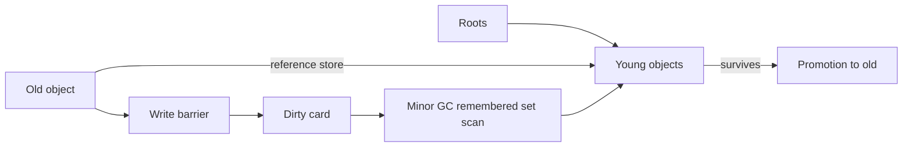

# Generational GC, Write Barriers, Card Tables & Safepoints

## Konu anlatımı
Tracing garbage collector root'lardan erişilebilir object'leri belirler; erişilemeyenleri reclaim eder. Generational GC'nin sezgisi, çoğu object'in genç ölmesidir. Heap young/old generation'lara ayrılır; young collection sık ve görece ucuz tutulur, yaşayan object'ler promote edilir.

Old generation'daki bir object young object'e pointer tutuyorsa yalnız young heap'i taramak yetmez. Her minor GC'de bütün old generation'ı taramak da generation avantajını bozar. Write barrier reference store sırasında cross-generation ilişkiyi kaydeder. Card table yaklaşımında heap küçük card bölgelerine bölünür; old→young pointer yazılan card dirty işaretlenir ve minor GC roots + dirty cards üzerinden young reachability'yi tamamlar.

## Mental model
Young heap sık temizlenen oda, old heap arşivdir. Write barrier arşivden genç odaya açılan yeni kapıları karta not eder; collector tüm arşivi değil yalnız not edilen bölgeleri kontrol eder.

## İçeride ne oluyor?
1. Allocation çoğu runtime'da bump-pointer/TLAB benzeri hızlı path ile young generation'da başlar.
2. Minor collection roots ve remembered set üzerinden young live set'i bulur.
3. Surviving object'ler kopyalanabilir veya yaş/policy eşiğine göre old generation'a promote edilir.
4. Reference store write barrier'ı card/remembered-set metadata'sını günceller; barrier hot-path maliyetidir.
5. Büyük card gereksiz tarama, küçük card daha fazla metadata/barrier overhead üretir.
6. Safepoint runtime'ın thread state'ini GC/deoptimization gibi global operasyonlar için güvenli gözlemleyebildiği koordinasyon noktasıdır.
7. Allocation rate, survivor rate, promotion ve old-gen pressure tail latency'yi birlikte belirler.

## Yüksek getirili mülakat soruları
1. Mark-sweep ile copying collector farkı nedir?
2. Generational hypothesis ne sağlar?
3. Minor GC neden bütün old generation'ı taramaz?
4. Write barrier ve remembered set neyi çözer?
5. Card size trade-off'u nedir?
6. Yüksek allocation-rate servisinde throughput ile pause-time arasında nasıl tuning yaparsın?
7. Collector seçimini p99 latency, memory headroom ve CPU economics ile nasıl bağlarsın?

## Beklenen cevap seviyesi
- **Junior:** reachability, roots, young/old generation, pause.
- **Mid:** promotion, write barrier, remembered set/card table.
- **Senior:** allocation fast path, fragmentation, concurrent phases, safepoint ve tail latency.
- **Staff/Principal:** workload profiling, collector/tuning seçimi, CPU-memory-latency economics ve operability.

## Mini alıştırma
Old object `A`, young `B`'yi referanslasın. Root yalnız `A`'ya erişsin. Minor GC'nin remembered set olmadan `B`'yi neden yanlış reclaim edebileceğini çiz; ardından dirty-card çözümünü ekle.

## Proje fikri
`mini-gen-gc`: object graph simülatörü yaz. Young/old generation, promotion threshold ve card table ekle; workload'larda scanned-object sayısı, promoted bytes ve pause proxy metriğini karşılaştır.

## Failure modes / trade-off / production bağlantısı
Eksik barrier liveness/correctness bug'ı; aşırı promotion old-gen pressure ve uzun collection; büyük heap daha seyrek GC ama daha büyük recovery/scan maliyeti üretir. Production'da allocation rate, live-set, promotion, GC CPU, pause histogramı ve memory headroom birlikte izlenmelidir.

## Kaynaklar
- Oracle/OpenJDK HotSpot GC Tuning Guide: https://docs.oracle.com/en/java/javase/25/gctuning/
- OpenJDK HotSpot GC source: https://github.com/openjdk/jdk/tree/master/src/hotspot/share/gc
- V8 garbage collection overview: https://v8.dev/blog/trash-talk
