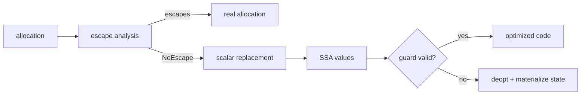

# Escape Analysis, Scalar Replacement & Deoptimization

## Konu anlatımı
JIT derleyicinin bir allocation için temel sorusu nesnenin kimliğinin program tarafından gözlemlenebilir olup olmadığıdır. Escape analysis referansın method/thread sınırlarından kaçıp kaçmadığını yaklaşık belirler. HotSpot'ta kaçmayan ve scalar-replaceable nesnelerin allocation'ı tamamen elimine edilip alanları SSA/scalar değerlere ayrılabilir. Bu genel bir “heap'ten stack'e taşıma” dönüşümü değildir.

Speculative optimization guard'ı bozulursa deoptimization ile daha az optimize execution state'ine dönülür. Fiziksel nesnesi scalar replacement ile ortadan kaldırılmış logical object gerekiyorsa runtime deopt metadata kullanarak onu yeniden materialize eder.

## Mental model
Escape analysis “bu kutunun kimliğini dışarıdan biri gözleyebilir mi?” sorusudur. Hayırsa kutu üretilmeden değerleri taşınabilir. Deoptimization optimize edilmiş sahneden JVM'in gözlemlenebilir state'ine geri dönüş sözleşmesidir.

## İçeride ne oluyor?
- IR üzerindeki reference/alias akışı conservative biçimde analiz edilir.
- NoEscape allocation scalar replacement ile field değerlerine ayrılabilir.
- Inlining analizi güçlendirebilir; polymorphism ve bilinmeyen call sınırları zayıflatabilir.
- Non-escaping lock bazı durumlarda elimine edilebilir.
- Deopt metadata locals, operand stack ve virtual object state'ini yeniden kurabilmelidir.
- Optimization semantic guarantee değildir; uygulama doğruluğu buna bağlı olmamalıdır.

## Mülakat soruları
- Escape analysis hangi problemi çözer?
- Scalar replacement neden stack allocation ile aynı değildir?
- Object identity optimizasyonu nasıl sınırlar?
- Inlining escape analysis'i neden güçlendirebilir?
- Scalar-replaced nesne deopt sırasında nasıl geri oluşturulur?
- Allocation rate azalırken latency neden mutlaka azalmaz?
- Principal seviyesinde JIT/runtime değişiklikleri için regression gate ve rollback nasıl tasarlanır?

## Beklenen cevap seviyesi
- **Mid:** escape/no-escape, allocation elimination, scalar replacement.
- **Senior:** inlining, aliasing, lock elision, speculative optimization/deopt.
- **Staff:** GC pressure, warmup, deopt storms ve benchmark doğruluğu.
- **Principal:** runtime rollout, workload çeşitliliği, cost/latency regression yönetimi.

## Mini alıştırma
Hot loop içinde iki alanlı kısa ömürlü `Point` oluşturup yalnız `x+y` kullanan sürüm ile nesneyi global listeye ekleyen sürümü karşılaştır. Hangisinde allocation elimination beklediğini ve identity/reflection gibi gözlemlenebilirliklerin sonucu nasıl değiştireceğini yaz.

## Proje fikri
`escape-lab`: JMH ile escape eden/etmeyen ve inline edilen/edilmeyen varyantları karşılaştır; allocation rate, GC pressure, JIT/deoptimization ve p99'u korele et.

## Failure modes / trade-off / production bağlantısı
Dead-code elimination microbenchmark'ı yanıltabilir. Compiler optimization'ını dil garantisi sanmak portability riskidir. Deopt storm tail latency'yi bozabilir. Production'da allocation rate, GC, compilation/deoptimization, CPU ve p95/p99 birlikte izlenmelidir.

## Kaynaklar
- Oracle Java 24 — HotSpot VM Performance Enhancements: https://docs.oracle.com/en/java/javase/24/vm/java-hotspot-virtual-machine-performance-enhancements.html
- OpenJDK — HotSpot Escape Analysis and Scalar Replacement Status: https://cr.openjdk.org/~cslucas/escape-analysis/EscapeAnalysis.html
