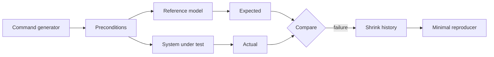

# Testing Engineering: Model-Based / State-Machine Testing

## Neden önemli?
Example test tek trace'i; stateless property test geniş input uzayını doğrular. Stateful sistemlerde bug çoğu zaman belirli **operation sequence + state transition** kombinasyonunda çıkar. Model-based testing (MBT), küçük bir reference model ile generated command history'lerini karşılaştırarak bu state-space'i sistematik biçimde araştırır.

## Temel model
Bir KV store için reference model basit bir map olabilir. Generator mevcut abstract state'e göre `put/get/delete` komutları üretir. Model expected transition/response'u hesaplar; aynı command system-under-test'te yürür; postcondition expected ile actual'ı karşılaştırır.

## Bileşenler
1. **Abstract state:** correctness için gerekli minimum bilgi; implementation detail değil.
2. **Commands:** public operations ve parametreleri.
3. **Preconditions:** command'ın mevcut state'te anlamlı olup olmadığını sınırlar.
4. **Transitions:** model state'inin operation sonrası nasıl değiştiği.
5. **Postconditions:** observable result/invariant karşılaştırması.
6. **Generator bias:** kritik transition'lara yeterli trafik verilmesi.
7. **Shrinking:** failing history'nin semantiğini koruyarak minimal sequence'e indirilmesi.
8. **Reproducibility:** seed, model version, environment, clock/randomness kontrolü.

## Reference model nasıl tasarlanır?
Model production kodunun ikinci implementation'ı olmamalıdır; aksi halde aynı tasarım hatasını iki kez kodlama riski vardır. Model daha yavaş olabilir ama semantiği açık olmalıdır. Örneğin production LRU cache doubly-linked list + hash map kullanırken model yalnız `(key,value,last_access_order)` listesi tutabilir.

Precondition'lar aşırı dar olursa generator kritik invalid/error transition'ları hiç üretmez. Coverage yalnız line coverage değildir; command frequency, state classes, transition pairs ve history length dağılımı izlenebilir.

## Concurrency sınırı
Sequential state machine testing concurrency correctness'i otomatik kanıtlamaz. Concurrent execution'da gerçek history operation invocation/response zamanlarını içerir; oracle seçilen consistency modeline göre history'nin geçerli bir serialization/partial order ile açıklanıp açıklanamadığını kontrol etmelidir. Fault injection ve deterministic scheduling bu katmanda MBT ile birlikte kullanılabilir.

## Mülakat soruları
1. MBT ile ordinary property-based testing farkı nedir?
2. Model neden implementation'dan bağımsız ve daha basit olmalıdır?
3. Precondition/postcondition ne işe yarar?
4. State-space explosion nasıl kontrol edilir?
5. Sequence shrinking neden bug triage maliyetini düşürür?
6. Senior: generator coverage'ını nasıl ölçersin?
7. Staff: concurrent KV store için sequential modelden history checker'a nasıl ilerlersin?
8. Principal: CI budget, nightly campaigns ve production telemetry arasında testing portfolio'sunu nasıl kurarsın?

## Seviyeye göre cevap derinliği
- **Junior/Mid:** state, command, transition, expected-vs-actual.
- **Senior:** generator bias, shrink, model independence, coverage ve nondeterminism.
- **Staff:** concurrency histories, consistency oracle, fault injection, deterministic replay.
- **Principal:** risk-based scope, compute budget, escaped-defect economics, ownership ve production feedback loop.

## Mini alıştırma
Capacity=2 LRU cache için `put/get/delete` commands, pre/postconditions ve eviction invariant'ını tanımla. `put(A), put(B), get(A), put(C)` sequence'inde abstract state'i adım adım çıkar ve hangi key'in evict edilmesi gerektiğini göster.

## Proje fikri
`state-machine-kv-test`: küçük bir KV/cache implementation'ını state-machine framework ile test et. Bilerek eviction veya version bug'ı ekle; random history'nin failure bulmasını ve shrinker'ın minimal reproducer üretmesini göster. Failing trace'i regression testine promote et.

## Failure modes / trade-off / production
- Model çok karmaşıksa oracle güvenilirliği düşer.
- Happy-path ağırlıklı generator kritik transition'ları kaçırır.
- Nondeterministic clock/random/retry failure replay'ini bozar.
- Sequential model distributed consistency kanıtı değildir.
- Cache, protocol state machine, storage engine, scheduler, workflow ve API lifecycle için MBT özellikle yüksek getiridir.

## Kaynaklar
- Hypothesis — Stateful testing: https://hypothesis.readthedocs.io/en/latest/stateful.html
- Chalmers — Model-based testing of data types with side effects: https://research.chalmers.se/en/publication/150539
- Chalmers — Testing a database for race conditions with QuickCheck: https://research.chalmers.se/en/publication/150540
