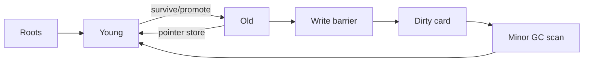

# Generational GC, Write Barriers, Card Tables & Safepoints

## Neden önemli?
Tracing GC yalnız unreachable object'leri bulmak değildir; production runtime tasarımında allocation throughput, pause latency, memory headroom ve CPU bütçesi birlikte yönetilir. Generational collector'lar çoğu object'in genç öldüğü gözleminden yararlanır.

## Mental model
Young heap sık temizlenen oda, old heap arşivdir. Old→young pointer yazıldığında write barrier arşivden genç odaya açılan kapıyı card table/remembered set'e not eder. Minor GC bütün old heap'i taramak yerine roots + kayıtlı bölgeleri tarar.

## Mekanik
Allocation çoğunlukla young generation'da hızlı bump-pointer/TLAB path'iyle başlar. Minor GC live young object'leri bulur; survivor'lar kopyalanabilir ve policy/age ile promote edilebilir. Old→young edge'leri kaçırmamak için reference-store write barrier remembered-set metadata'sını günceller. Card granularity büyüdükçe false-positive scan artar; küçüldükçe metadata/barrier maliyeti artar.

Safepoint, runtime'ın thread'leri GC/deoptimization gibi global koordinasyon için güvenli state'te gözlemleyebildiği noktadır. Modern collector'ların bazı fazları concurrent olsa da root snapshot, relocation veya bookkeeping için koordinasyon gerekebilir.

## Mülakat soruları
1. Mark-sweep ve copying collector farkı nedir?
2. Generational hypothesis nedir?
3. Minor GC neden tüm old generation'ı taramaz?
4. Write barrier / remembered set ne çözer?
5. Card size trade-off'u nedir?
6. Allocation rate, promotion ve p99 pause nasıl ilişkilidir?
7. Staff/Principal: collector/tuning seçimini latency SLO ve memory economics'e nasıl bağlarsın?

## Mini alıştırma
Root yalnız old `A`'ya, `A` da young `B`'ye erişsin. Remembered set yokken young-only scan'in `B`'yi neden kaçıracağını çiz; ardından dirty-card çözümünü ekle.

## Proje
`mini-gen-gc`: young/old generation, promotion threshold ve card table içeren object-graph simülatörü. Scanned objects, promoted bytes ve pause proxy ölç.

## Failure modes / trade-off / production
Eksik barrier correctness/liveness bug'ı yaratabilir. Promotion storm old-gen pressure üretir. Büyük heap pause/recovery riskini, küçük heap collection frequency'yi artırabilir. Allocation microbenchmark'ı tek başına tail latency'yi açıklamaz. Allocation rate, live set, promotion, GC CPU, pause histogramı ve memory headroom birlikte izlenmelidir.

## Kaynaklar
- Oracle/OpenJDK GC tuning: https://docs.oracle.com/en/java/javase/25/gctuning/
- OpenJDK HotSpot GC source: https://github.com/openjdk/jdk/tree/master/src/hotspot/share/gc
- V8 GC overview: https://v8.dev/blog/trash-talk
