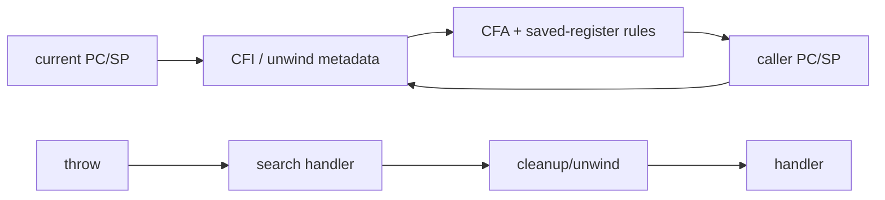

# Stack Unwinding, DWARF CFI & Exception ABI

## Konu anlatımı
Bir exception, profiler veya crash reporter stack'i sihirli biçimde okuyamaz. Runtime'ın mevcut frame'den caller frame'e nasıl döneceğini bilmesi gerekir. Compiler/linker, register ve stack durumunun nasıl geri kurulacağını anlatan unwind metadata üretir. DWARF Call Frame Information (CFI), Canonical Frame Address ve register recovery kurallarıyla bu yürüyüşü tarif eder.

C++ exception handling iki işi birleştirir: uygun handler'ı bulmak ve stack'i unwind ederek cleanup/destructor çalıştırmak. Itanium C++ ABI bu protokolde search ve cleanup phase'lerini ayırır. “Zero-cost exceptions” throw'un ücretsiz olması değil, normal path'teki explicit checking maliyetinin büyük bölümünü metadata/exceptional path'e kaydırma yaklaşımıdır.

## Mental model

Stack unwinding = “bu instruction noktasından caller state'ini yeniden kurma protokolü”. Exception ABI = compiler'ın ürettiği metadata ile runtime unwinder'ın aynı dili konuşması.

## İçeride ne oluyor?
1. Compiler prologue/epilogue ve register-save kararlarına uygun unwind bilgisi üretir.
2. Linker unwind section'larını executable/shared object içine taşır.
3. Unwinder instruction pointer'a göre frame bilgisini bulur.
4. CFA ve register recovery rules caller state'ini reconstruct eder.
5. Exception runtime handler arar; ardından cleanup/destructor çalıştırarak frame'leri açar.
6. JIT runtime'ları ürettikleri code için stack-map/unwind bilgisini runtime'a kaydetmelidir.

Frame pointer ile unwind metadata aynı şey değildir. Frame pointer profiling/debugging'i kolaylaştırabilir; optimize edilmiş kodda platform ABI'si ve unwind tables yine kritik olabilir. Inlining, tail-call optimization, signal frames ve JIT code source-level stack ile physical stack eşleşmesini zorlaştırır.

## Mülakat soruları
1. Stack trace oluşturmak için runtime hangi bilgilere ihtiyaç duyar?
2. Frame pointer ile DWARF unwind metadata arasındaki fark nedir?
3. “Zero-cost exception” neyi ifade eder, neyi etmez?
4. Inlining ve tail-call optimization stack trace'i nasıl etkiler?
5. Exception ABI neden compiler ve runtime arasında bir sözleşmedir?
6. Mixed native/JIT stack'lerde profiling ve crash unwinding'i nasıl tasarlarsın?
7. Principal: frame-pointer policy ile binary-size/performance/MTTR trade-off'unu nasıl standardize edersin?

## Beklenen cevap seviyesi
- **Mid:** call stack, saved registers, caller reconstruction.
- **Senior:** CFI/CFA, exception search/cleanup, optimization etkileri.
- **Staff:** JIT registration, async profiling, stripped symbols ve crash pipeline.
- **Principal:** fleet-wide build policy, debuginfo retention, symbol server, overhead ve incident MTTR.

## Kısa alıştırma
Üç frame'li call chain çiz. Her frame için SP, return address ve iki callee-saved register varsay. Caller state'inin hangi metadata ile reconstruct edileceğini yaz; frame pointer kaldırıldığında hangi bilginin unwind table'a taşınması gerektiğini açıkla.

## Proje fikri
`unwind-lab`: küçük C/C++ programını debug/release, frame-pointer açık/kapalı varyantlarda derle. `readelf --debug-dump=frames`, debugger backtrace ve profiler çıktısını karşılaştır; binary-size ve stack-trace farklarını raporla.

## Failure modes / trade-off / production bağlantısı
Eksik/bozuk unwind metadata stack'i yarıda kesebilir. Aggressive optimization source-level frame'leri physical frame'lerle birebir eşleştirmez. Symbol stripping deployment boyutunu düşürür fakat ayrı debug-symbol zinciri gerektirir. Frame pointer observability'yi kolaylaştırabilir fakat target/workload'a göre register/optimization maliyeti yaratabilir. Production'da build-id, symbol server, debuginfo retention ve profiler/crash-reporter doğruluğu release pipeline'ın parçası olmalıdır.

## Kaynaklar
- Itanium C++ ABI — Exception Handling: https://itanium-cxx-abi.github.io/cxx-abi/abi-eh.html
- DWARF Standard: https://dwarfstd.org/
- GCC Internals — Exception Handling: https://gcc.gnu.org/onlinedocs/gccint/GIMPLE-Exception-Handling.html
