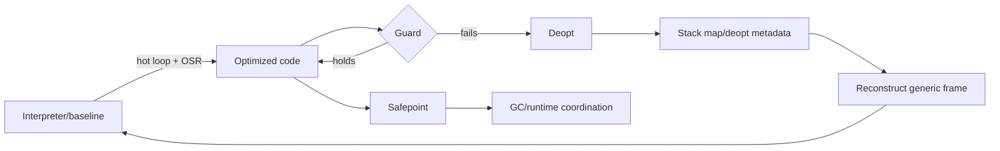

# JIT Deoptimization, OSR, Safepoints & Stack Maps

**Seviye:** Mid → Principal  
**Çalışma süresi:** 20–30 dk

## Neden var?
JIT compiler sıcak kodu hızlandırmak için runtime profiling'den gelen type/shape/branch varsayımlarını kullanabilir. Bu speculative assumption'lar değiştiğinde correctness'i korumak için optimize edilmiş frame'in daha genel execution state'e geri çevrilmesi gerekir: **deoptimization**. Uzun süren loop'u bitmesini beklemeden optimized code'a geçirmek ise **on-stack replacement (OSR)** problemidir.

## Stack map ve safepoint
Compiler belirli instruction address'lerde runtime'ın ihtiyaç duyduğu live values'ın register, stack offset veya constant konumlarını metadata olarak kaydedebilir. LLVM Stack Maps dokümantasyonu stack map'i runtime'ın belirli noktada ihtiyaç duyduğu live values'ın location kaydı olarak tanımlar; bu bilgi frame reconstruction ve code patching gibi JIT işleri için kullanılabilir.

Safepoint, runtime'ın GC/deopt gibi işler için execution state'i güvenilir biçimde gözleyebildiği noktadır. Statepoint/stack-map metadata sayesinde moving GC veya runtime frame reconstruction için gerekli pointer/value location'ları bulunabilir.

## OSR neden zor?
Normal optimized function entry parametrelerle başlar. OSR ise loop ortasındaki interpreter/baseline state'ini optimized representation'a map etmek zorundadır: locals, operand stack, loop induction variables ve inlined logical frames uyumlu hale gelmelidir. Deopt ters dönüşüm problemidir; optimizer eliminate ettiği logical değerleri gerektiğinde metadata/recipes ile yeniden üretilebilir tutmalıdır.

## Mülakat soruları
1. Speculative optimization neden guard gerektirir?
2. Deoptimization ile exception handling neden farklıdır?
3. Stack map debug info'dan nasıl farklıdır?
4. Inlining ve escape analysis deopt state reconstruction'ı neden zorlaştırır?
5. OSR normal JIT compilation'dan hangi ek state-mapping problemini getirir?
6. Safepoint density throughput ile worst-case handshake latency arasında nasıl trade-off yaratır?
7. Production'da deopt storm'u nasıl teşhis edersin?

## Beklenen cevap derinliği
- **Mid:** profiling → guard → deopt → generic execution zinciri.
- **Senior:** live values, frame reconstruction, stack maps, inlining/escape-analysis etkisi.
- **Staff:** safepoint density, code size, latency, uncommon traps ve telemetry.
- **Principal:** tiering policy, workload economics, rollout ve runtime/compiler ownership.

## Mini alıştırma
Hot `sum(objects)` loop'unda same-shape guard'ı koy. Loop ortasında farklı shape geldiğinde `i`, accumulator, current object ve continuation'ın deopt için nerede tutulacağını çiz.

## Proje
`toy-tiered-vm`: bytecode interpreter + hot-loop counter + integer fast path + type guard yaz. Guard fail olduğunda bytecode PC ve locals ile interpreter'a dön. OSR/deopt sayısı ve execution time ölç.

## Failure modes / trade-off / production
Aşırı speculation deopt storm ve CPU jitter; eksik metadata correctness bug'ı; çok yoğun safepoint code-size/throughput maliyeti; seyrek safepoint yüksek handshake latency yaratabilir. Compilation CPU, code-cache pressure, deopt reason/rate, OSR count, safepoint latency ve p99 birlikte izlenmelidir.

## Kaynaklar
- LLVM Stack Maps & Patch Points: https://llvm.org/docs/StackMaps.html
- LLVM GC Safepoints / Statepoints: https://llvm.org/docs/Statepoints.html
- V8 TurboFan JIT: https://v8.dev/docs/turbofan
