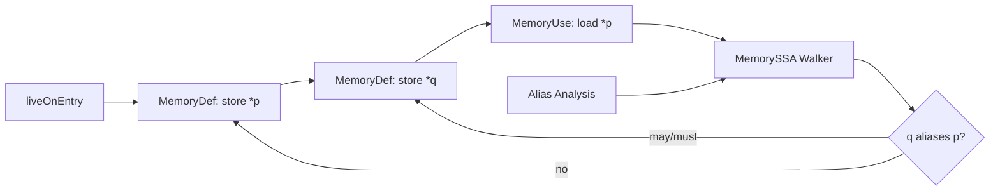

# MemorySSA, Alias Analysis & Memory Dependence

## Konu anlatımı
Klasik SSA register/value dünyasında her assignment yeni bir version üretir ve phi node control-flow birleşimlerinde hangi version'ın geldiğini ifade eder. Memory daha zordur: iki pointer aynı location'ı gösterebilir, function call görünmeyen state'i değiştirebilir ve load/store ilişkisini anlamadan compiler güvenli code motion veya dead-store elimination yapamaz.

LLVM MemorySSA, memory operasyonları üzerine sanal bir SSA katmanı kurar. Temel düğümler `MemoryDef`, `MemoryUse` ve `MemoryPhi`'dır. Store, bazı call/fence/ordered operations yeni memory version'ı tanımlayan `MemoryDef`; salt okuma `MemoryUse`; control-flow merge ise `MemoryPhi` olabilir. MemorySSA tek başına bütün alias problemini çözmez: walker, alias-analysis bilgisini kullanarak bir access'in gerçek/potansiyel clobber'ını arar.

Kritik trade-off precision vs compile time'dır. LLVM MemorySSA memory'yi çok sayıda kusursuz partition'a bölmek yerine deliberately daha kaba temsil kullanır; alias analysis daha sonra disambiguation sağlar. Bu, optimization query'lerini pratik maliyette tutar.

## Mental model
SSA values'a version verir; MemorySSA tüm memory state'ine ucuz sanal version zinciri verir. Alias analysis “bu iki address aynı yere dokunabilir mi?” sorusunu, MemorySSA ise “bu use'a hangi memory definition ulaşabilir/clobber edebilir?” sorusunu birlikte çözer.

## İçeride ne oluyor?
1. Function IR taranır ve memory-touching instructions MemoryAccess'lere eşlenir.
2. `MemoryDef` yeni memory version oluşturur; `MemoryUse` mevcut version'ı tüketir.
3. Control-flow birleşiminde gerekli yerde `MemoryPhi` oluşur.
4. Walker defining-access zincirinde geriye gider.
5. Alias analysis ilgisiz store'ları eleyerek gerçek clobber'a yaklaşır.
6. LICM/GVN/DSE gibi optimizasyonlar bu bilgiyi güvenli transformation için kullanabilir.
7. IR değişirse MemorySSA'nın updater API'leriyle tutarlı kalması gerekir.

## Yüksek getirili mülakat soruları
- Normal SSA memory'yi modellemekte neden yetersiz kalır?
- `MemoryDef`, `MemoryUse`, `MemoryPhi` neyi temsil eder?
- Alias analysis ile MemorySSA'nın görevleri nasıl ayrılır?
- Senior: `store *q` ile `load *p` arasında no-alias kanıtı hangi optimizasyonları açabilir?
- Senior: volatile/atomic operations neden yalnızca MemorySSA graph'ına bakılarak taşınamaz?
- Staff: daha hassas alias bilgisi optimization quality ile compile time'ı nasıl etkiler?
- Principal: compiler pipeline'da analysis invalidation/update maliyetini nasıl yönetirsin?

## Seviyeye göre cevap derinliği
- **Mid:** SSA, aliasing, load/store dependence ve üç MemorySSA node tipi.
- **Senior:** clobber walk, dominance, phi, LICM/DSE ve atomic/volatile sınırları.
- **Staff:** precision/compile-time trade-off, incremental update ve pass interaction.
- **Principal:** pipeline architecture, analysis caching/invalidation, optimization budget ve regression policy.

## Kısa alıştırma
`store 1, *p; store 2, *q; x = load *p` dizisini ele al. (a) `p` ve `q` must-alias, (b) no-alias, (c) may-alias durumlarında load'un hangi store tarafından clobber edilebileceğini çiz. Sonra hangi durumda ikinci store load açısından atlanabilir açıklayarak alias bilgisinin değerini göster.

## Proje fikri
`memoryssa-lab`: küçük C örneklerini LLVM IR'a çevir. `opt -passes='print<memoryssa>' -disable-output` ile MemorySSA'yı incele; pointer aliasing'i değiştiren örneklerde graph ve LICM/DSE davranışını karşılaştır.

## Failure modes / trade-off / production bağlantısı
- Fazla conservative alias sonucu optimization fırsatlarını kaçırır.
- Unsound no-alias varsayımı silent miscompile üretir; correctness performanstan önce gelir.
- Aşırı precision compile time ve memory kullanımını büyütebilir.
- IR mutation sonrası stale analysis compiler bug'ına dönüşebilir.
- Production compiler/toolchain ekipleri optimization regressions, compile-time bütçesi, code-size ve runtime benchmark'larını birlikte gate etmelidir.

## Birincil / güncel kaynaklar
- LLVM — MemorySSA: https://llvm.org/docs/MemorySSA.html
- LLVM — Alias Analysis: https://llvm.org/docs/AliasAnalysis.html
- LLVM — Writing an LLVM Pass / New Pass Manager: https://llvm.org/docs/WritingAnLLVMNewPMPass.html
